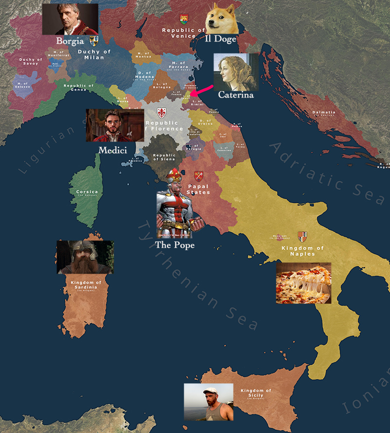
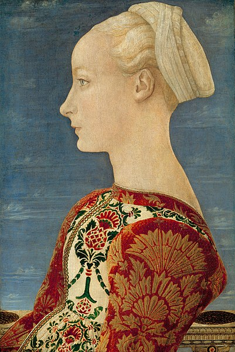
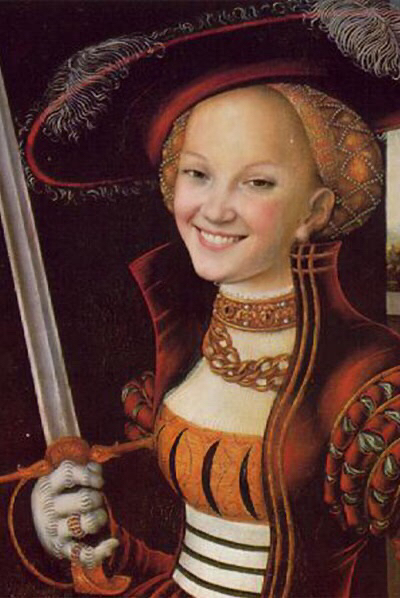
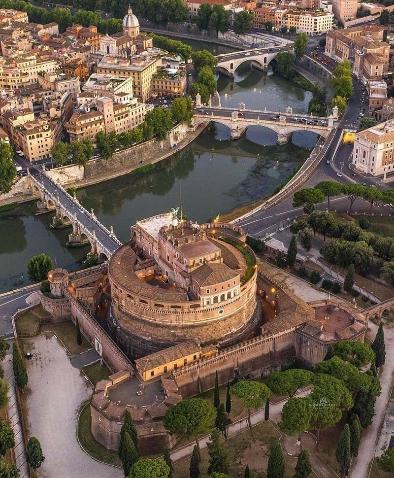

Do you ever miss **Game of Thrones**, with all its political machinations and incest? Well, stop punishing yourself by re-watching the latest seasons, and read about the Italian Renaissance instead! It has similar tropes involving murder and sex that you like so much, but significantly fewer dragons ex machina.

## The world map

Set between the 14th and 15th century, Renaissance Italy was divided into states led by powerful families, like the Aragon in Naples, the Pope in Rome, the Medici in Florence, the Borgia in Milan, and stench of rotten fish in Venice.

<FigureLabel>
    Click to zoom. Original map found <a href="https://i.redd.it/pmxtfnf176f51.jpg">here</a>.
</FigureLabel>

The period was saturated with such incredible characters, like *Lorenzo de Medici* - also called The Magnificent, probably by himself - or the polymath *Leonardo da Vinci*, the scheming *Niccolo' Machiavelli*, the Shakespearean *Lucrezia Borgia*.

With time, we'll get to talk about all of them. Now, I'd like to tackle my favorite by far: **Caterina Sforza**.

## Early life

Caterina was the illegitimate daughter of *Galeazzo Maria Sforza* and super hot mistress *Lucrezia Landriani*.

<FigureLabel>
    Lucrezia Landriani. Milf.
</FigureLabel>

Being from **Milan**, I'm guessing that Caterina's bastard last name was **Fog**. Though, unlike that asshole Ned Stark, Galeazzo ended up taking Caterina as his own daughter, raising her a Sforza.

The Sforza family had humble beginnings as warriors for hire, but were promoted to nobility thanks to their amazing achievements on the battlefield. The forefather of House Sforza was [Muzio Attendolo](https://en.wikipedia.org/wiki/Muzio_Attendolo_Sforza), a character so cool that deserves his own entry.

Caterina was a mix of the two Stark sisters: silent and cunning when circumstances allowed for it, and absolute freaking badass when push came to shove.

<FigureLabel>
    With that smile, Caterina can behead me anytime!
</FigureLabel>

Her father let her free to pursue her interests even if not necessarily ladylike, such as alchemy, fencing, and hunting. On a more negative note, he also assigned her a much older husband when she was only 13, which was super cringe even at the time, and had to be done on the *hush-hush*.

The lucky husband was **Girolamo Riario**. He wasn't particularly smart or deserving, but his uncle was the Motherfucking Pope Sisto IV, so he had that going for him.

<FigureLabel>
    Girolamo in some tv series with Girolamo in it
</FigureLabel>

Uncle Sisto gifted the lordship of **Forli** to the newlyweds, but the couple didn't immediately settle in, as they were spending their days in **Rome**, with Caterina making herself loved by the aristocracy and Girolamo plotting against Lorenzo the Magnificent, because the Pope totally hated the guy and thought that he wasn't so magnificent after all.

## Red wedding, italian style

The Pope assigned his nephew a simple task: "Hey Girolamo, would you kindly murder the brothers Lorenzo and Giuliano de' Medici for me, or is that too much an ask?"

Girolamo came up with a plan that involved the help of the Pazzi family in **Florence**, who also weren't crazy about the Medici. This is funny because Pazzi means *crazy*. Erm.

It's important to remember that Girolamo was an idiot, not to be trusted with *anything*.

The original plan was to poison the brothers at a banquet. Now, poisoning two people? Not exactly easy! They kinda need to bite the food at the same time, or they will realize what's going on, and you only get to kill one. So the plan was changed into an assault during mass at Santa Maria del Fiore, with a trusted hire going all stabby-stabby on the Medici siblings.

<FigureLabel>
    The low key cathedral where the murders were supposed to take place
</FigureLabel>

But **Montesecco**, the person who was supposed to execute the plan, was like I can't do it inside a church. Are you kidding? I have morals!

So, two unvetted killers were found last minute, as if this was a movie from the **Coen Brothers**.

The two nihilists waited for everybody in the church to get on their knees, as was customary at the time, and unleashed their stabbing attacks. But instead of splitting the targets, both morons charged on Giuliano, who didn't stand a chance. Though this meant that Lorenzo had the time to spider-man away.

Needless to say, Lorenzo wasn't too thrilled about the whole ordeal, and promised a swift investigation.

Despite not taking part in the murder, Montesecco was arrested because, when anything shitty happened in Florence, you could rest assured that Montesecco had a role. Everyone knew it.

Lorenzo had him tortured until he shouted: "𝗦𝗛𝗜𝗥𝗘! 𝗕𝗔𝗚𝗚𝗜𝗡𝗦!"

This is how it was discovered that Caterina's husband was the - air quotes - mind behind it all.

<FigureLabel>
    Instead of their portraits, I'm posting a photo of the tv show Medici: Masters of Florence because, to be honest, the Medici siblings weren't too good looking.
</FigureLabel>

Of course, Girolamo didn't love being found out, but wasn't too concerned either. "As long as my uncle, **TᕼE ᗰOTᕼEᖇᖴᑌᑕKIᑎG ᑭOᑭE**, is alive, I'm safe."

Then, the Pope died.

## The taking of Castel Sant'Angelo

The death of Sisto IV posed a problem for Girolamo Riario because, you see, he had this natural talent of making everybody hate him. So there were a great many people waiting for the right moment to get rid of him, like in a definitive manner. I'm not even sure that Lorenzo de' Medici was the angriest at the guy!

Little known fact, but when a Pope dies, Rome becomes the set of a **Purge** movie. Thefts, revenge killings, orgies, cats and dogs living together. I guess they figure it's the only time when **God** is not watching.

You could say that there was a certain pressure on the clergy to poop out a new Pope asap.

Given the chaos, the moment was ripe for Girolamo to be brutally murdered several times. With her husband panicking under a bed, Caterina realized she had to step up and take her life in her hands.

"Well, I guess I'm going to have to fix your shit," she must have said.

She was 21 years old and seven months pregnant.

Caterina rode her horse to **Castel Sant'Angelo**, the bastion that overlooked the city, and convinced the guards to let her in.

"Oh, you wouldn't let a pregnant woman out in the cold 🥺"

Once inside, she occupied the fortress, which gave her access to heavy and very wisely positioned cannons.

Her message was simple: "We need safe passage out of Rome. Until this is done, if you dare cross the bridge to go elect a new Pope, I'm going to blow you assholes up to the moon. And let me remind you that we know so little about  the moon, but it does seem terrible!"

There was a lot of back and forth outside the castle. The cardinals were begging Caterina to let go, and Caterina from the walls was shaking her head. That's a nope!

Finally, it was agreed that she and her husband would not only receive safe passage, but they would also retain the lordship of Forli.

Caterina was like: "Ok, but I also want money, soldi, dinero, pengarna." She was enjoying it.

The cardinals couldn't take an L this big, so they approached her husband. Girolamo agreed that what Caterina was asking was wrong. But what can you do? Bitches be crazy.

Finally, they gave up and added a payment for 8000 ducats to the contract. Caterina accepted and left the castle. The Riarios reached Forli safe and sound and learned that a new Pope had been elected: **Innocent VIII**.

The new Pope was a generous and kind man, which was rather novel for a Pope. All in all, he only hated one person, and this person was Girolamo Riario, to the surprise of no one.

**End of Part 1.**

Stay tuned for [Part 2](/caterina-sforza-2) of Caterina's story. Will she and her husband enjoy their reign in Forli and be happy ever after?
<Spoiler>
    Nope.
</Spoiler>

