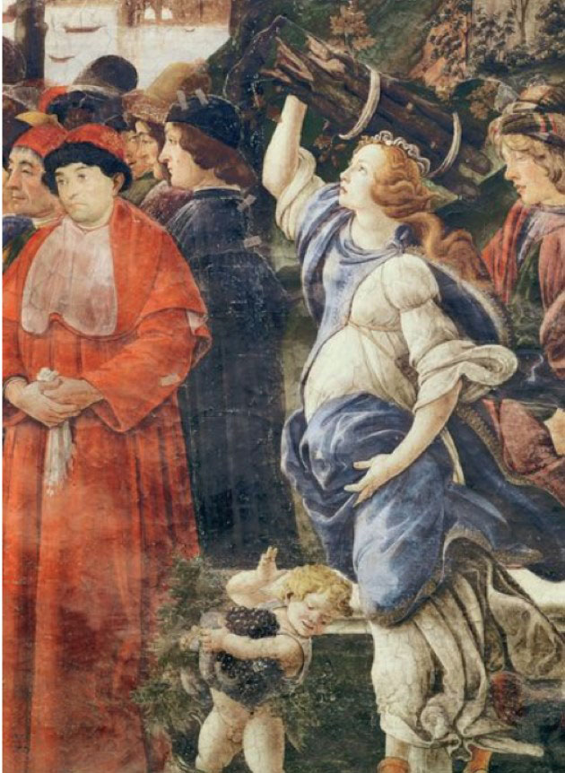

In [part 1](/caterina-sforza-1), we left Caterina and Girolamo in Forli, taking over their lordship of the city. Go read it if you haven't already, as we will be using callbacks.

Girolamo was now deprived of his strongest and only virtue: being nephew of a Pope. You can imagine how he was feeling. I like to think that he took this chance to reinvent himself, read a self-help book, change his hairstyle.

He did seem to have learned the lesson of maybe not having everyone hate you. In order to gain the love of the Forlivesi, he promised not to raise taxes. The Forlivesi appreciated the gesture, and gave a loving chance to this new Girolamo.

Now, Girolamo also enjoyed a lavish lifestyle, and this in his mind was still possible thanks to the 8000 ducats that his wife Caterina Sforza managed to squeeze from the Church during her Roman standoff.

Unfortunately, the newly elected Pope Innocent VIII, when he heard about this monetary promise, replied: "I ain't giving him shiiieeet!"

So, suddenly lighter of 8000 ducats, Girolamo decided to be a more mindful spender, and eased on the parties and the unnecessary ornaments.

Lol, just kidding, he raised taxes!

Now the Forlivesi didn't like it one bit.

## Comeuppance

## The scene on the ramparts

We actually have the whole scene thank you to the Animus technology.
 we
But, come on, did it really happen? Well, the Orsis did menace to kill her sons, and Caterina did not accept the black mail, but the pussy scene? Didn't really happen.

We actually suspect that it was circulated by none other than:
4
Box

Niccolo' Machiavelli: the incel strategist

You see, Machiavelli hated Caterina with all his heart. In fact, he was once sent by the Medici to close a deal with her, and he thought this was going to be a walk in the park because, and I quote:

"She is a woman, after all. And women are only good horizontally and/or in the kitchen, lmao!"

Well, Caterina played with him a bit. Let him wait for hours, juggled his balls a bit and then sent him back to Florence with no brexit deal.

We def need a post about Machiavelli. Find the link here. (No link means it's not done yet, duh.)

Box End

Stay tuned for Part 3 of Caterina's story. Will she and her husband enjoy their reign in Forli and be happy ever after?
<Spoiler>
    Nope.
</Spoiler>

<TextBox title={"Title"}>
    
This is content Lorem ipsum dolor sit amet, consectetur adipisicing elit. Alias animi asperiores, ducimus eligendi eum, exercitationem expedita fugit ipsum iure laboriosam laudantium magni molestiae nulla quia reiciendis rerum saepe unde vero.

</TextBox>

I would like to visit Forli', but compared to where I live and the main connecting train lines / roads, it's a bit "in culo".

<FigureLabel>
    Caterina Sforza, here portrayed by Botticelli as someone that, despite being uber-pregnant, gets shit done.
</FigureLabel>