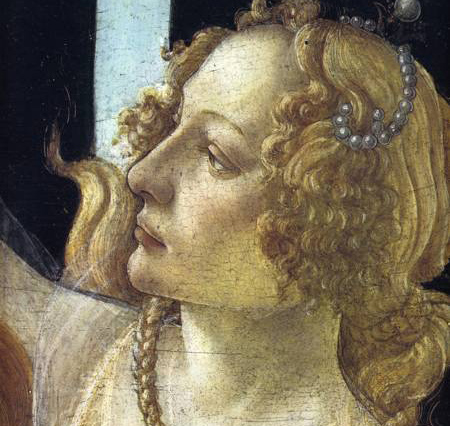
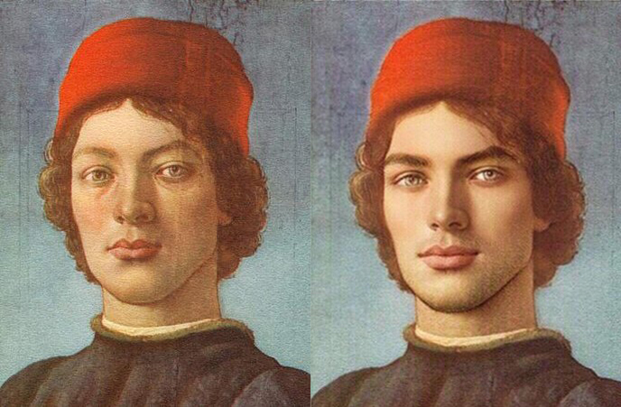

In [Part 3](/caterina-sforza-3), Caterina just lost her true love and thought well to murder everyone involved. But before we reach the catharsis, let's talk about Giacomo a tiny bit.

## Let's talk about Giacomo a tiny bit

For a former stable boy, Giacomo proved to be a completely unstable.

We like to blame aristocrats for their orgies, the overbearing taxes, their dumb tweets about cryptocurrencies, and we come up with solutions to fix aristocrats, like tax them, cancel them, *something something*, communism! But the thing is... people are dicks, all of them, Giacomo included.

We tend to forgive **hot** people because they inspire us sexually. But, should we?

As Giacomo's power increased, also his cruelty and insolence went off the charts. He incurred the hatred of all, including Caterina's children.

On one occasion, in full view of the Forlivesi, Giacomo Feo slapped **Ottaviano**, Caterina's firstborn who was held at knife-point by the **Orsi** 🐻‍❄️. It was unbearable, but nobody had the courage to do anything to defend the boy.

<iframe src="https://giphy.com/embed/xT1XGZ1NVqijIqFUTS" width="100%" height="100%" style="position:absolute" frameBorder="0" class="giphy-embed" allowFullScreen></iframe>

Now that we have deconstructed Giacomo Feo from novel Brad Pitt to cunty piece of **pickled garbage**, what do we know about the conspirators that murdered him? Well, they were incredibly close to Caterina. The closest of them all we will call **Mr. X**. We are going to reveal his name later, for effect.

Caterina sent a raven to former castellan **Tommaso Feo**, exiled in Imola:

<Indented>
    Dear Tommaso,
    <Break/>
    I don't love how we left things, but I'm ready to forgive you. Your little brother was killed. Help me murder the people responsible.
    <Break/>
    xxx
    <NewLine/>
    Caterina
</Indented>

It was time for **Caterina Sforza** to go medieval on some asses. Or should we say *current times*?

## The angel of death

What follows is the gruesome account of the acts that **Caterina Sforza** and **Tommaso Feo** committed to avenge Giacomo. It's a bit much to take in, so I suggest that you read the paragraph by listening to this song. It should help.

<ReactAudioPlayer src="music/spanish_flea.mp3" controls />
<Break/>
The investigation was swift, as most of the conspirators, right after killing Giacomo, thought well to reach the main piazza and boast to anyone what they just did. Italians.

Let's begin with the person that materially went stabby-stabby on Giacomo. This was non-other than **Giovanni Antonio Ghetti**, whom we briefly met in [Part 3](/caterina-sforza-3). He was the guard that arrested horny Tommaso Feo. 🤯

Ghetti was chased down to a **cemetery**. When caught, all his extremities - head, fingers, toes, other stuff - were separated from the body.

Ghetti's wife **Rosa** was Caterina's best friend. She and her children were thrown in a well and left to die.

Ghetti's younger kid of **five** years old survived a few days more hiding with friends of the family. He was later found and taken care of, together with the friends of the family, of course.

<iframe src="https://giphy.com/embed/KKXAkRhvK5Tr2" width="100%" height="100%" style="position:absolute" frameBorder="0" class="giphy-embed" allowFullScreen></iframe>

The same fate happened to the Ghetti brothers and their loved ones.

Then, Caterina targeted all the families that somewhat **resented** Giacomo: the Marcobelli, the Delle Selle, the Orcioli. Yes, even the Orcioli. They were all thrown into the dungeons of Ravaldino. Their houses and estates burned to the ground.

**Domenico da Bagnacavallo** was tortured until he revealed that a priest was involved. Plus, he confessed the name of the head conspirator, one **Mr. X**, whom we will reveal later, for effect.

The aforementioned priest was brought to the main piazza, stripped naked, then tied to a horse and drove around town until there was very little priest left.

**Antonio Pavagliotta**, who joined the conspiracy because he needed money, as he had a very expensive mistress, was hung together with his expensive mistress and, for completion, their three expensive children.

All the murderers' heads were then cut and affixed to the **bell tower**, where they stayed for over a year.

So it goes.

## Well, that happened

So, yeah, even if this occurred, like, decades ago, I feel a bit bad being here celebrating Caterina Sforza.

To clarify, do I think that Caterina went way over the line with all these acts? **Yes**.

But if I was the one that got murdered, would I want my wife to kill 38 people in reprisal? **Also yes**.

<FigureLabel>
    Maybe I overreacted a tiny bit
</FigureLabel>

## Mr. X

We have left the identity of **Mr. X** out of the carnage above, for effect. This means that it must be some explosive revelation. I can confirm this is the case.

The name of Mr. X has been mentioned a few times in these pages. Can you guess it?

* Was it maybe **Ludovico Orsi**, bearing tainted feelings against Caterina?

* Or was it incel **Niccolo' Machiavelli**, still mad for not getting that brexit deal he wanted so badly?

* Or could it have been **Tommaso Feo**, not loving the way that Caterina #metoo'd him like a little bitch?

Well, the identity of Mr. X is...

<Spoiler>
    
<strong>Ottaviano Riario!</strong>

    
Yes, Caterina's oldest son of 16 years old, legitimate heir who had been hostage of the Orsi 🧸, then publicly slapped by the late Giacomo Feo, was like "I ain't taking any more shit by any grownup!" 😭

    
<strong>OMG</strong>, right? Caterina was destroyed by the news. She finally found the resolve to confront his child about this. Chroniclers were present at the meeting and feared for the worst possible outcome for the poor kid.

    
In the end, Ottaviano was totally grounded. I am not joking.

</Spoiler>

So, did you guess it? I gave you all the clues! I'm sure you were suspecting the Orsi due to all the 🐻 references. That's good old misdirection!

## Third love is the charm

It was now the year 1497. Caterina Sforza was depressed due to the death of Giacomo and felt bad for murdering a whole lot of people. Luckily, it was gonna be soon the year 1500. A Jubilee year where you can pay money to the Church to be forgiven and go to heaven. So that was nice.

In nearby Tuscany, Lorenzo the Magnificent has passed away in 1492. He was replaced Piero de Medici, also known at the *Not Exactly As Wonderful TBQH*.

He fortunately didn't have kids, but one his nephews wa smart and kind man: Giovanni de Medici.

Giovanni was tasked to go Forli and beg Caterina for help to fight against **Pisa**, which reminds me...

Long story short, Giovanni and Caterina really clicked. One thing led to another. They got married. ❤️

So, look, I fucked up. In [Part 3](/caterina-sforza-3), I posted a hot picture of **Giacomo Feo**, but I made a mistake. That man was in reality Giovanni de Medici, who also was easy in the eyes. I blame my poor Google skills for this.

Luckily, I faceapped Giacomo's picture for the lulz, so I don't think I have to go back and fix the post. We can just say that Caterina had a type.

<FigureLabel>Giovanni de Medici               Giacomo Feo</FigureLabel>

Giovanni and Caterina enjoyed a few amazing years together. They had a child also named Giovanni, and we need to put a pin here <AiTwotonePushpin/> because **Giovanni Jr.** is a character so cool that he deserves a chapter of his own.

That said, you know who didn't love the Sforza and the Medici merging assets together? Nearby Venice and its leader the Doge.

At least, he died the same way I want to go, inside a spa in Tuscany.

Now, did he die stabbed? No, second most common cause of death in. The Gout.
But at least he died the same way I want to go: inside a spa in Tuscany.

Top 5 causes of death in Renaissance Italy
1. People going all stabby-stabby on you
2. The gout
3. A series of illnesses that involve drinking poop
4. Sudden death in the cradle (like one of those windows blue screens)
5. Old age (around 49)

So, what did Cesare Borgia do to Caterina while she was in captivity? The answer is, unfortunately, yes.

## The legacy

In season 3, for the casting of Caterina, they just decided to clone Emilia Clarke...

Or you could watch The Borgias, with Jeremy Irons. It's on HBO, which means probably a lot of barely justifiable nudities.

I don't advise that you play Assassin's Creed II. It's not a very good game, I'm not sure how much of that actually happened, and Caterina there speaks like Super Mario. I tried switching to the Italian language, but was compelled to revert when Ezio's mother said "topa".

https://www.youtube.com/watch?v=mAQuuwj573M&t=12s

Don't we all want to be loved by someone that would murder 36 people in case we died?

Stay tuned for Part 5, where finally we introduced the Thanos of the story. Motherfucking Cesare Borgia.