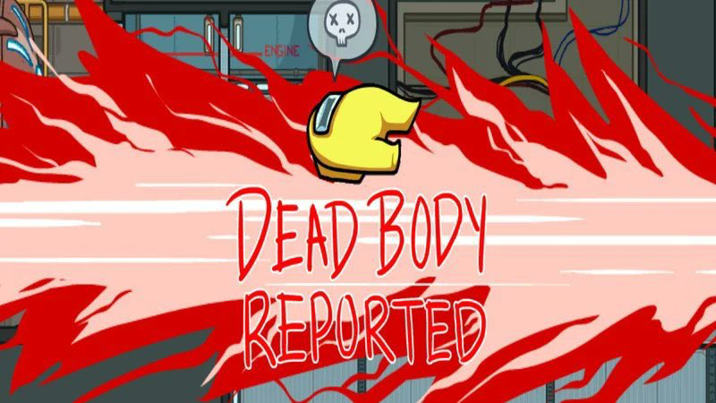
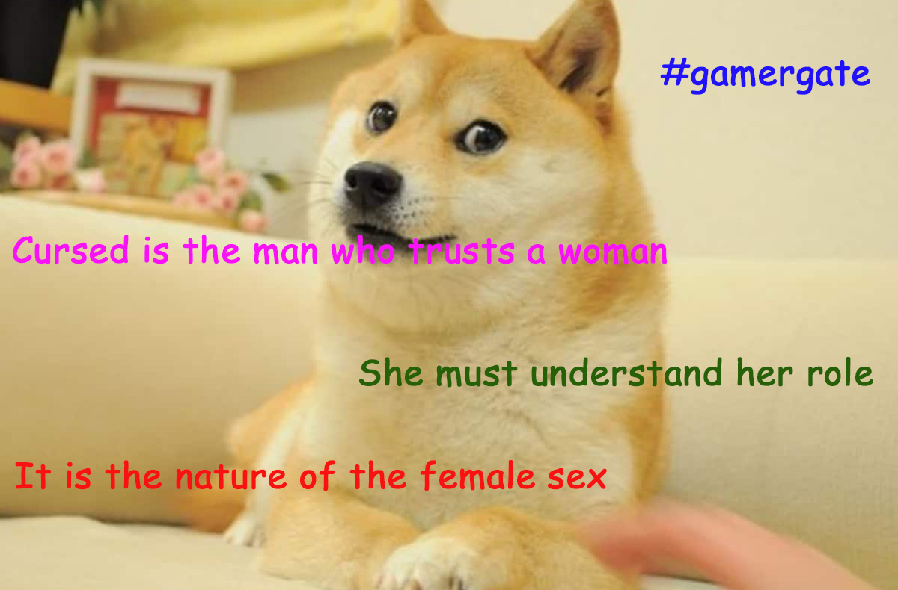

In [Part 3](/caterina-sforza-3), we left Caterina grieving for her lost love and toying with the idea of delivering some old ultra-violence. We'll get there, but first, let's talk about Giacomo a tiny bit.

## Let's talk about Giacomo a tiny bit

For a former stable boy, Giacomo Feo proved to be completely unstable.

We like to blame aristocrats for their orgies, their shitty McMansions, their dumb tweets about cryptocurrencies. And we come up with solutions to fix aristocracy, like tax them, cancel them, *something something*, communism! The thing is, given the wrong incentives, all people are dicks. All of them. Giacomo included. We tend to forgive **hot** people because they inspire us sexually. But, should we?

As Giacomo's power increased, his cruelty and insolence went off the charts. He enjoyed the whole gathering of riches a bit too much and couldn't get enough of it. As a result, he incurred the hatred of many, including Caterina's children.

In one occasion, Giacomo Feo became extremely mad at **Ottaviano Riario**, Caterina's firstborn whom we met in [Part 2](/caterina-sforza-2), held at knife-point by the **Orsi** 🐻‍❄️.

In front of several Forlivesi, Giacomo violently slapped Ottaviano.

<iframe src="https://giphy.com/embed/xT1XGZ1NVqijIqFUTS" width="100%" height="100%" style="position:absolute" frameBorder="0" class="giphy-embed" allowFullScreen></iframe>

Now that we have deconstructed Giacomo Feo from a proto-Brad Pitt to a cunty piece of **pickled garbage**, what do we know about the people that plotted his murder?

Well, they were incredibly close to Caterina. The closest of them all we will call **Mr. X**, and we are going to reveal his identity later, for effect.

Now let's tackle what you are here for, the **Quentin Tarantinian** retribution.

## The angel of death

Caterina sent a raven to former castellan **Tommaso Feo**, now exiled in Imola...

<Indented>
    Dear Tommaso,
    <Break/>
    I don't love how we left things, but I'm ready to forgive you. Your little brother has been killed. Help me murder the people responsible.
    <Break/>
    xxx
    <NewLine/>
    Caterina Sforza
</Indented>

It was time to go **medieval** on a bunch of asses.

What follows is the gruesome account of the acts that **Caterina Sforza** and **Tommaso Feo** committed to avenge Giacomo. It's a bit much to take in, so I suggest that you read the paragraph by listening to this song. It should help.

<ReactAudioPlayer src="music/spanish_flea.mp3" controls />
<Break/>

The investigation was swift, as the conspirators, right after killing Giacomo, thought well to reach the main piazza and boast what they just did to anyone there. Italians.

Let's start with the person that materially went stabby-stabby on Giacomo. This was non-other than **Giovanni Antonio Ghetti**, whom we briefly met in [Part 3](/caterina-sforza-3). He was the guard who arrested horny Tommaso Feo. 🤯

Ghetti was chased down to a **cemetery**. When he got caught, all his extremities - head, fingers, toes, other stuff - were separated from the body.

Ghetti's wife **Rosa** was Caterina's best friend. She and her children were thrown in a well and left to die.

Their younger kid of **five** survived a few days more hiding with friends of the family. He was later found and taken care of, together with the friends of the family, of course.

<iframe src="https://giphy.com/embed/KKXAkRhvK5Tr2" width="100%" height="100%" style="position:absolute" frameBorder="0" class="giphy-embed" allowFullScreen></iframe>

The other Ghetti brothers and their loved ones met a similar fate.

Then, Caterina targeted all the families that somewhat **resented** Giacomo: the Marcobelli, the Delle Selle, the Orcioli. Yes, even the Orcioli. They were all thrown into the dungeons of Ravaldino. Their houses and estates burned to the ground.

**Domenico da Bagnacavallo** was tortured until he revealed that a priest was also involved. Plus, he confessed the name of the head conspirator: one **Mr. X** whom we will reveal later, for effect.

The aforementioned priest was brought to the main piazza, stripped naked, tied to a horse and dragged around town until there was very little priest left.

**Antonio Pavagliotta**, who joined the conspiracy because he needed money, as he had a very expensive mistress, was hung together with his expensive mistress and, for completion, their three expensive children.

All the conspirators' heads were then cut and affixed to the **bell tower**, where they stayed for over a year, and were ultimately brought down by a windy day.

So it goes.

## Well, that happened

Even if this occurred, like, decades ago, it feels a bit distasteful to be here celebrating Caterina Sforza.

To clarify, do I think that Caterina went way over the line with all these acts? **Yes**.

With that in mind, if I was the one that got murdered, would I want my wife to kill 38 people in reprisal? **Also yes**.

<FigureLabel>
    Maybe I overreacted a tiny bit
</FigureLabel>

## Mr. X

We have left out the identity of Mr. X so far, for effect. This means that it must be some **unbearably** explosive revelation. I can confirm this is the case. The name of Mr. X has been mentioned a few times in these pages. Can you guess it?

Take a few minutes to think about it.

* Was it incel **Niccolo' Machiavelli**, still mad for not getting that brexit deal he wanted so badly?

* Or was it maybe **Ludovico Orsi**, bearing tainted feelings against Caterina?

* Or could it have been **Tommaso Feo**, not loving the way Caterina #metoo'd him?

The identity of Mr. X is...

<Spoiler>
    
<h3>Ottaviano Riario!</h3>

    
Yes, Caterina's oldest son of 16 years old, legitimate heir of Forli, who had been hostage of the Orsi 🧸, then publicly slapped by the late Giacomo Feo, was like "I ain't taking any more bullshit from any grownup!" 😭😭😭

    
<strong>OMG</strong>, right? Caterina was destroyed by the news. She finally found the resolve to confront his child. Chroniclers were present at the meeting and feared the worst possible outcome for the kid.

    
In the end, Ottaviano was sent to his room. I'm not joking.

</Spoiler>

So, did you guess it? I gave you all the clues! I feel like you were suspecting the Orsi due to the 🐻 references. That's good old misdirection!

## Third love is the charm

It was the year **1497**. Caterina Sforza was depressed for the loss of Giacomo and felt bad for murdering perhaps too many people.

Luckily, the year 1500 was approaching. A **Jubilee** year, during which you can pay a bag of money to the Church and get a blank slate pardon for your sins. So that was nice.

In nearby Tuscany, Lorenzo the Magnificent had passed away in 1492. He was succeeded by **Piero de Medici**, also known as the *Not exactly as magnificent, to be quite honest*.

Fortunately, he didn't have kids, but one his nephews was a smart, well-read, kind man: **Giovanni de Medici**.

Giovanni was tasked to go to Forli and beg Caterina for help to fight against **Pisa**, which reminds me...

Long story short, Giovanni and Caterina really clicked. One thing led to another. They got married. ❤️

## Full disclosure

So, look, I fucked up. In [Part 3](/caterina-sforza-3), I posted a hot picture of **Giacomo Feo**, which turned out to be incorrect. That man was in reality **Giovanni de Medici**, who also was easy in the eyes. I blame my poor Google skills for this.

Luckily, I had faceapped Giacomo's picture for comedic reasons, so they look different enough, and I don't think I have to go back and fix the post. We can just say that Caterina had a type.

<FigureLabel>Giovanni de Medici               Giacomo Feo</FigureLabel>

Giovanni and Caterina enjoyed a few amazing years together. They had a child also named Giovanni, and we need to put a pin here <AiTwotonePushpin/> because **Giovanni Jr.** is going to become a very cool character that deserves a chapter of his own.

Incidentally, do you know who didn't love House Sforza and House Medici merging assets together? Why, nearby **Venice** and its leader the Doge.

The Doge certainly didn't mince words about Caterina. Let's report a few of them in form of a meme.

Caterina Sforza put on her battle armor +10 and proceeded to meet Venice in battle.

But... wait a second... did... did Giovanni de Medici just die?

Already?!

## Yep 😢

You see, like any Medici, Giovanni suffered from the gout. Young kids, I hope this is a cautionary tale for you to avoid the temptations of inbreeding!

At least, Giovanni died the same way I also want to go, inside a spa in Tuscany, in the arms of Caterina Sforza. ❤️

<TextBox title={"Top 5 causes of death in Renaissance Italy"}>
    

        <ol>
            <li>People going all stabby-stabby on you</li>
            <li>A series of illnesses that involve drinking poop</li>
            <li>Sudden death in the cradle (like one of those windows blue screens)</li>
            <li>The gout</li>
            <li>Old age (around 38)</li>
        </ol>
    

</TextBox>

In retrospect, Venice's attack was good for Caterina's grief. She was compelled to think about that instead of watching Netflix all day in her sweatpants under the effect of mushrooms.

"If I must lose because I am a woman," she wrote her uncle, "I want to lose like a man."

As much as I'd like to close the chapter here with a cliffhanger, let's cut it short. Caterina won big time against Venice. Florence and Forli were saved. The Medici were happy with her. The Doge promised reprisals. Yadda yadda yadda. When need to close here because...

**End of Part 4.**

...in Part 5, a new player joins the fight: Cesare Fucking Borgia. And for Caterina, things will go for the worse. The much, much worse.