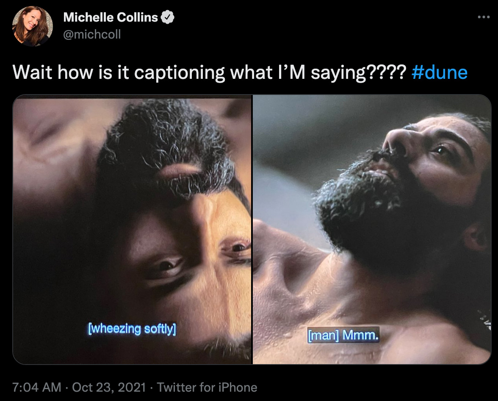
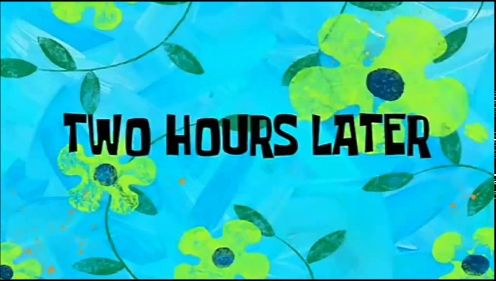
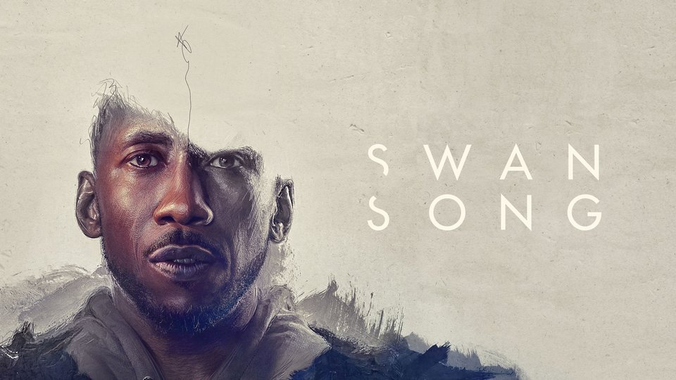

import TextBox from "../../../components/blog/Boxes";
import {Batman} from "../../../components/blog/Grids";
import {FigureLabel} from "../../../components/blog/Text";
import YouTube from "../../../components/blog/YouTube";
import FilmCard from "../../../components/blog/FilmCard";

Movies. Am I right?

This past year has to have been the worst one for the film industry, what with us still shaking off a pandemic, most of the greatest directors being dead for at least two decades, and **Will Smith** punching his way through an otherwise forgetful Oscars night.

We seem to not care about going to the movie theater anymore, and when we do, it has to be **worth it**, for instance, to watch masked action figures beating each other up in the groin or sexy people dealing with worms and beating each other up in the groin.

Can you imagine watching an **art film** in a theater in 2022?

Picture yourself being at home, **naked**, and then getting the idea that, yes, I should put clothes on to go outside, take the car, park the car, wait in line, buy pop-corns, sit in a crowded space, smell armpits, endure ads of local shops, and finally get to watch a film about obnoxious people sitting at home talking.

If you are trying to impress a date, there are less dishonest ways, like staging a robbery.

And people prefer **binging** series anyway.

Now, I like series as much as the next person, but I do appreciate the value of a story with a beginning, a middle, and an end, and that effs off in two hours, instead of taking me hostage for eight seasons, hundreds of hours to build a complex texture of characters in a mild fantasy setting, and then have the main protagonist go and burn a town in **Croatia** in accordance to a character growth study based on *bitches be crazy*.

This is why I want to contribute to Society with this list of the best 10 films I have watched in the past year.

**Note**: I'm not including any blockbusters because you have probably already watched them, and my goal is to help you find the hidden gems.

Also, I plan to use this blog post to impress my dates.

## 10. Promising Young Woman

<YouTube source={"7i5kiFDunk8"}/>
<FilmCard country={"USA"} director={"Emerald Fennell"} starring={"Carey Mulligan, Bo Burnham"} emoji={"🍸"} seenOn={"iTunes"}/>

I had great expectations for this one. I thought that the trailer was good, I like the cast, and the director has worked on **Killing Eve**.

<YouTube source={"Kk0PyD-XNZA"}/>

Unfortunately, I don't think that **Promising Young Woman** is particularly good.

The characters that are supposed to be bad are so bad, or lame, or both, that they don't even seem human, and if they don't seem human, then their behavior comes across as **alien** to us, and not something to be concerned with.

But the film's thesis is that their behavior **is** real, and it's very opinionated on how we are supposed to feel.

I believe that the best forms of art require the consumers of said art to do some of the work. **Promising Young Woman** disagrees, and a film that completes all the sentences for you is like a video game that plays itself.

But, but, but, if this film is such a failure, why including it at all in this best 10 films listicle? Two reasons.

1. I think it fails in an interesting way, and as a result I have been thinking about it way more than some of the other films mentioned downstairs

2. This past year I have watched, like, 12 films. What do you want from me?

## 9. Titane

Julia Ducournau is the insane mind behind [Raw](https://www.imdb.com/title/tt4954522/?ref_=nm_knf_i2), my favorite film for when I'm fasting.

<FigureLabel>Fun fact, I eat eight chicken breasts per week</FigureLabel>

So I was super eager to see her latest work Titane, which by the way won the **Palme d'or**. The trailer is... well... I'm not sure?

<YouTube source={"Q5_w2W5G9OM"}/>
<FilmCard country={"France"} director={"Julia Ducournau"} starring={"Vincent Lindon, Agathe Rousselle"} emoji={"😵‍💫"} seenOn={"MUBI"}/>

I guess I'll watch it and get back to you.

Ok, I'm sorry, what just happened?

The trailer **lied** to me! I was expecting weird people vibing off each other, and instead I get serial killing, steroid injecting, toxic relations, and car sex -- as in sex with cars, not sex in cars.

I loved it!

What **Agathe Rousselle** is doing with her body is incredible and upsetting.

## 8. Nightmare Alley

<YouTube source={"Q81Yf46Oj3s?start=11"}/>
<FilmCard country={"USA"} director={"Guillermo del Toro"} starring={"So many"} emoji={"🎪"} seenOn={"Disney+"}/>

I watched this film knowing that it bombed hard at the box office, and for the whole duration I had a strong feeling of: "This is the last one".

I don't think we will be seeing anytime soon another big production with such a talented and wide cast, expensive sets and high production values, while at the same time not being about super-heroes or big sci-fi universes.

Or at least, not in movie theaters.

People have stopped caring, and if anything, this genre will be saved by the streaming services, that still have the money to finance them and the ability and the algorithms required to generate the buzz and put these films in front of millions of eyeballs.

## 7. The Hand of God
<YouTube source={"i_1VW_0i6vo"}/>
<FilmCard country={"Italy"} director={"Paolo Sorrentino"} starring={"Neapolitan actors"} emoji={"🍕"} seenOn={"Netflix"}/>

asdasda

## 6. West Side Story

<YouTube source={"A5GJLwWiYSg"}/>
<FilmCard country={"USA"} director={"Steven Spielberg"} starring={"Ansel Elgort, Rachel Zegler"} emoji={"🎹"} seenOn={"Disney+"}/>

<TextBox title={"Interlude: The Batman"}>
    <ThreeColumns>
        <Batman/>
        <Col23>
            

                By the way, I watched <strong>The Batman</strong> and I thought that this movie was very long!
            

            

                You can blame the complexity of the story, the multiple villains, the chase sequences, but I believe the main reason for a 3 hours runtime is that titular Batman moves really slowly!
            

        </Col23>
    </ThreeColumns>
    

        He will enter a room, lethargically look around, and then walk toward center camera completely unhurried, while I'm like, motherfucker, can we chop chop? Tomorrow I have to commute to another country!
    

    

        Also, it was very interesting how Batman has a car, and it's just a car. Like, there is nothing special to this car, except some extra swagger but just a pinch of it. Kinda like a Mexican Batman, but not as much as a Sicilian Batman as one would expect.
    

</TextBox>

## 5. Swan song

<FilmCard country={"USA"} director={"Benjamin Cleary"} starring={"Mahershala Ali"} emoji={"👩🏿‍🦲👩🏿‍🦲"} seenOn={"Apple TV+"}/>

Did you know that **Apple** not only makes phones, computers, doctors repellent fruit, but also movies?

Swan Song plays like a long episode of **Black mirror**, and by that, I mean one of the good ones, not the boring, the toothless, or the sex with pigs ones.

This means that you are best enjoying it if you know nothing about the story, which is why I'm **not** embedding a trailer. I just don't trust you not to watch it.

Mahershala Ali is magnificent.

## 4. The French Dispatch

<YouTube source={"TcPk2p0Zaw4"}/>
<FilmCard country={"USA"} director={"Wes Anderson"} starring={"His usual crew"} emoji={"🥐"} seenOn={"Disney+"}/>

What are Wes Anderson's movies about?

I have no idea how to reply to this, except saying that they are about themselves.

When I was a kid, I was awestruck by model trains. I also liked nativity recreations for their miniature nature

<YouTube source={"ACkmg3Y64_s"}/>

They are like VR goggles that send you in an affectated world, where everything is symmetric, colorful, delightful.

Things happen in this world, but do they really?

Plus, Léa Seydoux is naked for most of the time.

## 3. The Green Knight
<YouTube source={"sS6ksY8xWCY"}/>
<FilmCard country={"USA"} director={"David Lowery"} starring={"Dev Patel, Alicia Vikander"} emoji={"‍🥦"} seenOn={"Amazon Prime"}/>

When [A24](https://a24films.com/) releases a new film, you just have to watch it, otherwise you risk missing out on some of the best, weirdest gems out there, like Under the skin, Locke, Ex Machina, The Lobster, The Witch, Swiss Army Man.

The Green Knight is yet another of those.

Based on a poem within the Arthurian Literary Universe, the film follows Gawain's quest very closely. Though, while the poem delivers the classic hero's journey, the film does the same while also commenting on the fact that heroes' journeys are kind of silly.

This results in a completely reinvented ending that makes the whole operation stick the lading. The final line for the titular Knight are chef kiss. Also, every shot is absolutely gorgeous.

## 2. The worst person in the world

<YouTube source={"mwPR9UeRy4Q"}/>
<FilmCard country={"Norway"} director={"Joachim Trier"} starring={"Norwegian actors"} emoji={"🇳🇴"} seenOn={"iTunes"}/>

Is Joachim Trier related to Lars Von?

## 1. Pig

Nicolas Cage does two kind of films:

* Wet farts he can pay up debt with

* Absolute masterpieces he can pay up debt with

So, which one is it with Pig? Let's give it a watch...

<YouTube source={"VSJTPbAm-SM?start=3"}/>
<FilmCard country={"USA"} director={"Michael Sarnoski"} starring={"Nicolas Cage"} emoji={"🐷"} seenOn={"Torrent"}/>

Well, it's the latter.

You could compare this film about a hermit former chef searching for his kidnapped truffle pig to **John Wick**, but the outcome of the comparison should be that the two films are polar opposites.

I would have expected the Venn diagram between me and Nic Cage's character to be cuff-links, instead it's the mastercard symbol.
