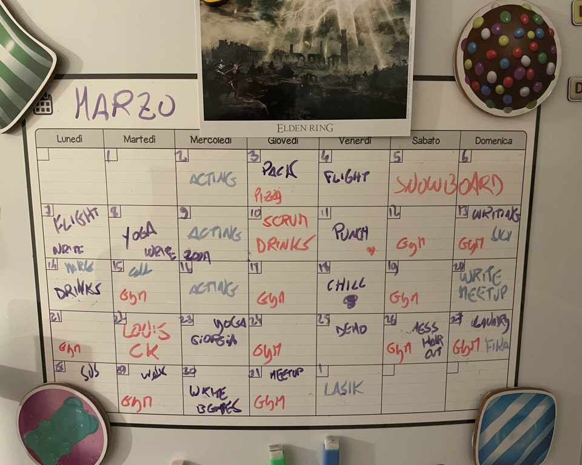

import {ResponsiveEmbed} from "../../../components/blog/ResponsiveEmbed";
import {Dialogue, FigureLabel, Formula, Pony} from "../../../components/blog/Text";
import Quote from "../../../components/blog/Quote";

I'm on a date and I'm asked what my **daily routine** is, because these are the kind of things people ask on dates.

Against better judgement, I provide a detailed account of my day, which takes me a solid **seven minutes** of monologuing. When I'm done, my date is holding her head with two hands, elbows firm on the table and an expression of **anguish**.

She takes a long sip of beer, then asks:

<Dialogue>"Where... where do you find the energy to do all that?"</Dialogue>

I allow a beat of silence, for effect, then reply:

<Dialogue>"Food." 🦄</Dialogue>

And let me be clear, this is a **rude** answer that she doesn't deserve, being a cool, smart, vaccinated woman. Even if she asks way too personal questions.

Now, the reasons why I'm sabotaging my own dates are better discussed with a **professional** and are beside the point. The point is that, yes, I seem to be doing a great many things in a day that, may I remind you, only comprises 24 hours.

If my fridge is to be trusted, this is my standard month:

<FigureLabel>Yes, I have started writing this post in March 🙈</FigureLabel>

And this doesn't even include commuting to another country every day, reading [a book per week](/books-2021), and subjecting myself to dates.

Speaking of, she's now curious about what I'm typing on my laptop. I reply that I'm working at this **blog post**. Yes, this is all happening live. She sighs, then asks:

<Dialogue>"Anyway, what's your secret? I could really use some motivation." </Dialogue>

To which I promptly respond:

<Dialogue>"You do, if you are a freaking moron." 🦄</Dialogue>

And look, we have already established that my flirting skills need a tiny bit of **fine-tuning**, so no use lingering on it. Let's focus on the core message...

## Motivation is bad

There will come a time when things align just perfectly in your life, making you feel highly **motivated**.

Could be due to scoring a **critical** on hormone levels; could be a relieving post-nut clarity; or maybe you read one of those **Tim Urban** posts saying that you have 4000 weeks in your life so, you know, better hurry or something.

There even is an infamous day when motivations tend to coalesce. This day is **December 31st** when human adults lie to themselves with insane prospects...

<Dialogue>
    That's it, come tomorrow, I will diet, I will exercise, I will finally start writing that novel about lesbian zombie nuns.
</Dialogue>

This motivated version of you is an unreliable, noncommittal, outright toxic version of you. You should **never** trust this stranger with any decision. If at all possible, you should slap yourself out of this state.

And the **tomorrows** in these kind of vows are never 24 hours from now. Everything is closed on New Year's Day anyway!

No, these tomorrows are an abstract concept. The rug under which all aspirations are swept. The elephant cemetery of good intentions. **Parks & Recreation**'s March 31st.

<YouTube source="XhulR_kJf7Y"></YouTube>

## Why motivation is bad

When you let *best-version-of-you* take big decisions like losing weight, learning Javascript, beating **Elden Ring**, you are going to have an initial amazing experience.

You will see those kilos, lines of code, lore bosses go down like the NASDAQ. It's going to be galvanizing. You'll feel **unstoppable**. For a bit.

But, eventually, shit will get real.

<ResponsiveEmbed ratio={"16:9"} src={"//coub.com/embed/4widc?muted=false&autostart=false&originalSize=false&startWithHD=true"}/>

The **unexpected** is bound to happen. It can be something as mundane as a tax audit, the text from an ex, or the threat of nuclear war, but it will be enough to break your streak.

As a result, the Universe will fight back like **Rocky** in act 3, and will reclaim all the energy you shoved into it. The larger the progress you made, the bigger the downfall in accordance to Newton's **third law of motion**: something, something, action, reaction.

(What, I'm not a scholar.)

What's worse is that you will enter a **positive feedback loop**.

The thing you wanted to achieve seems now so distant and unreachable that you rather sit on your butt and watch tv. This will make you feel **sluggish**, so you'll watch more tv because that's all the energy you can spare. This leads to frustration. Frustration to anxiety. Anxiety to junk food. Junk food to obesity. Obesity to shame. Shame to the **dark side**.

<ResponsiveEmbed ratio="16:9" src="https://giphy.com/embed/nNOZe5giJhwsM"/>

<FigureLabel>Horny now</FigureLabel>

And all that you are left with is the feeling of:

<Dialogue>
    I would have reached my goal, had shit not gotten real.
</Dialogue>

## If not motivation, what then?

To avoid positive feedback loops, you need to make falling off the **bandwagon** a feature, and not a bug.

Admit that you are **pickled garbage**, and instead of striving for quantum leaps, focus on tiny, incremental changes, and let them sediment by means of habits formation.

And this is a moment like another to disclose that I'm basing all of this on James Clear's [Atomic Habits](https://www.bookdepository.com/Atomic-Habits/9781847941831). I'd suggest you buy it, but why would you when you can read this post [for free](https://www.paypal.com/paypalme/gianlucabelvisi)?

## One percent better

Imagine yourself today. You woke up, had breakfast, hopefully showered, went to work, and kept at it until you passed out on the mezzanine. Let's put a value to this person. Let's give it a 1. Replace with 0.2 if you are from **Naples**.

Imagine being this very same person for the whole year. How much would that account for? Let's run the math:

<Formula>
    1365 = 1
</Formula>

Ok, cool!

Now, project doing a bit more every day. Let's say 1% more. Not much, innit? Let's do the calculation again:

<Formula>
    1.01365 = 37.78
</Formula>

You will agree that 37.78 is, like, a thousand times higher than 1.

In only one year, you have turned your life around, and all it took was doing a **rounding error** more every day.

## Do you feel inspired?

Would you still feel inspired if I told you that this is a bold faced **lie**?

Thanks to **compounding**, one percent better is actually a lot! Improve your basketball fundamentals for that amount every day, and you'll be Michael Jordan by midsummer!

But don't blame me, this comes verbatim from the book!

<FigureLabel>I kid you not. With the graph and all!</FigureLabel>

So, it appears that you have been **manipulated**. They could have used religion for that, or even worse self-help, but **cartesian geometry**? I'm disappointed and impressed at the same time!

But the point still stands. This is not about doing more, but about doing more of the right things and less of the wrong ones, and turn it into a habit.

## I'll bite, what's a habit?

A habit is a behavior that is repeated so regularly that it occurs **effortlessly**, which makes it more difficult to change than a conscious action, for better or worse.

This is important, because consciousness is a huge **bottleneck**. We can only do one thing at a time, and the more we can delegate to the non-conscious self, the better.

<ResponsiveEmbed ratio="16:9" src="https://giphy.com/embed/Q1aRmd8e90WIw"/>

A habit divides into four phases

1. **Cue**: Your brain constantly mines the world for input, and some of these signals solicit automatic attention based on past occurrences. Imagine walking around the center of a town on a Sunday morning, with cobblestones and parked bicycles, when suddenly you smell freshly baked croissants 🥐

2. **Craving**: Great, now all you can think of is croissants. Maybe you are also recalling that vacation in Paris: the tour Eiffel, the fancy vegetarian restaurant, the smell of bakeries while climbing Montmartre.

3. **Response**: You have created a problem that has only a solution. In this case, entering the shop, buying 12 croissants and putting them in your face at the counter in front of a teary eyed baker. These are the moments that he is reminded what he sacrificed his life for! Remember to pay,

4. **Reward**: Problem solved. Not only you feel satisfied for bringing balance to the Force, but now you have formed a strong bond between the smell of pastry and this feeling of everything being just about right despite lots of French people. And it just cost you1 4800 Calories.

<FigureLabel>Wait, do I smell coffee?</FigureLabel>

Knowing the subatomic particles a habit is made of is the lever that you need to harness the power of habit formation. This is coalesced by the Author into the **four laws** of behavioral change, which we are very conveniently going to explore...

## 1. Make it obvious

<Dialogue>Oh, I should, like, be better and stuff.</Dialogue>

Define your goal

<Dialogue>I will [ACTION] in [LOCATION] at [TIME].</Dialogue>

My goal is to go to the gym at 6:30 AM every other day so that I can grow a six-pack or at least cancel out the fattening due to all the pizza backing thank you very much.

This is my route to the gym...

<FigureLabel>I have been attacked by wolves in three non consecutive occasions</FigureLabel>

Stack habits so that one comes naturally after the other.

The reward of habit A is the cue into habit B.

My cue to wake up early and raise from the warm embrace of the bed is that I can make killer espresso.

The reward is, of course, drinking but also my cue to go to the gym. The reward of the gym is sauna. And so on.

<YouTube source="EbbzNFtRnZA"></YouTube>

You need an environment that will help you follow the habit.

Make the cue visible and the bad invisible.

Have a reading zone. Build a faraday cage and live inside it so that tik-tok will never find you.

If you want to quit smoking, consider selling the cigarette shop.
context is the cue

## 2. Make it attractive

goals do not differentiate winners from losers.

Systems focus on the person you want to become, instead of the result.

If you want to quit smoking, and someone offers you a cigarette. If you reply:

<Dialogue>"No, thanks. I'm trying to quit."</Dialogue>

If you are framing yourself by your struggle. You are setting yourself for failure. Trying to quit, really? Another beer and you will crawl back to me, imploring for a smoke. And at that point do you know what i will say to you. Ok.

Here is a better answer:

<Dialogue>"No, thanks. I'm not a smoker."</Dialogue>

You made it about your identity. Who you are.

I personally like to go one step further and make it about who I am not:

<Dialogue>"No, thanks. I'm not a piece of shit like you."</Dialogue>

Dopamine -- craving
-- experiencing

Temptation buildiing: need to do VS want to do

Group influence: find a culture you want to become.

Make hard habits attractive by learning to associate them to a positive experience.

Hardcore history.

Success is the product of daily habits.

Do not compare yourself to others. Compare yourself to past yourself. If you see no difference, you are stagnating. Which is ok if you are 100% satisfied with who you are and there is nothing more you want to be.

Is that the case?

## 3. Make it easy

Repetition

Reduce any kind of friction. The gym bag is ready the night before, I already wear the bracelet that lets me in the building.

make it automatic

Reduce friction

Prime the environment for use

2 minute rule

## 4. Make it satisfying

Sauna

Reward yourself
sauna after gym

Focus on the reward. Sauna after the gym.

feel succesful: complete tasks, put post its in done

Don't break the chain. Killstreak.

Acountability partners

circles closing

You can break a bad habit, but you are unlikely to forget it.

## Post credits

adsas

## Wait, are you still on the date?

Well, yeah. Who do you think was I talking with all this time?

She's in the bathroom now, as the tears ruined her makeup. I think I stroke a cord into her.

Yeah, but I'm coming up with an excuse to leave because I just noticed a giant red flag.

I told her that I was considering getting a golden retriever and name it Renato, and she said:

<Dialogue>Oh, but golden retrievers are such boring dogs.</Dialogue>

I couldn't believe what I just heard.

<Dialogue>You know who's a boring dog? Your mom. Because she's a whore.</Dialogue>

I know, that was incredibly stupid of me. I should have said "because she's a bitch"! I had the perfect comeback on a silver plate, and I totally ruined it!

I feel like I will wake up at night all sweaty and thinking about the missed opportunity. If I had one chance to go back in time and change things, I wouldn't even kill Hitler. I would go back to tonight and change my line.

If I had two shots at time travel, still I wouldn't kill Hitler. I would buy bitcoin instead.

Now, three times? Totally Hitler. I don't care what you say, I will go back to 1945 and murder the guy.

Four times? Has to be Jesus. He just rubs me the wrong way with his effortless abs.

Five times or more? Dinosaurs all the way down.

