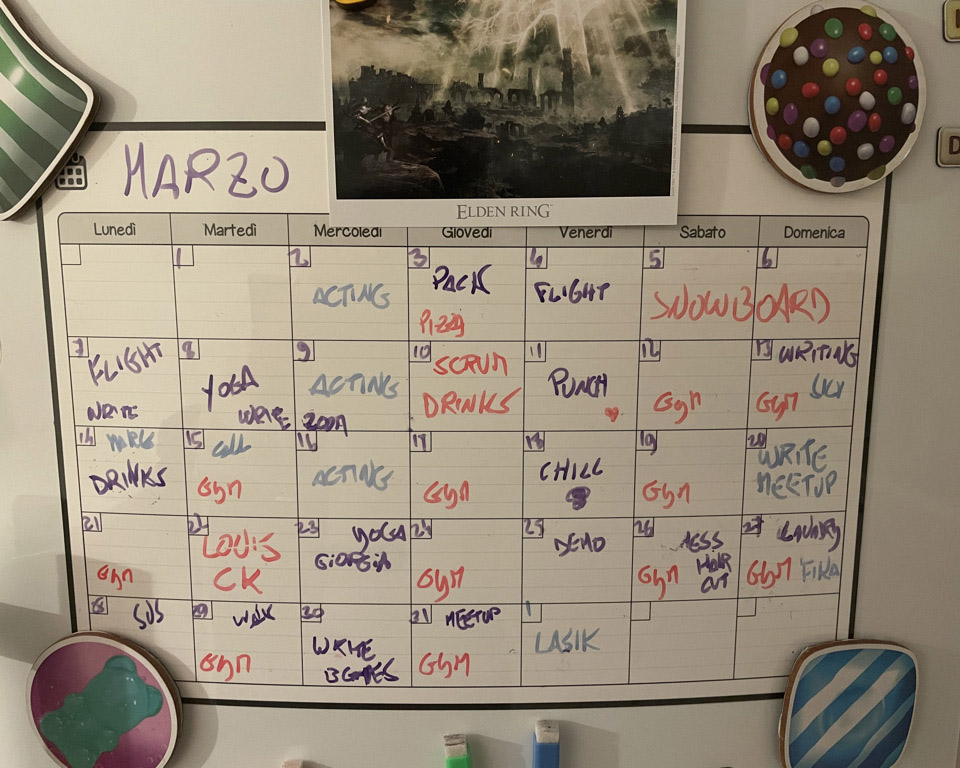
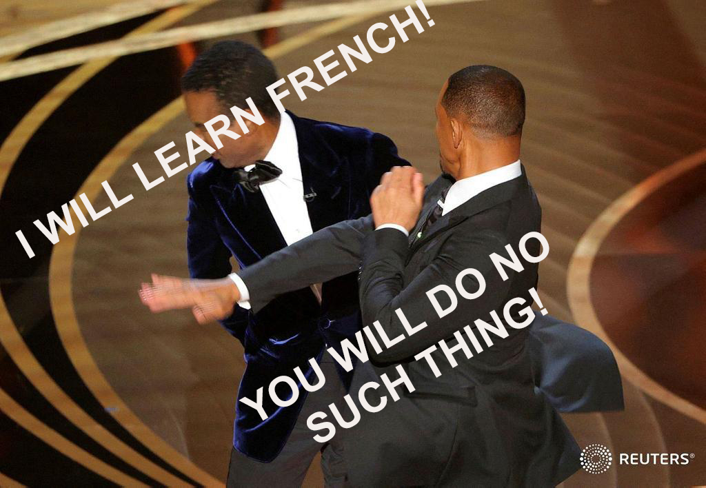
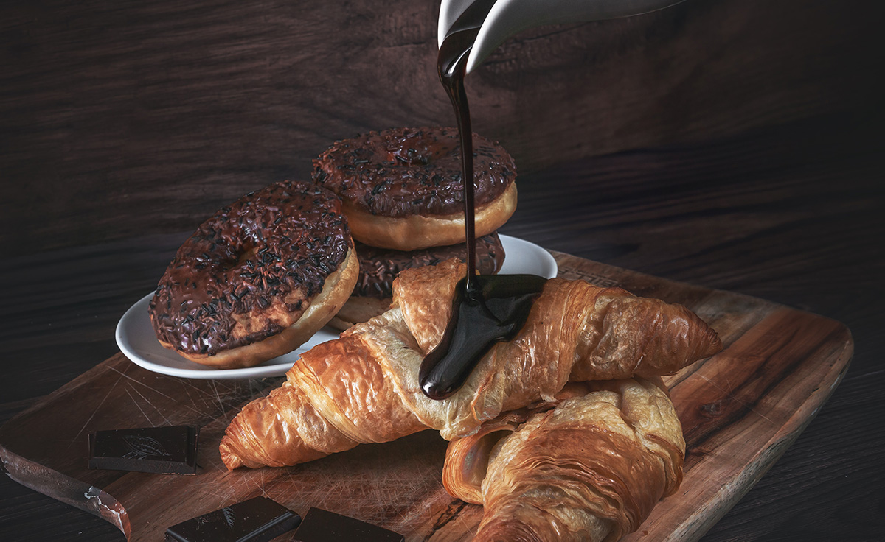

import {Dialogue, FigureLabel, Formula, Pony} from "../../../components/blog/Text";
import Quote from "../../../components/blog/Quote";

So, I'm on a date, and I'm asked what my **daily routine** is, because apparently these are the kind of questions people ask on dates.

I bite the bullet and provide a detailed account of my day, which takes me a solid **seven minutes**, because I'm thorough.

At the end of my lengthy monologue, my date is holding her head with two hands. Her elbows firmly on the table and an expression of **anguish**.

She takes a long sip at her beer, then asks:

<Dialogue>"Where... where do you find the energy to do all that?"</Dialogue>

I allow a few seconds of silence, for effect. Then reply:

<Dialogue>"Food." 🦄</Dialogue>

And let me be clear, this is a **rude** answer on my part, which she doesn't deserve, being a perfectly nice, smart woman and all that, even if she asks way too personal questions.

Now, the reasons why I'm self sabotaging my own dates are better discussed with a **professional** and are besides the point. The point is that, yes, I seem to be doing a great many things in a day that, may I remind you, only lasts 24 hours.

According to my fridge, this is my standard month:

<FigureLabel>Yes, I started writing this post in March 🙈</FigureLabel>

And this doesn't even include commuting to work to another country every day, reading [a book per week](/books-2021), and playing **Elden Ring**. This latter is the reason why I'm four books behind schedule, and I might have to compromise and start reading comics. Comics!

<iframe src="https://giphy.com/embed/pVAMI8QYM42n6" width="100%" height="100%" style="position:absolute" frameBorder="0" class="giphy-embed" allowFullScreen></iframe>

Anyway, my date is now curious on what I'm typing on my laptop. I tell her that I'm working at this very **blog post**. Yes, this is all happening live. My priorities are clear, which I feel she understands.

She then asks:

<Dialogue>"Anyway, what's your secret? I could really use some motivation." </Dialogue>

To which I promptly reply:

<Dialogue>"You do, if you are a fucking moron." 🦄</Dialogue>

And look, we have already established that my flirting skills need a tiny bit of **work**, so no use lingering on it. Let's focus instead on the core message...

## Motivation is bad, actually

There will come a time when things will align just perfectly in your life, and as a result you will feel highly **motivated**.

It could be due to scoring a critical on your hormone levels. It could be a relieving post-nut clarity, or maybe you read one of those **Tim Urban** posts that say that you only have 4000 weeks in your life so, you know, better hurry or something.

Now, this motivated version of you is an unreliable, false, toxic, version of you. You should **never**, ever trust this stranger with any important decision. If at all possible, you should slap yourself out of this state.

There even is an infamous day when motivations tend to coalesce the most. This day is **December 31st**. That's when human adults lie to themselves with insane prospects.

<Dialogue>
    That's it, come tomorrow, I will diet, I will exercise, I will finally start writing that novel about lesbian zombie nuns.
</Dialogue>

The **tomorrow** in these kinds of vows is never 24 hours from now. Everything is closed on January 1st anyway!

No, this kind of tomorrows is a completely abstract concept. It's the rug under which all aspirations are swept. It's the pet cemetery of your good intentions. It's **Parks & Recreation**'s March 31st.

<YouTube source="XhulR_kJf7Y"></YouTube>

## Why motivation is bad

Suppose you promise yourself to diet and lose 1 million kilos in an afternoon or something. According to Newton's **third law of motion**: something, something, action, reaction.

(What, I'm not a scholar.)

Significant change in one's life comes with a huge spring attached. The more you stretch it, the higher the resistance. And when you lose your grip, the kickback will send you back to square one with such a strength that you will be stuck there, by the way gaining two kilos on your original weight, you **fatso**.

(Again, this is Newton talking.)

What's worse is that you will enter a **positive feedback loop**. The thing you wanted to achieve seems now so distant and unreachable that you will rather sit on your butt-cheeks and watch tv. This will make you feel sluggish, so you'll watch more tv because that's all the energy you have. At some point, Netflix will stop playing and ask via pop-up whether you are a lazy piece of shit. 🦄

This leads to anxiety. Anxiety leads to junk food. Junk food to obesity. Obesity to shame. Shame to the dark side.

<iframe src="https://giphy.com/embed/nNOZe5giJhwsM" width="100%" height="100%" style="position:absolute" frameBorder="0" class="giphy-embed" allowFullScreen></iframe>

<FigureLabel>Horny now.</FigureLabel>

Never put yourself in the position of feeling shame, as shame is a conservative force. It will drag you down and keep you there.

And with this, I hope that I have shamed out of any feeling of motivation.

Instead, you should consider trying tiny, incremental changes. And this is a moment like another to disclose that I'm basing all of this on James Clear's [Atomic Habits](https://www.bookdepository.com/Atomic-Habits/9781847941831). I'd suggest you buy it, but why would you when you can read this post [for free](https://www.paypal.com/paypalme/gianlucabelvisi)?

## One percent better

Imagine yourself today. You woke up, had breakfast, showered, went to work, and kep at it until you passed out.

Let's put a value to this person. Let's give it a 1. Replace with 0.2 if you are from **Naples**.

Imagine you being this very same you for the whole year. How much would that account for? Let me run the math:

<Formula>
    1365 = 1
</Formula>

Ok, cool!

Now imagine doing a tiny bit more every day. Let's say 1% more. Not much, is it? Let's do the calculation again:

<Formula>
    1.01365 = 37.78
</Formula>

I think you will agree that 37.78 is significantly higher than 1.

In just a year, you have turned your life around, and all you had to do was do a **rounding error** more every day.

## Do you feel inspired?

Would you still feel inspired if I told you that I **lied** to you?

Thanks to **compounding**, one percent better is actually a lot! Improve your basketball fundamentals for that amount every day, and you'll be Michael Jordan by midsummer!

So, it appears that I have manipulated you. I could have used Religion for that, or even worse self-help, but I used Math instead!

But the point stands. You should not aspire at always improving, or you will enter another positive feedback that ends with you becoming a hummingbird.

<YouTube source="Q1aV0W-3qdM"></YouTube>

This is not about doing more, but about doing more of the right things and less of the wrong ones, and make it a habit.

## I'll bite, what's a habit?

A habit is an action that you perform regularly and which is so embedded in you that doing it comes at no cost.

This is important, because consciousness is a huge bottleneck. We can only do one thing at a time, and the more we can delegate to non-conscious habits, the better.

<iframe src="https://giphy.com/embed/Q1aRmd8e90WIw" width="100%" height="100%" style="position:absolute" frameBorder="0" class="giphy-embed" allowFullScreen></iframe>

* **Cue**: Your brain constantly mines the world for input, and some of these signals solicit automatic attention based on past occurrences. Imagine walking around the center of a town on a Sunday morning, with cobblestones and parked bicycles, when suddenly you smell freshly baked croissants 🥐

* **Craving**: Great, now all you can think is croissants. Maybe you also think about that vacation in Paris: the tour Eiffel, the fancy restaurant, the catacombs. But everything sends you back to those buttery croissants

* **Response**: You have created a problem, and now you have to solve it. In this case, by entering the bakery, buying 12 croissants and putting them in your face at the counter in front of a teary eyed baker. Remember to pay.

* **Reward**: Problem solved. Not only you feel satisfied for bringing balance to the Force, but now you have formed a strong bond between the smell of pastry and this feeling of everything being just about right, even if for a tiny bit.

<FigureLabel>And wait, do I smell coffee?</FigureLabel>

As a great majority of scientists say, this is extremely powerful shit.

The four laws of behavioral change

## 1. Make it obvious

Goal, I want to go to the gym early in the morning so that I a

make it automatic

"I will [stuff] at [time] o clock, in [location]"

Stack habits so that one comes naturally after the other.

<YouTube source="EbbzNFtRnZA"></YouTube>

You need an environment that will help you follow the habit.

Make the cue visible and the bad invisible.

Have a reading zone. Build a faraday cage and live inside it so that Tik Tok will never find you.

If you want to quit smoking, sell the cigarette shop.

## 2. Make it attractive

goals do not differentiate winners from losers.

Systems focus on the person you want to become, instead of the result.

If you want to quit smoking, and someone offers you a cigarette. If you reply:

<Dialogue>"No, thank you. I'm trying to quit."</Dialogue>

You are framing yourself by your struggle. You are setting yourself for failure. Trying to quit, really? Another beer and you will crawl back to me, imploring for a smoke. And at that point do you know what i will say to you. Ok.

Here is a better answer:

<Dialogue>"No, thank you. I'm not a smoker."</Dialogue>

You made it about your identity. Who you are.

I personally like to go one step further and make it about who I am not:

<Dialogue>"No, thank you. I'm not a piece of shit."</Dialogue>

Dopaming -- craving
-- experiencing

Temptation buildiing: need to do VS want to do

Group influence: find a culture you want to become.

Make hard habits attractive by learning to associate them to a positive experience.

Gym at 6:30

Coffee mindfulness session

Hardcore history.

Success is the product of daily habits.

Do not compare yourself to others. Compare yourself to past yourself.

When Facebook suggests you posts from 8 years ago, and after you have reabsorbed the tears as if they were snot, what do you t

## 3. Make it easy

Repetition

Reduce friction

Prime the environment for use

2 minute rule

## 4. Make it satisfying

Sauna

Reward yourself
sauna after gym

feel succesful: complete tasks, put post its in done

Don't break the chain. Killstreak.

Acountability partners

circles closing

You can break a bad habit, but you are unlikely to forget it.

## Wait, are you still on the date?

Well, yeah. Who do you think was I talking with all this time?

She's in the bathroom now, as the tears ruined her makeup. I think I stroke a cord into her.

Yeah, but I'm coming up with an excuse to leave because I just noticed a giant red flag.

I told her that I was considering getting a golden retriever and name it Renato, and she said:

<Dialogue>Oh, but golden retrievers are such boring dogs.</Dialogue>

I couldn't believe what I just heard.

<Dialogue>You know who's a boring dog? Your mom. Because she's a whore.</Dialogue>

I know, that was incredibly stupid of me. I should have said "because she's a bitch"! I had the perfect comeback on a silver plate, and I totally ruined it!

I feel like I will wake up at night all sweaty and thinking about the missed opportunity. If I had one chance to go back in time and change things, I wouldn't even kill Hitler. I would go back to tonight and change my line.

If I had two shots at time travel, still I wouldn't kill Hitler. I would buy bitcoin instead.

Now, three times? Totally Hitler. I don't care what you say, I will go back to 1945 and murder the guy.

Four times? Has to be Jesus. He just rubs me the wrong way with his effortless abs.

Five times or more? Dinosaurs all the way down.