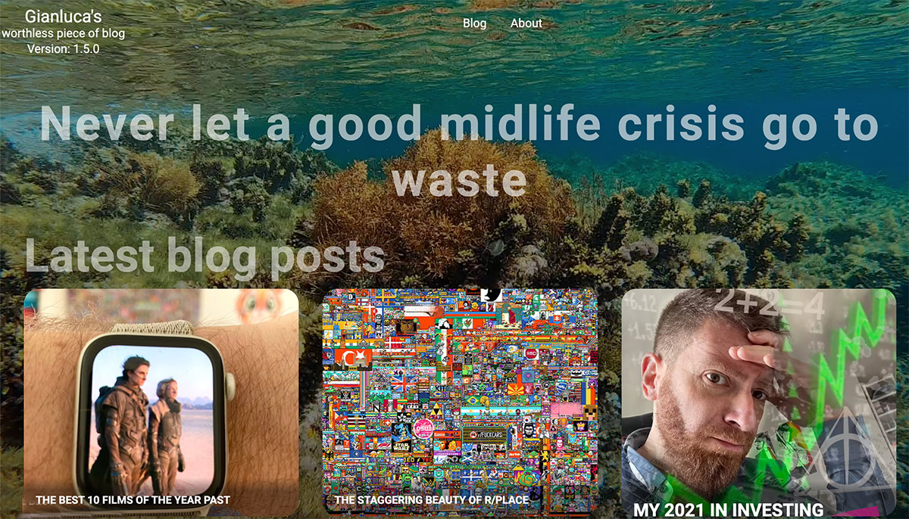
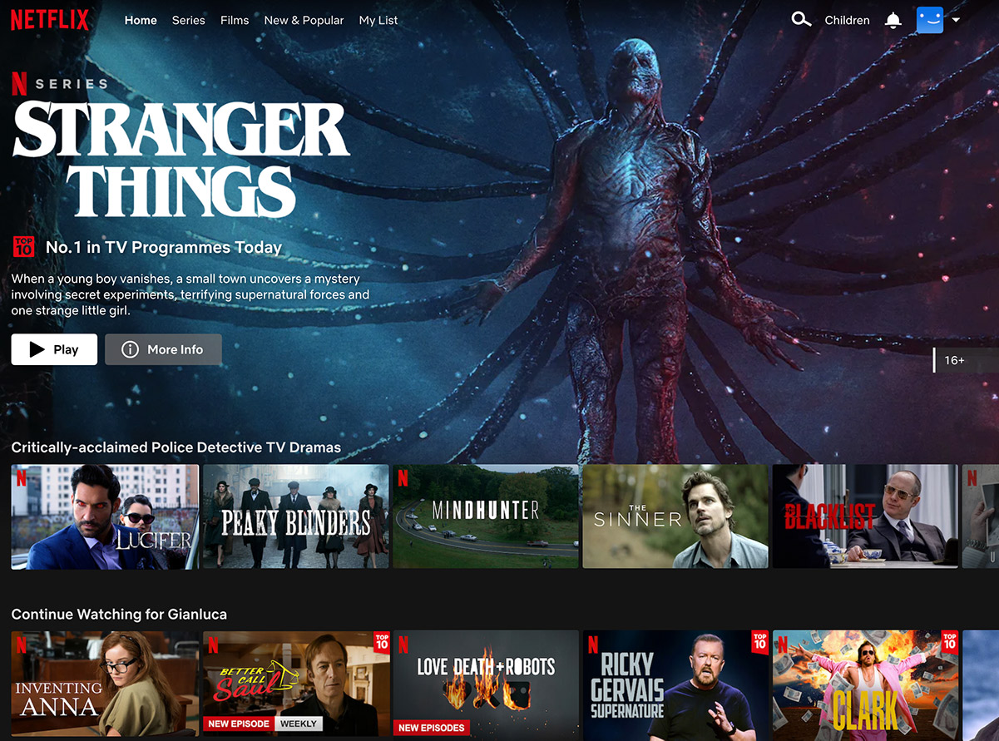
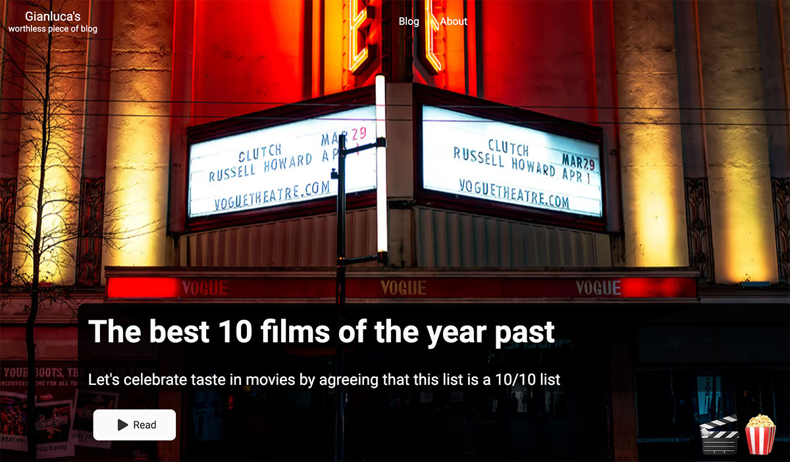

import LinkButton from "../../../components/Button";
import Poll from "../../../components/blog/Poll";
import {FigureLabel, Pony} from "../../../components/blog/Text";

I've been let know that my website is, and I quote, esthetically uneasy on the eyes. Unpleasant to look at. Uncanny valley-y. And don't get me wrong, it's ok for an **amateurish** work, but it's so frustrating as it could have been good with just a little more effort.

Now, in front of this harsh but well worded feedback - so rare these days! - the only thing I could think of is:

<Pony>I need to cut ties with this person. 🦄</Pony>

Then I took a long look at my homepage...



<Pony>Oh my god she's right! 🙀</Pony>

So, after cutting ties with her, I got to work at a radical overhaul of my blog, wielding a glass of wine and unafraid of using it.

## First things first

When **change** is warranted, one must understand why change is needed, otherwise you are going to transform something into something else, and still retain the same problems.

So, what is currently not working on my homepage? Well, it seems to be coming straight from 2003, what with that huge six seconds holiday video on repeat that doesn't even work on mobile, I suspect for battery reasons.

It does have cool animations, and it gives you a glimpse on the latest content I posted, but are you feeling compelled to read a post with such a presentation?

...

It's not a rhetorical question. Please answer...

<Poll id="netflix"
      question="Are you feeling compelled to read a post with such a presentation?"
      answers={["Lmao, no!", "To be honest, not really", "Yes, actually", "You cut ties with me, why should I answer?"]}
      labels={["No 🦄", "No 🙈", "Yes (liar)", "I'm Hitler"]}
/>

So, what should the homepage focus on? Why do people come here? Why would they do that if they can be anywhere else? Why, the content of course!

The witty posts uncovering stories from remote internet corners, the Renaissance, the w. All written with a cute self-deprecating sense of humor. And I'm not saying this, I'm just reading from your dms, at least the parts that I can read without blushing, you silly pervs 🙈

Looking at online avenues where content is King 👑, I soon realized that I needed to turn my blog into Netflix, only with good content!




<FigureLabel>Hot take: I think that <strong>Stranger Things</strong> is pickled garbage.</FigureLabel>


I want you to experience my blog the same way I experience Netflix, that is, scrolling the lists for something to watch to a solid 5 minutes, then resolve to watch for the umpteenth time an illegally downloaded version of **In Bruges**.


<div style="padding-top:47.000%;position:relative;"><iframe src="https://gifer.com/embed/NRVv" width="100%" height="100%" style='position:absolute;top:0;left:0;' frameBorder="0" allowFullScreen></iframe></div><p></p>

## The project

Let's start with a blueprint of what we want to achieve...

<iframe width="650" height="800" src="https://miro.com/app/live-embed/uXjVOxQ3ODY=/?moveToViewport=-788,-625,874,1221" frameBorder="0" scrolling="no" allowFullScreen></iframe>

I see a list of things that need be done:

◼ A simple way of fetching posts, together with all their metadata, so that we can easily create groups

◼ The most recent post must become the featured one, and occupy a solid third of the screen

◼ Several rows of sliders that present posts grouped by different criteria

◼ A transparent header that allows the featured image to be in full display, but that turns black the moment you start scrolling


## Fetching content

This is incredibly easy to achieve, as Gatsby, the framework I'm using on top of React, allows for content querying via GraphQl, which is really weird, which is why I won't show you a query, but also effective.

Suffice to say that, in my code, all I need to do is this:

```javascript copy
const posts = data.allMdx.edges
```

And boom I have all the posts on my palm, ready to be manipulated and grouped as I please. Let's do some of that grouping:

```javascript copy

const posts               = data.allMdx.edges
const featured          = posts[0]
const latest               = [...posts].slice(1, 14)
const caterina           = [...posts].filter(post => containsHashtags(post, 'caterina sforza')).reverse()
const food                 = [...posts].filter(post => containsHashtags(post, 'food', 'coffee', 'diet')).reverse()
const mindfulness   = [...posts].filter(post => containsHashtags(post, 'mindfulness')).reverse()
const randomized    = [...posts].sort(() => Math.random() - 0.5).slice(0, 15)
const chronological = [...posts].reverse()

```

Ok, this only took me a glass of wine to do, but only because when I created my blog, I have been forward-looking and implemented hashtags support even if not needed at the time. Amateurish my ass.

Now that we have the cOnTeNt, let's put it to use on an actual page. Based on the Miro board above, this is all we need...

```jsx copy

<Layout isDark={true}>
    <FeaturedPost post={featured}/>
    <Sliders>
        <NetflixSlider
            title="Latest posts"
            subtitle="The more recent they are, the better written"
            posts={latest}
        />
        <NetflixSlider
            title="On Caterina Sforza"
            subtitle="This pentalogy is quite possibly the piece of writing I'm the most proud of"
            posts={caterina}
        />
        // other sliders omitted...
    </Sliders>
</Layout>

```

## The featured post


```jsx copy

<Wrapper data-aos="fade-up" data-aos-duration="1000">
    <Background image={getImage(content.featureImage)} alt="background" data-aos="fade-up"/>
    <Overlay>
        <Title >{content.title}</Title>
        <SubTitle>{content.subTitle}</SubTitle>
        <Button to={content.path} big={true}>Read</Button>
    </Overlay>
    <Emoji>
        {content.onHover}
    </Emoji>
</Wrapper>
```

### Let's talk about the button

<p></p>


<LinkButton to={""} onHover={"💩💩💩💩💩💩💩"}>Shitty Button</LinkButton>

<p></p>

asd



## The slider

asdsa

It's gonna be fine. You are going to be fine.

```jsx copy
<Container>
    <Header>
        <TitleWrapper>
            <Title data-tip={subtitle} data-place="top">
                {title}
            </Title>
        </TitleWrapper>
        <ProgressBar data-aos="fade-left" data-aos-duration="1000" data-aos-delay="100">
            {Array.from(Array(calculatePages()).keys()).map((elem, index) => {
                return (
                    <ProgressElement key={index} highlighted={elem === sliderIndex}/>
                )
            })}
        </ProgressBar>
    </Header>
    <SliderWrapper>
        <LeftHandle
            disabled={sliderIndex <= 0}
            onClick={e => setSliderIndex(sliderIndex - 1)}>
            <Arrow>
                <BsChevronCompactLeft/>
            </Arrow>
        </LeftHandle>
        <Slider index={sliderIndex}>
            {posts.map((post, index) => {
                const fm = post.node.frontmatter
                let itemsPerScreen = calculateItemsPerScreen(width);
                let isLast = index + 1 === itemsPerScreen
                return (
                    <CardContainer key={fm.path} itemsPerScreen={itemsPerScreen} isLast={isLast}>
                        <NetflixCard
                            cardImage={fm.cardImage}
                            title={fm.title}
                            subTitle={fm.subTitle}
                            date={fm.date}
                            path={fm.path}
                            onHover={fm.onHover}
                            index={index}
                        />
                    </CardContainer>
                )
            })}
        </Slider>
        <RightHandle
            disabled={sliderIndex >= calculatePages() - 1}
            onClick={e => setSliderIndex(sliderIndex + 1)}>
            <Arrow>
                <BsChevronCompactRight/>
            </Arrow>
        </RightHandle>

    </SliderWrapper>
</Container>

```


asd