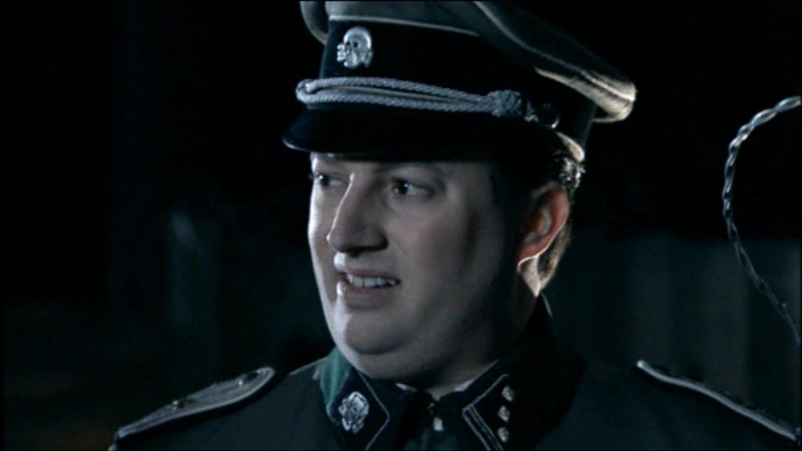

import {FigureLabel, Indented, Pony} from "../../../components/blog/Text";

<Indented>
    <h2>Disclaimer</h2>
</Indented>
<Indented>
    You'll notice that this post is different from the others. This piece is in fact thought as a stand-up monologue to be acted in front of people, and not read. Hence the parts where I talk to "you" or some jokes that don't really make sense in written form.
</Indented>
<Indented>
    There is also a harshness in a few bits like the very final line that does not reflect who I am or the humour that I'm going for in this blog, which is almost entirely self-deprecatory.
</Indented>
<Indented>
    The reason for this is that I'm playing the character of an extremely dumb person who thinks himself smart. And to be fair, it's fun to say some effed up things every once in a while, especially in front of a small audience of slightly intoxicated people.
</Indented>
<Indented>
    With these disclaimers out of the way, I hope you like it!
</Indented>

<FigureLabel>
    Aristotle. Strong pedo vibes.
</FigureLabel>

## On philosophy

So, I’ve been studying philosophy recently. I find that it's essential to know a little about philosophy, and more importantly about **ethics**, because it really helps me feel a better person... than you!

Which matters to me. Incidentally, it’s why I am on this slightly elevated stage talking with you — talking **at** you! — commenting about life, discussing things that inspire me, judging your dates...

And let me tell you, some of you can do so much **better**. You know who you are. And you know what you have to do!

Now, I want to be super clear on this. What I’m suggesting is that you **break up** with your date because they are uglier than you.

## Breaking up

People say that there’s no easy way to break up with someone, and to that I reply **bullshit**. Of course there is an easy way of breaking up with someone, and that’s blaming the other person for **everything**.

But what if they didn’t do anything to warrant a break-up? Well, then invent something!

For instance, suppose that I’m at a restaurant with a girlfriend I want to break up with. Suppose that I’m chewing my food loudly, and she says: “Didn’t your mom teach you good manners?”

Now, that’s an opening for my strike!

I will be like: “No, my mother didn’t teach me good manners. She didn’t have the time. Too busy being a **prostitute** in Hungary to keep her 16 children alive, wasn't she?

I guess she could have done more. I’d be happy to ask her, but I can't, because she died of **Covid**, and today, among all days, is the first anniversary of her death. You know what maybe we shouldn’t see each other anymore!”

Then I break in **tears** and leave the restaurant without paying the bill.

Now, this strategy of blaming the other person for everything is also very useful because, at any moment, I can change my mind. I can call her back and say “Hey, would you like to meet again? I’m... I’d like to try to **forgive you**.”

Because, fun fact about people, they all want to be forgiven. So this is something that you can take advantage of, as **Jesus** did.

<FigureLabel>
    Lmao, busted!
</FigureLabel>

So we date again a few times more, but now at any moment I have an easy way out because I can say: “Look, I’ve tried my best, but every time I see your face, I think about that **toxic** comment you made about my poor mom!”

Then I break in tears and leave the restaurant without paying the bill.

But I digress. What was I talking about? Ah, ethics!

## Ethics

Ethics addresses a question that is as old as people. How **ought** one live?

According to which moral values should we base our existence upon? This is generally not defined via a bunch of rules such as don’t steal, don’t kill, don’t eat sugar after 3 pm.

“But mom! You never let me do anything... stupid whore!”

No, what happens instead is that you find your morality by pondering on how you would react to a series of thought experiments, and among these, the most famous one is the **trolley problem**, which is not about whether you can carry said trolley with you on the flight, because we all know the answer is no, Vanessa. That shit’s huge! Also, not the best way of carrying your Labrador.

Let me explain the trolley problem.

You are crossing a bridge over train tracks when you notice **five people** tied to the tracks. On the opposite side, a train is approaching fast, so you don’t have time to free them. Next to you, an **obese** person is there just chilling, eating a sandwich.

So, what do you do? You can either do nothing, and let five people die. Or you could gently but firmly push the obese person over the bridge and against the train, making it stop and saving five lives, but at the cost of killing the one guy, who at least died doing what he loved. Eating a **sandwich**.

Side note. The person is not obese out of spite. The thought experiment requires him to be fat so that you don’t choose the so-called **Jesus** option:

<Pony>
    “Oh, I would rather throw myself against the train, and save those five souls!”
</Pony>

No, shut up Vanessa. You are not large enough to stop the train. And also, no you wouldn’t! You would never sacrifice yourself to save others. Actually, you would shoot a **Tik-Tok** of the train mowing down those people, and then you would count the views while pleasuring yourself.

## The choice

Let’s consider the choice. If you do nothing, it means that you believe that the act of killing a person is wrong no matter what the outcome is. This makes you a **Deontologist**, and you belong to the school of Immanuel Kant, which is just his last name. I’m not passing judgement on the guy.

If instead you push the guy, you are a **Consequentialist**. You deem it moral to sacrifice a life if the benefit far outweighs the cost. This makes you belong to the school of Thanos.

“So what’s your ethics platform like mister, uhm, Thanos?”

“Thank you for asking. My entire moral foundation is about getting these six stones, put them on a winter glove, snap my fingers and as a result kill fifty percent of the people. This will solve any sort of problems, really.”

“Ok, let me get this straight. You are saying that you want to bring the world population back to what it was in **1974**, and this will fix things forever?”

“Uh… yes?”

So, Consequentialism, in its purest essence, is kind of bullshit. But what about Deontology?

Well, with Deontology you judge something not by the outcome, but by the act itself, which is either inherently good or bad. This is the **Categorical Imperative** by Immanuel Kant. Again, just his last name.

Let me give you an example: lying is inherently bad, so you must **never** lie. Makes sense, right? But what if nazis ask you if you are hiding any jews?

Ding dong.

“Hello?”

“Good morning. We are nazis— as you can notice from the uniforms and the... uh... swastikas. We were wondering, and feel free to say no, but are you by any chance hiding any jews?”

“Ufffff. Well, yes. Since you are asking. There’s a whole family behind that fake wall. That’s too bad though because I was really fond of them, especially the little girl, always writing on her **diary**.”

“Yeah, no, we understand. Do you mind if we get in and, you know, apprehend them?”

“I mean, sure. Hey, if it’s not too much of a bother, do you mind leaving the diary behind? I was thinking maybe I can publish it? Make some money?”

“Look, we really shouldn’t, but you know what? You can keep it. It’s our way of saying thank you for calling us.”

<FigureLabel>
    Immanuel Kant. Strong pedo vibes.
</FigureLabel>

So yeah that Immanuel guy was also kind of a cunt. But it’s not even his fault, because this shit is hard. Life is **freaking hard**! We all strive to get rules that simplify Life, so that we don’t have to think so much all the time. But rules are weird. They work well until they don’t, and when they don’t, they turn to shit so fast it's ridiculous!

Sure, turning the other cheek is admirable, but what if I am the heavy-weight champion? There, you made me lose the fight. Thank you, **Jesus**!

Of course, killing one person to save five seems **reasonable**, but what if that person is my mom, and I still love her, which means that I don’t want her to die just yet?

And finally, lying to break up with someone is deplorable, but what if I really want to eat at one of those **Michelin** restaurants, and I don’t want to pay the bill?

It seems to me that Life is just a sequence of **shit choices**, with diminishing returns and no chance of winning.

And you know what, that’s ok.

We are not supposed to get good at Life. Where did we even get the idea, a Coca-Cola commercial?

Nowhere is written that we need to become Life experts. We are only supposed to do Life for a bit.

If you think about it, there isn’t even much time to do anything anyway. So watch a movie, order pizza, go out for a walk, and then make yourself a favor and just die.

And this is **philosophy** in a nutshell.

Although, me personally? I would definitely push the guy against the train. But that doesn’t make me a Consequentialist. I just don’t like fat people.