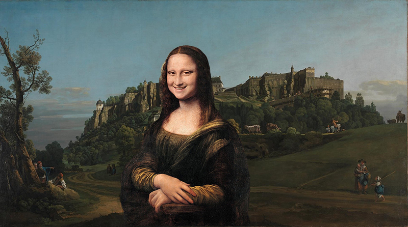
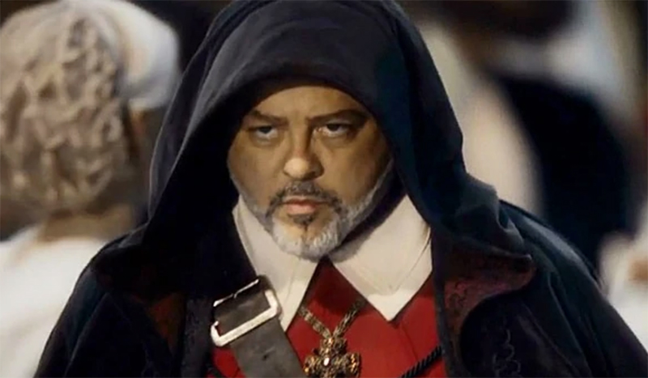
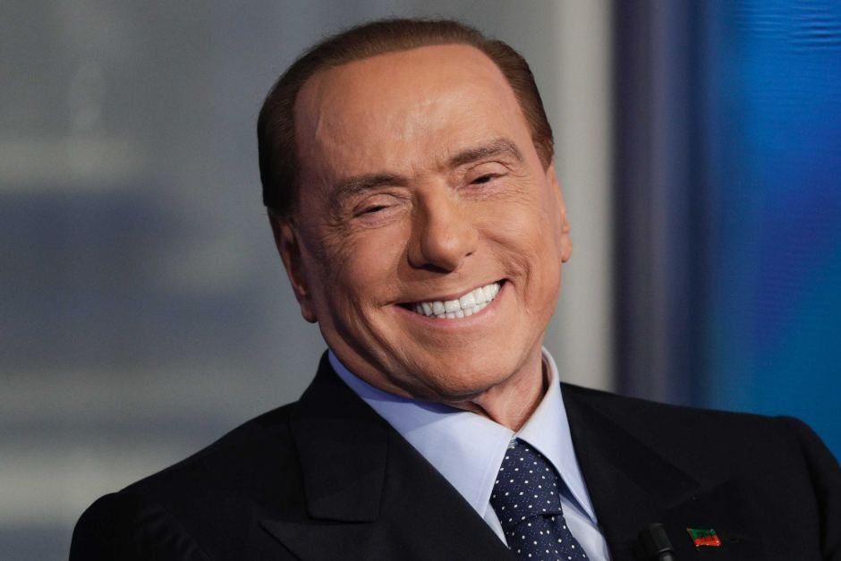
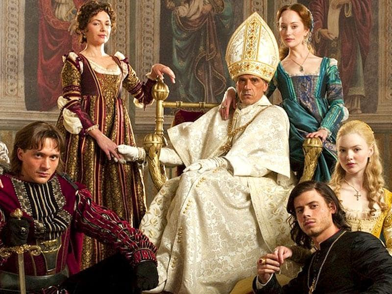
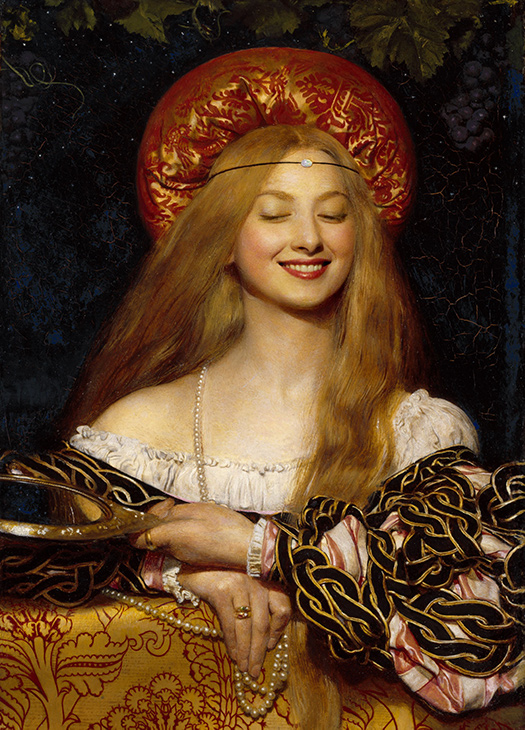
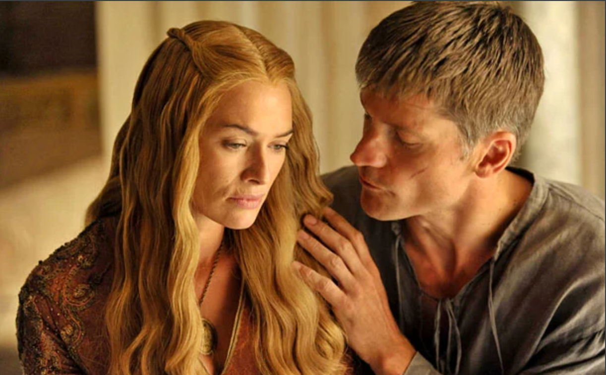
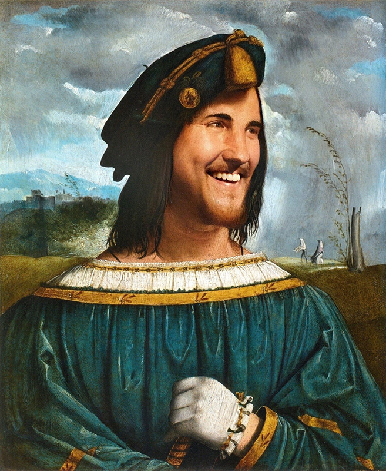
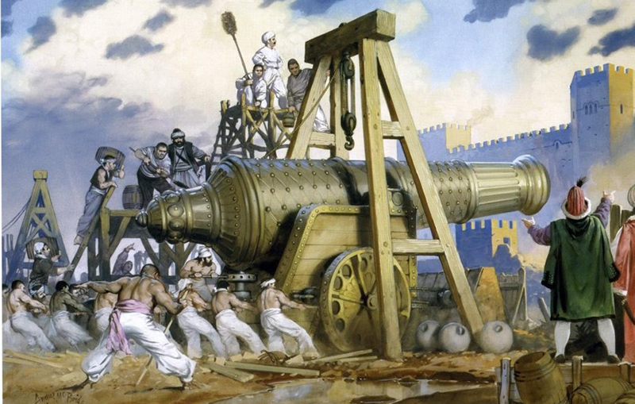
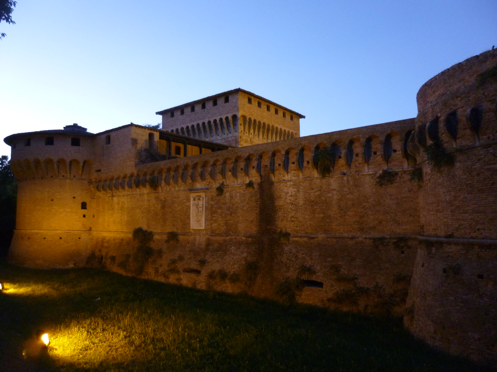

import {Lucrezia, TigressBook} from "../../../components/blog/Grids";

Welcome to the extended finale of this series on Caterina Sforza that started [here](/caterina-sforza-1) and continued [here](/caterina-sforza-2), [here](/caterina-sforza-3), and [here](/caterina-sforza-4)!

Will our heroine survive the threat posed by the Borgia family?

Well, no. She's been dead for **500 years**. But you know what I mean.

Of course, we need to talk about the Borgia, but first let me confess to you that the woman on the cover is not Caterina. I ran out of portraits of her, so I used Leonardo da Vinci's **Lady with an Ermine**, i.e. [Cecilia Gallerani](https://en.wikipedia.org/wiki/Cecilia_Gallerani).

I counted on the fact that you wouldn't notice because you are ignorant. Incidentally, this was the cover I was initially going for...

## Ok let's talk about the Borgia because holy shit

Originally from Valencia, the *Borja* family set root in the boot when Alfons became **Pope Callixtus III**. This was before Caterina's time.

Uncle Pope helped his nephew **Rodrigo** become cardinal at age 27, inventing the term *nepotism*, which is Italian for nephew.

Rodrigo was instrumental in the whole spanish inquisition affair. Among other things, he put to trial 13000 jews that had converted to Christianity, which was particularly mean.

1Plus, he was the final boss in **Assassin's Creed 2**. An easy boss. The parry window was obscenely wide.

<FigureLabel>Rodrigo Borgia and his bitch resting face.</FigureLabel>

When **Pope Innocent XIII** died in 1492, can you guess who replaced him? Why, Rodrigo of course!

So if my math is correct, **House Borgia** had two Popes in their ranks, which is kinda cool. I mean, how many Popes does your family have?

Of course, to achieve this they used bribes, intimidation, and blackmail. On the other hand, **God** operates in mysterious ways, so maybe corruption is one of them?

As **Pope Alexander VI**, Rodrigo captured and hanged all the mob bosses in Rome, which is easy to do if you ignore *habeas corpus*.

But he was also a fun guy. He used to hold parties that involved hiring legions of **prostitutes**. Prizes were given to whoever managed to have sex with the most women.

Kinda reminds me of someone. 🤔

<FigureLabel>Italy's best statesman. <small>(Meant as an insult.)</small></FigureLabel>

As any decent Pope, Rodrigo had several kids from his main wife Vannozza:

1. Giovanni
2. Cesare
3. Lucrezia
4. A fourth son nobody cared about

<FigureLabel>A Borgia never pays his debts.</FigureLabel>

In 1497, Giovanni was murdered. Rodrigo hated love hearing about the death of his **firstborn**, as he had many plans for him.

Cesare was forced to abandon his career as cardinal and take his dead brother's role of commander of the army for **House Borgia**.

An investigation on Giovanni's death was started and then quickly **withdrawn** once all evidence pointed to... Cesare of course. 🙀

## Eyes on Forlì

With the Borgia safely settled in the North of Italy and now also in the center because of the whole **Pope thing**, Rodrigo thought that I would be cool to conquer all the smaller reigns in between. Or, to use his own words, **pacify them**.

This of course included **Forlì**. The Pope proposed a marriage between his daughter Lucrezia and Caterina Sforza's firstborn Ottaviano, who was no longer grounded for having ordered the murder of his mother's husband Giacomo Feo.

(This seems very soap-opera-y, but if you have read the previous chapters, it all makes sense.)

<FigureLabel>Lucrezia Borgia. <Break/> It's hard to tell how much of her story is true and what is the result of malignant gossip. We are choosing whatever is more entertaining because these people suck anyway.</FigureLabel>

Caterina thought that the whole union idea was **super cringe**, since Lucrezia had already been married to her cousin Giovanni sforza. And by the way Giovanni chose to forfeit the marriage and reported that Lucrezia was very close to her brother Cesare. Like, extremely close.

<FigureLabel>You see, Cersei, even the Borgia siblings did it. It's actually not weird at all!</FigureLabel>

Refusing the marriage probably saved Ottaviano's life, as there was a pattern in all of Lucrezia's love affairs.

<TextBox title={"The Borgia's way to riches"}>
    <ThreeColumns>
        <Lucrezia/>
        <Col23>
            <ol>
                <li>Let a nobleman marry Lucrezia, who was hot</li>
                <li>Merge assets between families</li>
                <li>Have Lucrezia kill the husband by poison or - far worse - divorce him with the accusation of being impotent</li>
                <li>Profit</li>
            </ol>
        </Col23>
    </ThreeColumns>
</TextBox>

On the other hand, since he couldn't take Forlì by the means of wedding, the Pope felt compelled to move to **plan B**.

## War

The Pope secured an alliance with France and received an army of 12000 mercenaries, led by **Cesare Borgia**.

In exchange, the French king **Louis XII** would get safe passage to **Naples**, which he really wanted to conquer for reasons that are unfathomable to me.

The army descended to the center of Italy, and let's ignore all the other cities because we have no emotional attachment to them. I mean, who gives a shit about Pesaro? No, our next scenes opens with Cesare's army entering Forlì.

Caterina Sforza was waiting on the walls of **Ravaldino**, as one does.

Cesare approached the castle on a horse, followed by the French. As many before him, he thought that he could seduce Caterina into submission.

<FigureLabel><strong>Fun Fact:</strong> Cesare Borgia was the inspiration for Niccolo' Machiavelli's <strong> The Prince.</strong> To this day, we don't know if the book was written as real advice for regents or as a cautionary tale. Good job, Niccolo'.</FigureLabel>

The Borgia commander spent some time illustrating how it would be cool for everyone if Caterina **surrendered** just like that. From the ramparts, Caterina was like ok let me come down so that we can talk.

The drawbridge was lowered. Caterina reached the outer edge of the moat alone. Cesare dismounted his horse.

"It seems like you have a great army with you," said Caterina. Then she turned the back to her foe. "Come inside. We shall discuss the terms of my surrender."

Cesare was elated by the quick turnaround. He followed Caterina on the drawbridge like Homer Simpson in the Land of Chocolate...

<iframe src="https://i.kym-cdn.com/photos/images/original/001/318/447/ff3.gif" width="100%" height="100%" style="position:absolute" frameBorder="0" class="giphy-embed" allowFullScreen></iframe>

...but a few steps onto the bridge he realized: "Wait a second, this is really dumb!"

He attempted to walk back quickly. In the meantime, Caterina's men had started raising the bridge, and Cesare had to jump his last steps to safety, **ruinously** falling on the ground and humiliating himself in front of the French.

From the closing gate, Caterina had the time to say: "I almost got you, sisterfucker."

Cesare was so pissed that he started shouting the **c-word** at Caterina. Then he promised 1000 Ducats to whomever would capture her.

## The siege of Ravaldino

Castle Ravaldino was considered to be impenetrable, and Caterina had food enough for 4 months of siege, which was more than the money Cesare had to pay for the mercenaries for that amount of time.

On the other hand, Cesare had the newest prototypes in cannon technology, which could shoot projectiles as large as soccer balls.

Caterina also had some of those, albeit smaller one. With a lucky shot, she killed **Costantino Da Bologna**, who was the **Elon Musk** of military technology. The French were devastated by the loss. Caterina's ransom increased to 10000 ducats, which could buy you a bunch of Teslas.

The siege continued for the whole Christmas break of 1499. During daytime, Cesare's cannons carved some holes on the thick walls. During nighttime, Caterina's men fixed the cracks. Rinse/repeat.

During this period, Caterina sent a mail for the Pope, pleading for clemency. But, hear this, people say that she added to the parchment a textile that was owned by someone with the plague. If true, Caterina was the first that sent a mail with a virus in attachment.

On New Year's Day, 42 hooded pilgrims stopped by the siege and asked Cesare if the had safe passage south, as they were headed to Rome. Cesare was like sure. As they walked in front of the castle, Caterina quickly lowered the bridge, they lowered their hoodies and turned out to be soldiers. They entered the castle in support of Caterina.

Cesare must have shouted some very loud "porco dios".

But things started to turn around once the French realized that the south wall was the weak spot. Focusing their cannon balls on that side, not only did they create a widening crack, but the fallen bricks started filling the moat, creating a passage.

<FigureLabel>The southern wall of Ravaldino. We can still see the darker scar where the breach was made. Or at least it looks that way.</FigureLabel>

During nighttime, Caterina ordered all cannons to be positioned by the crack. Come morning, the French started crossing the moat, but Caterina's cannons didn't shoot. Her men started abandoning here to try to save their lives. Caterina and a few true believer fought their way to the keep.

They shut the door, then Caterina shouted from a high window: "You frog eaters can suck my..." then she felt a hand on her shoulder. "Mademoiselle, you are captured now."

Looks like somebody betrayed her and opened the freaking backdoor.

Cesare Borgia was a bit too happy of having captured caterina, at the point that the French captain Yves D'Allegre informed him that Caterina was to be considered a prisoner of Louis XII, and not to be harmed.

But D'Allegre had to continue his march to Naples, so he was forced to leave Caterina in Borgia's hands. So if you are wondering what Cesare Borgia did to her, the answer is, unfortunately, yes.

## Captivity

Cesare held Caterina as his personal pet for months. When he finally brought her to Rome, she was thrown into a jail in Castel Sant'Angelo, the same fort she occupied and menace to blow up a bunch of cardinals.

Caterina was refused to cede the lordship of Forli, which was a condition for her release. Plus, during the siege, she secretly had her children sent to Florence. Since she had married a Medici, Florence gave her kids political asylum.

This angered Cesare even more, as he needed her heir to renounce Forli for his conquest to be finalized.

Caterina knew that, the moment, she would have abdicated from Forli was also the moment she was no longer needed, and was one poisoned meal away from dying. That was the Borgia way.

After more than a year, Yves D'Allegre returned from his expedition to the south and went to Rome as he heard news of Caterina's poor conditions. D'Allegre, and the whole French army, really, admired Caterina Sforza. The commander complained with the Pope about the poor condition of a prisoner that was under the protection of Louis XII.

The Pope told him "convince her to give away Forli and I'll leave her to your protection"

D'Allegre and Caterina had a long conversation at the end of which she accepted the conditions. The French captain ensured that her final meals in Rome were low carb and low poision, then he escorted her to Florence, which accepted her exile and where her kids were.

## Final years

This whole prison time broke Caterina in many ways and she never seeked again to regain Forli, even when a new Pope more friendly toward her could have maybe allowed for it.

But she did fight in court against her late husband's brother to regain custody of Giovanni Jr. her youngest son of 7.

She spent the following 8 years raising Giovanni as a Medici and a Sforza, and passed away in 1509 at age 46, for complications related to tuberculosis and generally having burned the candle from all kinds of sides.

## The legacy of Caterina Sforza

[here](/the-legacy-of-caterina-sforza)

<TextBox title={"Bibliography"}>
    <ThreeColumns>
        <TigressBook/>
        <Col23>
            

                Almost the entirety of the events narrated in this series is taken from Elizabeth Lev's excellent book <a target="_blank" href={"https://www.bookdepository.com/Tigress-Forli-Elizabeth-Lev/9780547844169"}>The Tigress of Forlì</a>.
            

            

                If you are fascinated by the period and the characters, I suggest that you read it, as there is so much I left out for these posts.
            

            

                Of course, the mistakes are all mine.
            

        </Col23>
    </ThreeColumns>
</TextBox>
