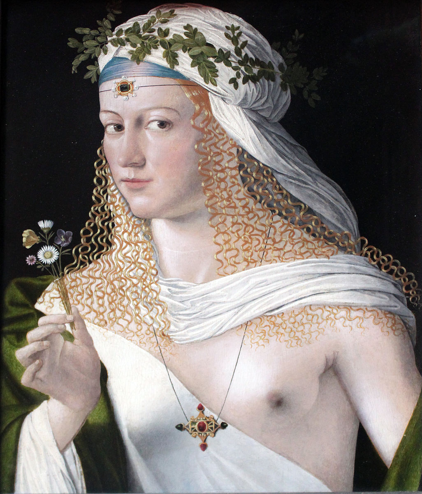
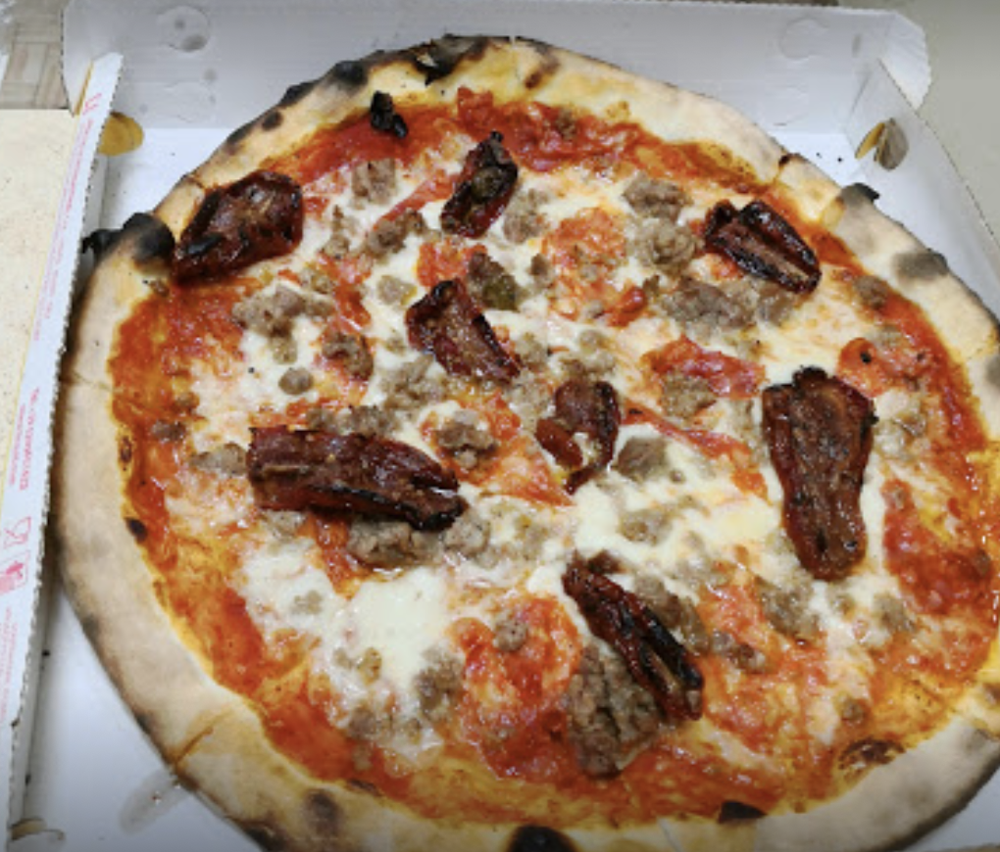

Welcome to this private and exclusive room where we discuss the legacy of Caterina Sforza.

There are only two ways you could have unlocked this entry:

1. You have followed Caterina's tale from his [inception](/caterina-sforza-1) until [the end](/caterina-sforza-1).

2. You have googled "clown porn" and are deeply dissatisfied with the results

Ok, cool. I promised you closure, and closure you will get. So, what happened to the supporting cast?

## Rodrigo Borgia

In 1503, two years after Caterina's release, Rodrigo and Cesare attended a dinner party at Cardinal Cornetto's, whom it was rumored they wanted dead. Right after the party they and the cardinal fell ill. Did they poison themselves by mistake? We don't know, but it would be a fitting end, wouldn't it? Ok fine let's say they did! 🥳

Doctors did all they could to save them, and by "all they could" I mean they bled him with leeches.

That helped younger Cesare, but for Rodrigo they had to move to plan B. Prayer.

Prayer turned out to be as effective as Ivermectin, and Rodrigo couldn't help but die. With the corpse still lukewarm, servants and cardinals alike looted the papal chamber of all the gold and the clown porn.

Rodrigo's body couldn't even be exposed during the funeral, as it became grossly swollen and black. The following Pope, Pius III, forbid any prayer for his predecessor, whom he thought was a Shit Pope.

## Cesare Borgia

Cesare escaped the death that took his father and spent months to recover in Castel Sant'Angelo, the same place where Caterina was imprisoned.

What he could not escape was no longer having a Pope as a daddy. If you think about it, it really helps your career!

The new Pope Pius III was a real nice guy and was favorable to Cesare, but he only reigned 26 days because this is what happens to nice Popes. The newer Pope Julius II didn't like Cesare one bit, and neither did a whole other bunch of people like Ferdinand II from Naples.

Cesare accrued a great many betrayals and lost almost all of his Monopoly buildings. In an attempt to regain the bits of Spain, his homeland, that he lost, he was assaulted, pinched with a spear, stripped naked and left to die. His enemies also removed the leather mask that covered half of his face disfigured by syphilis.

This all happened in 1507, so Caterina was still alive to get the news, which I think it's cute.

## Lucrezia Borgia

After her third husband died, **surely of natural causes**, Lucrezia attempted an unsuccessful career in clown porn.

She had several lovers, and the poet Lord Byron, who read her lover letters centuries later, thought that they were chef kiss.

She finally passed away in 1519 for complications of her 10th pregnancy, as was customary at the time.

<FigureLabel>Lucrezia and her mono-bra.</FigureLabel>

## Niccolo' Machiavelli

Throughout his whole life, Machiavelli has had intense Little Finger vibes.

He famously distrusted mercanaries because he felt they didn't have skin in the game. With an army of farmers at his command, he successfully defeated Pisa, which reminds me...

Following a series of shit decisions by the Medici in their Diminishing Returns phase, he was accused of betrayal, imprisoned and tortured.

Not finding any real proof of wrongdoings, the Medici couldn't admit their bad, and decided to exile him. He died at the age of 58, which was actually pretty good, all things considered.

## Yves D'Allegre

The French captain with a huge crush on Caterina took part on the sack of [Lucca](https://upload.wikimedia.org/wikipedia/commons/thumb/4/4c/Dumpster-non.JPG/220px-Dumpster-non.JPG), for which we must be grateful.

He carried a series of successful assaults to Italian cities but then, during the siege of Ravenna, he saw his son die and, boiling for vengeance like a proper south european, charged into battle too soon and was killed in 1512.

## Forli'

Little known fact, but Forli' is one of the oldest settlements in history, dating from the paleolithic, or 800000 years ago.

After Caterina lost the city, the Pope returned it to the previous owners the Ordelaffi, who did a shit job because it's the Ordelaffi we are talking about.

Then a bunch of stuff happened, and it's suddenly 2022. I'm planning to visit the City, and walk the ramparts of Ravaldino, but hen i google "best pizza in Forli", I get this piece of shit...

So I really don't know.

## Caterina's kids

### From Girolamo Riario

* Ottaviano

* Cesare

* Bianca

* Sforzino

### From Giacomo Feo:

I actually don't think they had kids.

### From Giovanni de Medici
* Giovanni di Giovanni de Medici <AiTwotonePushpin/>

## Ok let's talk about Giovanni <AiTwotonePushpin/>

Giovanni dalle Bande Nere (John of the Black Bands)

Vita, lotta.

Papa Pius III liked him.

Died from the Gout

Julius II

