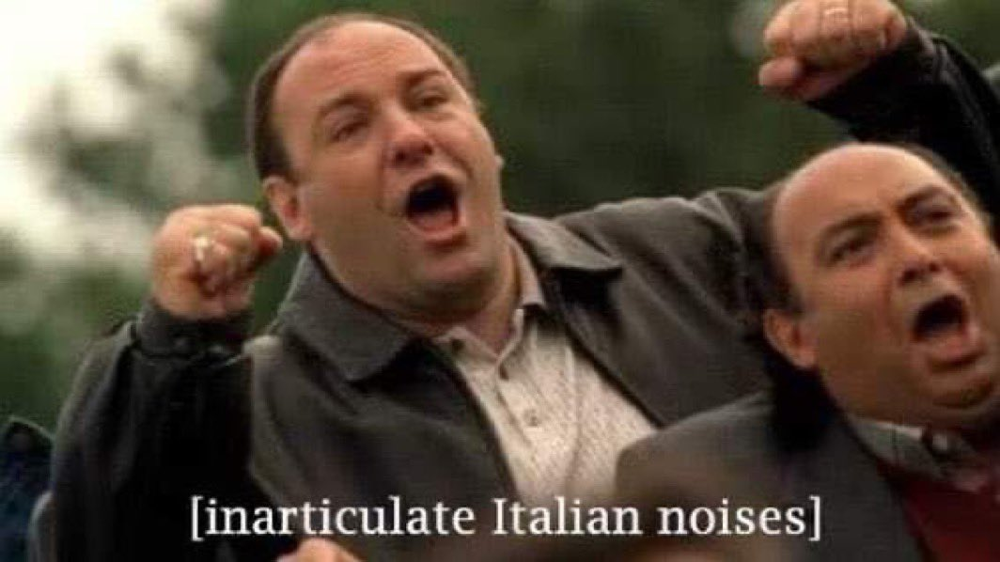
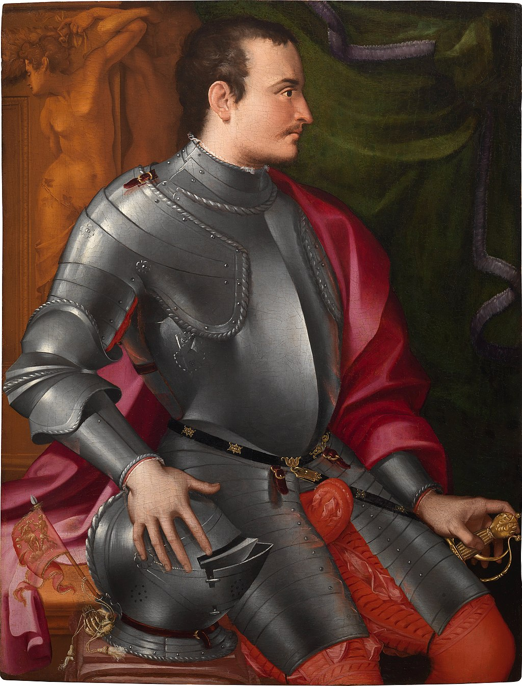

Welcome. You have unlocked an exclusive room where we discuss the legacy of **Caterina Sforza**.

There are only two ways you could have reached this entry:

1. You have followed Caterina's tale from its [inception](/caterina-sforza-1) to [the end](/caterina-sforza-5).

2. You have googled **clown porn** and are deeply dissatisfied with the results

Let's have some closure by looking at what happened to the supporting cast.

## Rodrigo Borgia

In 1503, two years after Caterina's release, Rodrigo and Cesare attended a dinner party at **Cardinal Cornetto's**, whom it was rumored they wanted dead because of course they did.

Right after the party, they fell ill. Did the Borgia poison themselves by mistake? We don't know, but it would be a fitting end, wouldn't it? Ok fine let's say that they did! 🥳

Young Cesare ended up recovering. Rodrigo not so much. Doctors did all they could to save him, and by "all they could" I mean that they covered him with **leeches**.

Since the bleeding surprisingly didn't help, they moved to plan B. **Prayer**.

<YouTube source="lDK9QqIzhwk"/>

Prayer turned out to be as effective as **Ivermectin**, and Rodrigo couldn't help but die. With his corpse still lukewarm, servants and cardinals alike looted the papal chamber of the gold and the clown porn.

Rodrigo's body couldn't even be exposed during the funeral, as it became grossly swollen and black. The following Pope, Pius III, forbid any prayer for his predecessor, whom he thought was a **Shit Pope**.

<iframe src="https://giphy.com/embed/gtakVlnStZUbe" width="100%" height="100%" style="position:absolute" frameBorder="0" class="giphy-embed" allowFullScreen></iframe>

## Cesare Borgia

Even though he escaped the death that took his father, Cesare spent months to recover in **Castel Sant'Angelo**.

What he couldn't escape was no longer having a Pope as a daddy. If you think about it, it really helps your career!

The new Pope **Pius III** was a nice guy and favorable to Cesare, but he only reigned for 26 days because this is what happens to nice Popes. The newer Pope **Julius II** didn't like Cesare one bit, and neither did a whole other bunch of people like **Ferdinand II** from Naples, because of his whole empowering the French to invade his reign.

Out of allies, Cesare accrued a great many betrayals and lost almost all of his **Monopoly** buildings.

<YouTube source="F6H171wgC40"/>

In an attempt to regain the bits of his land in Spain that he lost, Cesare was assaulted, pinched with a spear, stripped naked and left to die. His enemies also removed the **leather mask** that covered half of his face, which was disfigured by syphilis. So it goes.

This all happened in 1507, so Caterina was still alive to receive the news, so that was nice!

## Lucrezia Borgia

After her third husband died, surely of **natural causes**, Lucrezia attempted an unsuccessful career in clown porn.

She had a few more occasional partners and wrote many love letters. The poet **Lord Byron**, had a chance to read them centuries later and thought that they were chef kiss.

She passed away in 1519 for complications during her 10th pregnancy, as was customary at the time.

<FigureLabel>Lucrezia and her boob incident.</FigureLabel>

## Niccolo' Machiavelli

Throughout his whole life, Machiavelli has had intense **Little Finger** vibes.

He famously distrusted mercenaries because he felt they didn't have enough **skin in the game**. With an army of farmers at his command, he successfully defeated Pisa, which reminds me...

What he couldn't defeat was dumb employers. Following a series of dumb decisions taken by the Medici in their Diminishing Returns phase, he was used as a scapegoat and accused of **betrayal**, then imprisoned and tortured.

Not finding any real proof of wrongdoings, the Medici couldn't admit their bad, and decided to **exile** him. He died at the age of 58, which was actually pretty good, all things considered.

## Yves D'Allegre

The French captain with a huge crush on Caterina took part on the sack of [Lucca](https://upload.wikimedia.org/wikipedia/commons/thumb/4/4c/Dumpster-non.JPG/220px-Dumpster-non.JPG), for which we must be grateful.

He carried more successful assaults to Italian cities but, during the siege of **Ravenna**, he saw his own son die and, boiling with rage like a proper south european, he charged into battle too soon and was killed in 1512.

## Forlì

Little known fact, but Forlì is one of the oldest settlements in history, dating to the **paleolithic**, or 800 thousand years ago.

After Caterina lost the city, the Pope returned it to the previous owners the **Ordelaffi**, who did a terrible job. Classic Ordelaffi. Then a bunch of stuff happened, everyone got distracted for a hot minute, and it's suddenly 2022.

I'm planning to visit the city, walk the main square where Girolamo's body was torn to pieces, rest in the orchard where **Tommaso Feo** became extremely horny, pee from the ramparts of Ravaldino.

But when I google "best pizza in Forli", I get this piece of shit...

So I really don't know.

## Caterina's kids

Caterina had many kids, as was customary at the time. What happened to them? Didn't I say that at least one was really cool? Let's go through them...

### From Girolamo Riario

### Ottaviano

Caterina's firstborn had his stepfather killed, which was frowned upon even at the time. He was a mildly successful, albeit underpaid, army captain, employed by Florence to defeat Pisa.

As he grew older, he became morbidly obese and thought that clergy life was best for him.

### Cesare

Cesare was probably as terrible as his older brother, but he didn't kill any stepdads, so he had that going for him.

As Ottaviano, he seeked employment in the Church and became bishop of Pisa, the same city that his brother defeated. And no we are not posting that Pisa image again because we have already reached the limit on the **rule of three**.

### Bianca

Bianca was actually cool. The day his father Girolamo was killed by the **Orsi** 🧸, as she was taken hostage together with her mother, one of the captors groped her. She reacted by kicking the groin of his molester. The guy was later nicknamed "lo spallato". The unballed.

During Caterina's captivity, she became a surrogate mother for his little brother Giovanni Jr.  <AiTwotonePushpin/>

Because of this, she married very late at age 22, but she found a good nobleman from Parma, who definitely had a weird pronunciation of the letter R, as all people from Parma have.

### Sforzino

His nickname literally meant "little Sforza", and at least 50% of it turned out to be true. As his brothers, he chose a career in God, and became the bishop of Lucca. **Ouch**.

## From Giacomo Feo:

I want go out on a limb here and say that they didn't have kids of any consequence.

## From Giovanni de Medici

### Giovanni di Giovanni de Medici <AiTwotonePushpin/>

Ok let's talk about the coolest son.

After her imprisonment, Caterina raised Giovanni both in the arts of the pen and the sword. He proved to be way more interested in the latter.

The newly nominated Pope **Pius III** was a Medici, and wow these families really took turns, didn't they? The Pope admired Giovanni's spirit and made him captain of a platoon of a few hundred men.

After Caterina's death, Giovanni was adopted by the Medici family. He fell in love and married his stepsister Maria Salviati, whose grandad was the late **Lorenzo the Magnificent**. So yeah this was really cute but also cringe because of the whole inbreeding thing. They had a son, Cosimo.

Giovanni was a captain like no others. Usually, captains stay away from the center of the battle and dress differently from the other soldiers. They do this to stand out, as there is value in capturing captains alive and then ransom them.

Giovanni thought himself no superior to his men. He dressed the same and was the first to charge. For Frodo.

<iframe src="https://giphy.com/embed/VqleJG2rBop7W" width="100%" height="100%" style="position:absolute" frameBorder="0" class="giphy-embed" allowFullScreen></iframe>

He gained many victories and was beloved by his men. Allies and foes called him by the decoration on his shield: **Giovanni dalle Bande Nere**, or John of the Black Bands, as he was internationally known.

As mentioned, **Pius III** died after only 26 days into his papacy because of the gout. He was a Medici after all.

His successor **Julius II** was also a Medici because, come on, 26 days is nothing. We need one Pope more!

Julius II descended from Giuliano de Medici, the brother of Lorenzo the Magnificent that died when killers went all stabby-stabby on him, courtesy by the Pazzi and Girolamio Riario. [Do you remember](/caterina-sforza-1)?

In the meantime, the city state of Florence had disintegrated and there was a pull to create a **Duchy of Tuscany**. Now, who could be selected as Duke? Why, a Medici! But which one? Well, there were three legit candidates:

1. Some guy whose name I can't remember. Let's call him **Mimmo**

2. **Giovanni dalle Bande Nere**, stormborn, first of his name, son of Giovanni the Gout Ridden, son of Caterina Sforza the Tigress of Forlì, husband to the niece of The Magnificent, great unifier of the two Medici branches, kinda cute

3. **Alexander de Medici**, son of the Pope

Now, can you guess which one Julius II preferred?

To ensure his son to be picked, the Pope had to get rid of the other two candidates. Mimmo was easy. The Pope was like: "Mimmo, you're a cardinal now."

"Oh, am I?"

"Yes. The cardinal of... let's say Hungary. You leave tomorrow!"

"Wait, is Hungary even a real place?"

"Only one way to find out!"

Eliminating Giovanni was harder, as he was extremely popular. Actually, scrap that. It was super easy. The Pope simply gave Giovanni's army assignment after assignment until the inevitable was bound to happen. Giovanni was shot in the leg. He himself held the candle for the surgeon that cut the leg out, but it didn't help and Giovanni died at age 28.

Alexander was then chosen as Duke, but he did such a terrible job that the Tuscans went all stabby-stabby on him like 15 minutes later.

In response to that, Cosimo, Giovann's son and Caterina's Sforza's nephew and legacy, became the first beloved Grand Duke of Tuscany.

## The End

So, why talk about Caterina Sforza now? What is it in her life that makes it relevant today?

As for many others, 2021 has been a difficult year for me. Still, I feel like 2021 has been better than 2020, which on the other hand was a significant improvement from 2019. Fuck 2019!

What helped me was books. And clown porn. I gave myself the steep goal of reading 52 books a year both in 2020 and 2021 (post coming soon!), and among these 103 works of knowledge and the first Harry Potter, Elizabeth Lev's biography of Caterina is what really stuck with me. I feel like we all can learn from this woman that just doesn't give a shit, that mocks you from the ramparts, that uses all of her skills and then some, that murders 38 people on a whim. Maybe not the last one.

If these last two years have seen a progression, it's in part thanks to books
