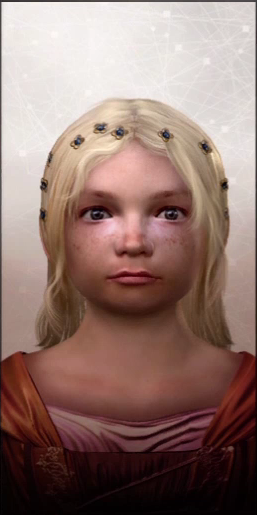

Welcome. You have unlocked an exclusive room where we discuss the legacy of Caterina Sforza.

There are only two ways you could have reached this entry:

1. You have followed Caterina's tale from its [inception](/caterina-sforza-1) until [the end](/caterina-sforza-5).

2. You have googled "clown porn" and are deeply dissatisfied with the results

Ok, cool. I have promised you closure, and closure you will get. Let's start with what happened to the supporting cast.

## Rodrigo Borgia

In 1503, two years after Caterina's release, Rodrigo and Cesare attended a dinner party at **Cardinal Cornetto's**, whom it was rumored they wanted dead.

Right after the party, they and the cardinal fell ill. Did the Borgia poison themselves by mistake? We don't know, but it would be a fitting end, wouldn't it? Ok fine let's say they did! 🥳

Young Cesare finally recovered. Rodrigo not so much. Doctors did all they could to save him, and by "all they could" I mean that they covered him with **leeches**.

Since the bleeding surprisingly didn't help, they moved to plan B. **Prayer**.

<YouTube source="lDK9QqIzhwk"/>

Prayer turned out to be as effective as **Ivermectin**, and Rodrigo couldn't help but die. With the corpse still lukewarm, servants and cardinals looted the papal chamber of all the gold and the clown porn.

Rodrigo's body couldn't even be exposed during the funeral, as it became grossly swollen and black. The following Pope, Pius III, forbid any prayer for his predecessor, whom he thought was a **Shit Pope**.

## Cesare Borgia

Even though he escaped the death that took his father, Cesare spent months to recover in **Castel Sant'Angelo**, the same place where Caterina was imprisoned.

What he could not escape was no longer having a Pope as a daddy. If you think about it, it really helps your career!

The new Pope **Pius III** was a real nice guy and was favorable to Cesare, but he only reigned for 26 days because this is what happens to nice Popes. The newer Pope **Julius II** didn't like Cesare one bit, and neither did a whole other bunch of people like **Ferdinand II** from Naples.

Out of powerful friends, Cesare accrued a great many betrayals and lost almost all of his **Monopoly** buildings.

<YouTube source="F6H171wgC40"/>

In an attempt to regain the bits of his homeland Spain that he lost, he was assaulted, pinched with a spear, stripped naked and left to die. His enemies also removed the **leather mask** that covered half of his face, which was disfigured by syphilis. So it goes.

This all happened in 1507, so Caterina was still alive to get the news, which I think it's cute.

## Lucrezia Borgia

After her third husband died, **surely of natural causes**, Lucrezia attempted an unsuccessful career in clown porn.

She had a few more partners, and the poet **Lord Byron**, who read her love letters centuries later, thought that they were chef kiss.

She finally passed away in 1519 for complications during her 10th pregnancy, as was customary at the time.

<FigureLabel>Lucrezia and her boob incident.</FigureLabel>

## Niccolo' Machiavelli

Throughout his whole life, Machiavelli has had intense **Little Finger** vibes.

He famously distrusted mercenaries because he felt they didn't have **skin in the game**. With an army of farmers at his command, he successfully defeated Pisa, which reminds me...

Following a series of shit decisions by the Medici in their Diminishing Returns phase, he was accused of **betrayal**, imprisoned and tortured.

Not finding any real proof of wrongdoings, the Medici couldn't admit their bad, and decided to **exile** him. He died at the age of 58, which was actually pretty good, all things considered.

## Yves D'Allegre

The French captain with a huge crush on Caterina took part on the sack of [Lucca](https://upload.wikimedia.org/wikipedia/commons/thumb/4/4c/Dumpster-non.JPG/220px-Dumpster-non.JPG), for which we must be grateful.

He carried a series of successful assaults to Italian cities but then, during the siege of **Ravenna**, he saw his son die and, boiling with rage like a proper south european, he charged into battle too soon and was killed in 1512.

## Forlì

Little known fact, but Forlì is one of the oldest settlements in history, dating to the **paleolithic**, or 800 thousand years ago.

After Caterina lost the city, the Pope returned it to the previous owners the **Ordelaffi**, who did a terrible job because it's the Ordelaffi we are talking about.

Then a bunch of stuff happened, everyone got distracted for a hot minute, and it's suddenly 2022.

I'm planning to visit the City, see the main Square where Girolamo's body was torn to pieces, walk the ramparts of Ravaldino. But when I google "best pizza in Forli", I get this piece of shit...

So I really don't know.

## Caterina's kids

Caterina had many kids, as was customary at the time. What happened to them? Didn't I say that at least one was really cool? Let's enumerate them...

### From Girolamo Riario

### Ottaviano

Caterina' firstborn had his stepfather killed, which was frowned upon even at the time. He was a mildly successful, albeit underpaid, army captain, employed by Florence to defeat Pisa.

As he grew older, he became morbidly obese, and chose that clergy life was best for him.

### Cesare

Cesare was probably as terrible as his older brother, but he didn't kill any stepdads, so he had that going for him.

As Ottaviano, he chose employment in the Church and became Bishop of Pisa, the same city that his brother defeated. And no we are not posting that Pisa image again because we already reached capacity for the rule of three.

### Bianca

Bianca was actually cool. The day his father Girolamo was killed by the Orsi 🧸, she and her mother where captured, and one of the captors groped her. She reacted by kicking his captor's groin. The guy was later nicknamed "lo spallato". The unballed.

During Caterina's captivity, she became surrogate mother for his little brother Giovanni Jr.  <AiTwotonePushpin/>

Because of this, she married very late at age 22, but she found a good nobleman from Parma, who probably had a weird pronunciation of the letter R, as all people from Parma have.

### Sforzino

His nickname literally meant "little Sforza", and at least 50% of it turned out to be true.

As his bros, he chose a career in God, and became the bishop of Lucca. Ouch.

## From Giacomo Feo:

I wanna go out on a limb here and say that they didn't have kids of any consequence.

## From Giovanni de Medici

### Giovanni di Giovanni de Medici <AiTwotonePushpin/>

Ok let's talk about Giovanni <AiTwotonePushpin/>

Giovanni dalle Bande Nere (John of the Black Bands)

Vita, lotta.

Papa Pius III liked him.

Died from the Gout

Julius II

