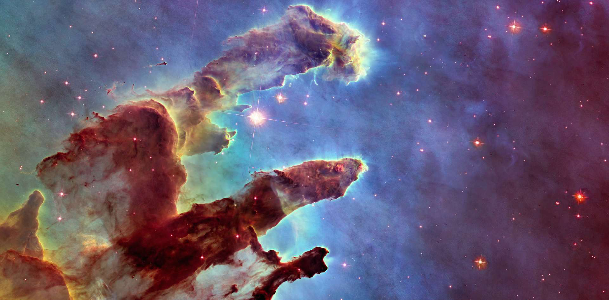
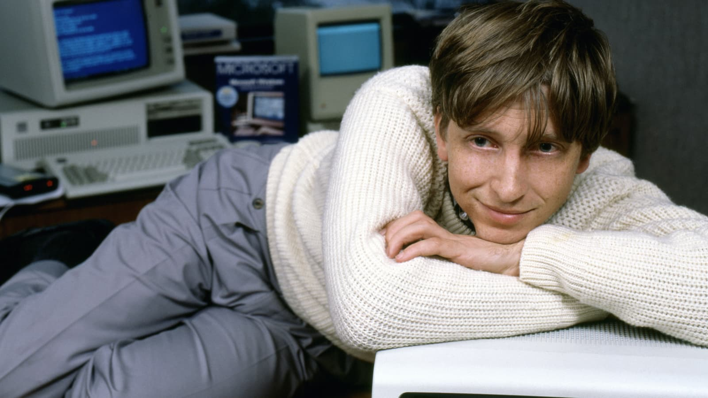
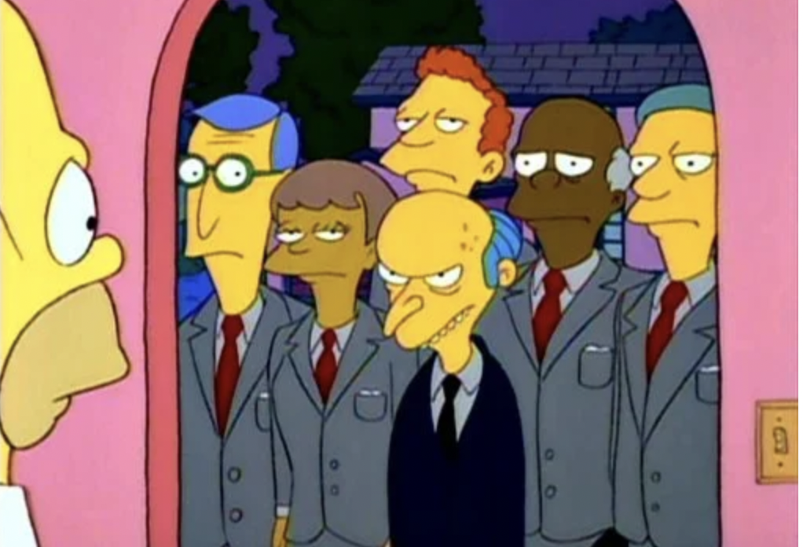
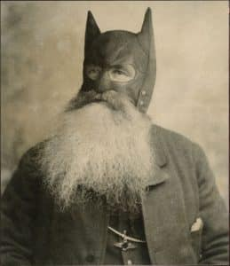
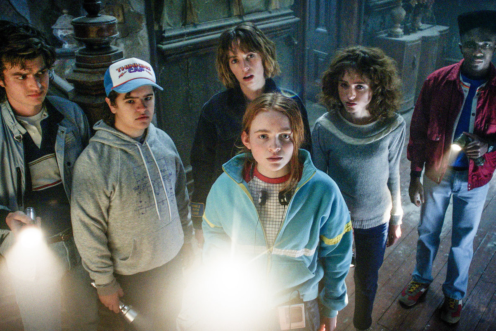

import {FigureLabel} from "../../../components/blog/Text";
import {Listen} from "../../../components/blog/YouTubeAudio";
import Quote from "../../../components/blog/Quote";
import Nsfw from "../../../components/blog/Nsfw";

I love taking showers.

First, they keep you clean, which is important now more than ever. Plus, they allow you to spend some **quality** time with the person that likes you the most, yourself!

I use showers as an opportunity to ease on the reins of the day-to-day grind, and get loose and lost in thoughts I would otherwise never have. Hands down the best 45 minutes of my day.

Sometimes, these ideas are the inception for a bigger project. Other times, they are collected back in the drain where they belong. I'd like to share some that are in the limbo between those two states.

<small>
    <strong>Warning</strong>: this post contains an <strong>NSFW</strong> picture of myself. It's hidden behind a spoiler tag,
    which technically makes the post SFW if you manage to resist the urge of revealing the content,
    but I'm not sure you can.
</small>

<iframe src="https://giphy.com/embed/6ra84Uso2hoir3YCgb" width="100%" height="100%" style="position:absolute" frameBorder="0" class="giphy-embed" allowFullScreen></iframe>

Let's start small...

## The Universe

The Universe is 13.8 billion years old. Let me repeat it for effect. **13.8 billion** years. And that's last time I checked, so it's probably 14 by now.

It's fair to say that the Universe is quite big, but have you ever stopped considering how much **stuff** is in it?

<FigureLabel>A detail of the Universe.</FigureLabel>

Well, the number of **atoms** in the Universe is 1082, or a hundred billion billion billion billion billion billion billion billion billion, give or take.

Now, this might seem like a lot, but do we need more? I ask because we always think that we have **enough**. Enough wine, enough cheese, enough energy, enough time, enough love. Until we don't.

In 1991, **Bill Gates** said that 640 kilobytes of RAM are more than anyone will ever need. Today, my 32 gigabytes beg to disagree, being all sweaty-spaghetti while editing a holiday video.

I hope that we can make do with 1082 atoms, because that's all we get. It's not like we can open up the Universe and add more as we do with RAM.

Seems like the Universe is an **Apple** product.

<FigureLabel>
    Stupid sexy Gates. By the way, he denies ever commenting about 640KB of RAM, but how can we trust a guy that is
    putting vaccines in our 5G?
</FigureLabel>

## There are too many songs

I feel like I'm not alone in thinking that there are way too many songs.

We are already struggling with the ones we have, and more are released every day. This is untenable. And the thing is we don't need this many!

Let me clarify, I **love** music. I listen to it daily, and I strongly believe that songs are the soundtrack of our existence. There are songs that instantly translate into a specific emotion in your brain, and this is, I believe, the solution to limit their proliferation.

Suppose that you are a woman that kisses a girl and ends up liking it, I'm sure there is a song that conveys this feeling. Do we feel like we want more? No, exactly!

Let's make a list of all human emotions and find which song, if any, better represents each of them. When and if we find the song, we close the entry, hereby forbidding the release of new songs on that specific feeling.

Soon, we will have mapped the human brain, which means no more songs! I guess covers are still ok, but super frowned upon.

I know what you are thinking. This is genius. And I have already started the work...

<table>
    <thead>
        <tr>
            <th>Emotion</th>
            <th>Song</th>
        </tr>
    </thead>
    <tbody>
        <tr>
            <td>I love you, can you hurry up and feel the same?</td>
            <td>Beatles - Love me do<Listen url={""}/></td>
        </tr>
        <tr>
            <td>I love you, and when you run out of options, maybe we can date!</td>
            <td>Pulp - Disco 2000<Listen url={""}/></td>
        </tr>
        <tr>
            <td>Ok, gee, we are finally in love!</td>
            <td>Etta James - At Last<Listen url={""}/></td>
        </tr>
        <tr>
            <td>Oh no, you are breaking up with me, aren't you?</td>
            <td>The Righteous Brothers - Unchained Melody<Listen url={""}/></td>
        </tr>
        <tr>
            <td>We are both dickheads, so we kinda deserve each other</td>
            <td>Escape (The Pina Colada Song)<Listen url={""}/></td>
        </tr>
        <tr>
            <td>War is bad because I'm in it</td>
            <td>Alice in Chains - Rooster<Listen url={""}/></td>
        </tr>
        <tr>
            <td>War is cool because I'm not in it</td>
            <td>Elvis Costello - Oliver's Army<Listen url={""}/></td>
        </tr>
        <tr>
            <td>War is bad overall</td>
            <td>Pink Floyd - Us and Them<Listen url={""}/></td>
        </tr>
        <tr>
            <td>I'm not particularly good at anything, and I'm not ok with this</td>
            <td>Radiohead - Creep <Listen url={"https://www.youtube.com/watch?v=XFkzRNyygfk"}/></td>
        </tr>
        <tr>
            <td>I'm not particularly good at anything, and I'm ok with this</td>
            <td>Beck - Loser <Listen url={""}/></td>
        </tr>
        <tr>
            <td>I've got the feeling that tonight is going to be a good night</td>
            <td>No song yet<Listen url={""}/></td>
        </tr>
    </tbody>
</table>

You will notice that the list is largely incomplete. That's because humans are complex creatures, and I need more showers. (My armpits are nodding.) But you can also contribute by submitting a pull request here.

One welcome side effect is that we are, in fact, mapping human **emotions**.

So, if you have a funny feeling that you can't explain, do check this list. If it's not present, you should immediately **cease and desist** from feeling that feeling. We don't want more songs, thank you very much.

<FigureLabel>"We have received a report of a new feeling"</FigureLabel>

## Bruce Wayne

I was today years old, all busy taking a shower, when I realized that **Bruce Wayne** cannot really grow a beard.

Because the moment he does, well then Batman will also have the same beard, and people will be like “Wait a minute!”

<FigureLabel>As if his chin couldn't look more like a scrotum.</FigureLabel>

## I don't have to put up with any of this

Since I was a kid, I've always had a high amount of moles scattered throughout my body. What us gingers lack in Soul, we compensate with moles.

This has been a significant psychological issue for me. Was I ever bullied for it? Not even once. Did I as a kid pre-bully myself into avoiding activities that required me to be in a shared changing room in anticipation of a bullying that never took place? Yep!

That was, in retrospect, a mistake that made me miss out on so many formative experiences. 🙈

<FigureLabel>
    Like, I never went solving mysteries on my bike with friends in a nostalgia-ridden eighties setting. Nor, for that matter, ever took part in anything similar to the ending of the <strong>IT</strong> novel in the sewers. 😳
</FigureLabel>

With time, wisdom prevailed. I just stopped making it such a big deal. I was also blessed by partners that never seemed to mind, so that helped a lot.

Then, in early 2022, I recall taking a shower, looking at my body and thinking wow, I have certainly come a long way since I was young. I have developed the knowledge that these things don't matter.

But here's the thing about knowledge...

<Quote title={"Quote"} from={"Yuval Noah Harari"}>
    Knowledge that does not change behaviour is useless. But knowledge that changes behaviour quickly loses its relevance.
</Quote>

Now that the lesson is **learned**, I don't have to put up with any of this! This shit can be fixed!

With this epiphany, I select the five moles I like the least: James, Matthew, Susan, Ralph, and Bruno, (Yes, I have named them. You don't?) then I book an appointment for a laser surgery.

The receptionist welcomes me in, and I'm about to tell her about James, Matthew, Susan, Ralph, and Bruno, when I have another **revelation**. I don't have to put up with any of this! Like, anything at all!

"You know what?" I tell the receptionist. "Let's take a more **radical** approach. Let's nuke from orbit!"

She doesn't understand the reference, so she's not the one. I clarify.

"Let's get rid of all of them. At least those on the front torso. Next year, we take out the ones on the back, then we do legs and arms, and if at the tail end of this I don't get a complimentary anal bleaching, I'm gonna be real pissed!"

"Ok, we can do this," she replies. "But it's going to be expensive and excruciatingly painful."

"Coincidentally, my middle name is Expensive and Excruciatingly Painful." My mom could not be persuaded with any other option.

I enter the room where the laser operator shoots up people for money. The laser operator is **hot** and does not speak the language of the colonizer.

It's time for me to look less like a dalmatian and more like Fist of the North Star meets rapper 50 Cent. Here is the result after the first year of sessions. Warning NSFW.

<Nsfw>
    <FigureLabel>Wait, NSFW means Not Sexy For Women, right?</FigureLabel>
</Nsfw>

During one of the last sessions around February, the laser operator tells me: "It's important that you don't expose the affected area to the sun". She says this in Swedish, which I understand. 🥳

I'm like "Sure thing. But, hum, what about in August? Can I suntan by then?" I say this in Swedish, which she understands. 🎊

In response, she open mouth laughs at me in Swedish, which I understand. 😭 "More like August next year, lmao!"

So here I am, surrounded by naked people and sporting an SPF protection of plus infinity, also called cloth.

So if I were to add a corollary to the moral prescription "I don't have to put up with any of this," it would be something like "But maybe check the consequences first, you piece of sh🦄."

## Post credits

To complete the anecdote, a couple of weeks after the procedure, I share a moment of **hygge** with a person. She notices the markings and asks me about them.

"Oh, these?" I reply. "I pay a dominatrix to visit me twice a month and apply cigarette burns to my body. It's the only time I feel alive."

That instantly marked the end of the hygge. Let's just say that my sense of humor is more of an acquired taste.

## Bruce Wayne (reprise)

Something about Bruce Wayne has been bugging me for a long time, and I think I can now put my finger on what it is. Have you noticed how Bruce Wayne always shows up at galas with a different date, but he’s never in a relationship?

And we are talking about stunningly attractive supermodels. But Bruce does not seem to be interested in them, and I get it, because this is all a pantomime. Bruce Wayne is the mask. He's playing a character who acts like a less problematic version of Leonardo di Caprio. He does that to protect his real identity, of a utility belt wearer vigilante.

But then, does he lie to these women?

Does he ask them out, being all flirty-flirty, have them fall in love, and then dump them? This seems extremely out of character, which is why I have developed the theory that, for these events, Bruce Wayne hires prostitutes.

Granted, this goes way deeper, because any decent journalist would easily run a background check and reach the conclusion that Roxy is not really a debutante.

No, there must be a carefully executed operation behind, where said prostitutes are hired years in advance. They are paid laser surgeries to remove their tattoos. They are sent to college. Fake documents are forged, accents are crafted through speaking and acting classes, and strings are pulled for them to have a career as actors, models, or nuclear scientists.

This is something that must take a lot of time and resources to accomplish, and I can imagine that the whole initiative is being led by Alfred.

So, when a subject is ready, she is activated, and gets to date Bruce Wayne for a few nights while the paparazzi take pictures.

I don’t even think that he has sex with them. He doesn’t strike me as that kind of guy. Though I’m not sure about Alfred.

## Solving Chess

When a game is left to the last 7 pieces, Chess is a solved problem.

The way Chess is solved is that we have calculated all the possible move sequences with any 7 pieces left, in any position on the board. So this is not an AI thing. We just know the optimal moves. Sometimes the sequences are weird and unintuitive, but it doesn't matter, because they will lead you to victory, provided that you have downloaded and committed to memory the 140 terabytes archive that lists them all

So, what if we add a piece? Can we solve chess when it's down to any last 8 pieces? Of course we can, but we need to pay around 5 million dollars per year in cloud storage.

With this in mind, can we solve Chess? Can we map all possible combination for 32 pieces, and hence be done with this sport and leave a bunch Russians out of job?

Unfortunately, it's not possible. We cannot build the flash storage that contains all the permutations because there aren't enough atoms in the Universe.

I told you we were going to run out of them!