import {ResponsiveEmbed} from "../../../components/blog/ResponsiveEmbed";
import {SpicyTake} from "../../../components/blog/Titles";
import {Dialogue, FigureLabel, Indented} from "../../../components/blog/Text";
import TvCard from "../../../components/blog/TvCard";
import YouTube from "../../../components/blog/YouTube";
import BlogImage from "../../../components/blog/BlogImage";

TV shows. Am I right?

These last couple of years must have been the best for the **TV industry**, what with us sitting on our buttocks all day, gas prices making it expensive to drive cars toward destinations, and starving streaming services punching production companies with bags of currency to create new content.

    <iframe src="https://giphy.com/embed/3oKIPa2TdahY8LAAxy" width="100%" height="100%" style="position:absolute"
            frameBorder="0" class="giphy-embed" allowFullScreen></iframe>

As a species, we seem to enjoy binging entire seasons until 3:00 AM on a work day, with **Netflix** politely asking: "Hey, real quick, are you still alive?" 🙊

And I get it. Why **constrain** ourselves with a story that has a beginning, a middle, and an end, that effs off in two hours, when you can tell the same facts by **spreading** them all over eight seasons to maximize consumption?

It's not like we are busy or anything! And the longer we stare into the sea of pixels, the less we ponder about the **emptiness** of our existence.

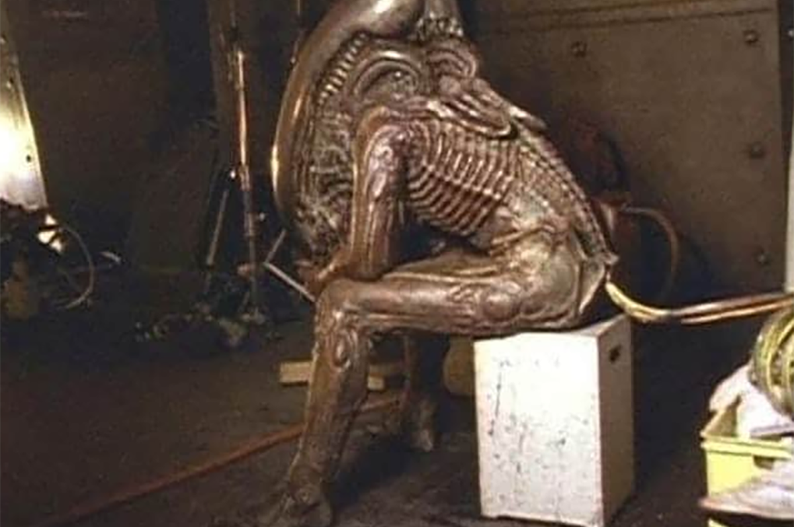

<FigureLabel>Give me the strength to look at my investments...</FigureLabel>

If I come across as **salty**, it's because I am!

I guess I've wasted too many hours on series that over-promised and shit-delivered. If I could get that time back, I would use it to learn to play an instrument, so that I could **seduce** people by the campfire with my sweet guitar skills, instead of **exhausting** them intellectually.

But good TV shows are possible! In this post, I'll share with you five **excellent** series that you should watch in 2022. May my quirky taste in series shine a light!

<Indented>
    
<strong>Important Warning.</strong> This post also contains a <strong>spicy take</strong> on a beloved show that has just wrapped up and that I did not like.

    
I ask you to read my opinions with an open mind.

    
 Initially, you will reject them. You will be mad at me, even. But let that sink in. Take a few thoughtful showers, then admit your <strong>mistakes</strong>, unwatch said program, and apologize by <a target={"_blank"} href={"paypal.me/gianlucabelvisi"}>sending me money</a>.

    <BlogImage imageName={"worst-person"}/>
    <FigureLabel>Heartbreaking: the worst person in the world just made a great point</FigureLabel>
</Indented>

The shows are in no particular order because we are all **adults** here. Although, I did place the ones I like the most at the bottom, for effect, so I guess they are ordered after all. 🤷‍♂️

## The Great

<YouTube source={"1sMrtt7sAR8"}/>
<TvCard seenOn={"Hulu"} seasons={"2"} ongoing={"yes"} emoji={"🤴🏻👸🏼"}/>

Set in **Russia** circa 18th century judging by the dress code, **The Great** follows the occasionally true story of Catherine, trying to overthrow her husband's reign of fear and incompetence, and replace it with her **Enlightenment** inspired reign of fear and incompetence.

<small>(Remember kids, nobility is <strong>cringe</strong>, as they said back then. If at all possible, you should avoid it.)</small>

If the show feels like the **adaptation** of a play, it's because it is. Most of the story takes place in one giant set, the casting is race blind, and the actors speak a mix of modern and *ye olde* English ("Nay means nay!"), instead of the language most commonly used by Russian nobles at the time: French.

Highlight of the whole production is **Nicholas Hoult** having the time of his life portraying a character that can switch from funny goofball to homicidal maniac on a dime, while always managing to be **delightful**.

He is truly a wonder to witness.

<ResponsiveEmbed ratio={"16:9"} src={"https://gfycat.com/ifr/EsteemedMadeupHammerheadshark"}/>

<FigureLabel>Did you get it? Because he was in that film?</FigureLabel>

If you liked **The Favourite**, this is more of that goodness.

(After my immersion in Russian literature [last year](/books-2021), and this show now, it seems to me that Russians are a bunch of interesting folks. I wonder what they are up to these days.)

## For All Mankind

Ronald D Moore has learned the ropes writing for **Star Trek**. Then, for his debut as showrunner, he worked at **Battlestar Galactica**, which had a stupid story and ridiculous characters.

On his following project **For All Mankind**, he must have thought what if this time I write an intelligent story and - hear me out! - compelling characters that have interesting arcs?

This turned out to be an excellent idea...

<YouTube source={"HZS9M52Bd_w"}/>
<TvCard seenOn={"Apple TV+"} seasons={"3"} ongoing={"yes"} emoji={"🚀🌚"}/>

For All Mankind is set in an alternative universe where the **Soviets** have won the race to the Moon. So this is what they are up to these days!

This makes the Americans extremely **butt-hurt** as they go pedal to the metal into the space program, instead of getting bored with rocket launches as in our own darker timeline.

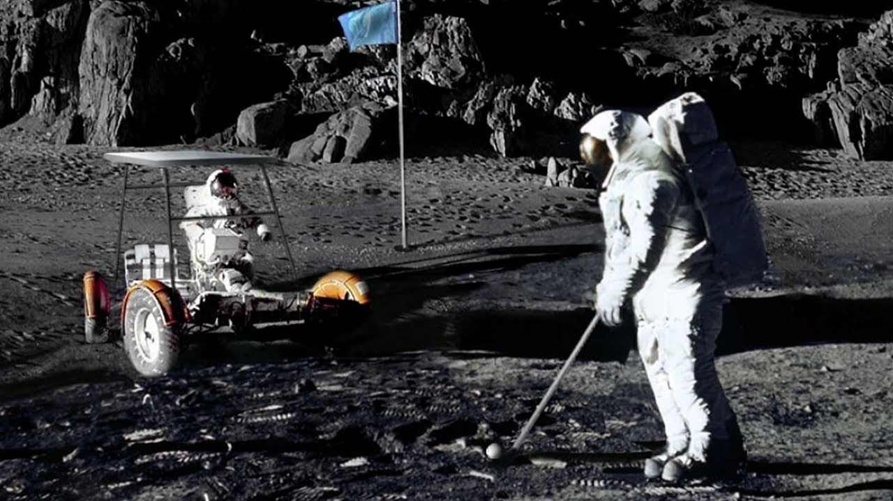

<FigureLabel>This photograph of astronaut Alan Shepard playing golf on the Moon was used as political leverage to <strong>defund</strong> NASA, and it's probably why we haven't landed on Mars yet. Piece of shit 🦄</FigureLabel>

As a side effect to giving NASA **infinite money**, in the show's continuum, technology advances a bit faster, with the iPhone 14 being the iPhone 17 or something like that.

On a more negative note, due to the increased **nationalism**, republicans stay in power for longer, which means that they don't get the Clinton/Lewinsky scandal.

And for some reason, **John Lennon** is not murdered, so some changes are just neutral.

Across the pacific pond, the **Soviet Union** holds together to their common objective of maintaining space superiority, instead of falling in 1989 over the population's desire for Levi's jeans, soft drinks, and not dying.

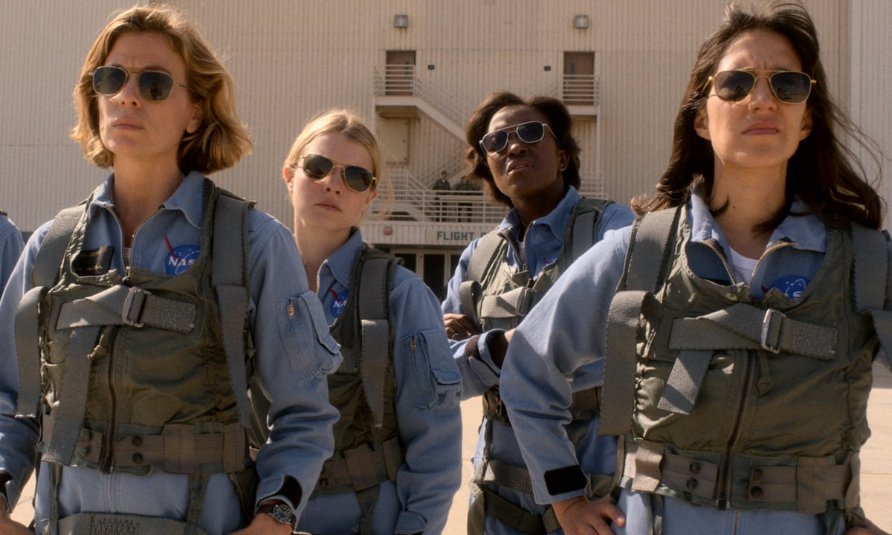

<FigureLabel>The shows intelligently explains the introduction of women astronauts so early in the timeline as a publicity stunt to match the <strong>Soviets</strong>. Say what you will about Communism, but women in that society were equal to men in every aspect except politics</FigureLabel>

As you can imagine, establishing a base on the **Moon** is already a difficult endeavor in and of itself, but doing it in a world where two super-powers are trolling each other is **hella** challenging.

Which means that characters go through such hardships and have to face emergencies so big that they make you think how will they even survive this one? And sometimes the answer is: "Oh, they don't", which makes the times they do feel **earned**.

Best sci-fi of the decade.

## Barry

<YouTube source={"M6TZdk1t8Zo"}/>
<TvCard seenOn={"HBO Max"} seasons={"3"} ongoing={"yes"} emoji={"🎭🥷🏼"}/>

According to my napkin calculation, **Breaking Bad** is 70% drama and 30% dark comedy.

Have you ever stopped considering what happens if you swap those numbers? You get **Barry** is what you get!

Titular Barry is a former US Marine shell-shocked by the whole **Afghanistan thing**. Back to the homeland, he is coached into making use of his particular set of skills by becoming a hit-man.

While fulfilling a contract about killing an actor, he discovers the joys of being **on stage**, decides to quit the hitting men career, and enrolls in the same acting class of the poor guy he had to dispose.

Of course, the old life keeps creeping up.

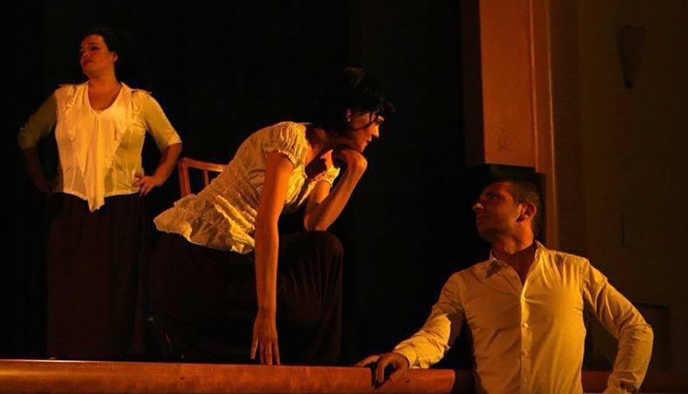

<FigureLabel>If the idea of a killer being reformed by acting seems too unrealistic, I'd like to give my anecdotal testimony. As someone who has acted a life ago, I have hardly ever murdered anyone.</FigureLabel>

Set in Los Angeles, the show heavily parodizes the **Hollywood** scene. Actors, producers, teachers are all self-absorbed, brain-dead pricks.

And then there is **Sally**.

Played by **Sarah Goldberg** - who has not a background in comedy - Sally is a national treasure...

<YouTube source={"qw62N4v8Cwo"}/>

Conversely, the **Chechen** and **Bolivian** mob, who are supposedly the bad guys, are all sweethearts, and they contribute to what is quite possibly my favorite dialogue exchange:

<Dialogue>"He killed my twin brother!"</Dialogue>

<Dialogue>"Dude, you need to let that go!"</Dialogue>

Speaking of Breaking Bad...

<SpicyTake>I didn't love Better Call Saul</SpicyTake>

<YouTube source={"9q4qzYrHVmI"}/>
<TvCard seenOn={"AMC"} seasons={"6"} ongoing={"god, no"} emoji={"👩🏼‍💼👨🏻‍💼"}/>

This fucking show.

As for its sequel, **Better Call Saul** has unparalleled visual storytelling. It's the best example on TV of the power of *showing* / *not telling*, which is incredibly hard to convey, and here is on par with the work of the **Coen Brothers**.

Take for instance this wonderful scene...

<YouTube source={"B33hKP5khGc"}/>

Initially, it's just two wine enthusiasts talking shop. Then, you understand the subtext: they are flirting! 🥰

And it's a kind one at that, where boundaries are removed like onion layers ➡ Am I talking too much? ➡ Not at all ➡ Mr Fring ➡ ✋🏿Gustavo ➡ ...

Toward the end, something happens that makes Gustavo **leave** abruptly. We are not told what got into his mind, and we don't need to, because we do know! Of course, he cannot let another person in his life, not after what happened last time. 😭

So, it sucks that people at the top of their **storytelling** game, forgot to include a story.

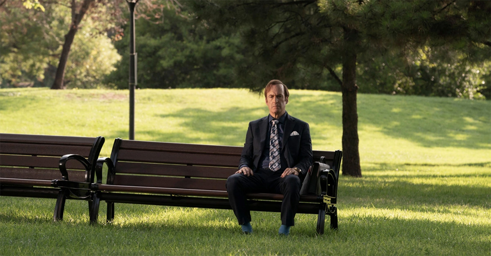

<FigureLabel>Life is like a box of chocolates</FigureLabel>

**Better Call Saul** took six seasons to tell a story that could have been wrapped into a 2 hours long movie like that **Jesse** one, which you could then skip more easily.

Should you choose to invest the 2 days and 15 hours to watch this show, you will find plenty of masterfully written and acted scenes that end up being mostly **naval gazing** and character studies that are not as interesting as they were hoping.

But at least, they managed to make the **Mexico** scenes not yellow.

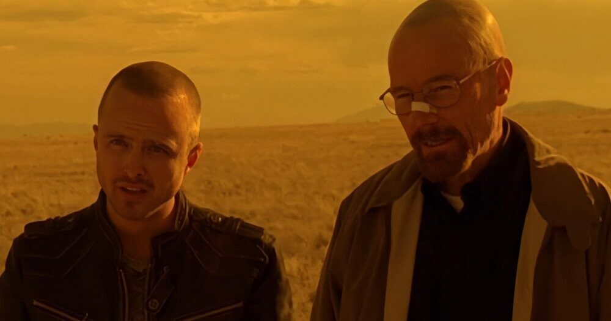

<FigureLabel>In Breaking Bad, it got ridiculous</FigureLabel>

## Succession

<YouTube source={"OzYxJV_rmE8"}/>
<TvCard seenOn={"HBO Max"} seasons={"3"} ongoing={"yes"} emoji={"👴🏽💵🙋🏻‍♂️🙋🏽‍♂️‍🙋🏽‍♀️"}/>

Is it possible to love a show where every character is a piece of shit?

With **Succession**, you can imagine the notes that a network would provide:

<Dialogue>" You need at least a likable character that the audience can identify with "</Dialogue>

So, there is an alternative version of this show where protagonist **Kendall Roy** is a righteous man who is trying to save the family company from a senile abusive father and his spoiled siblings, possibly set in the same universe of **For All Mankind**.

This would end up being a lesser version of the show. It's important for **Succession** to be choke-full of detestable characters, because something happens along the way that you don't expect.

You start seeing these people not as villains, but as **broken** beings.

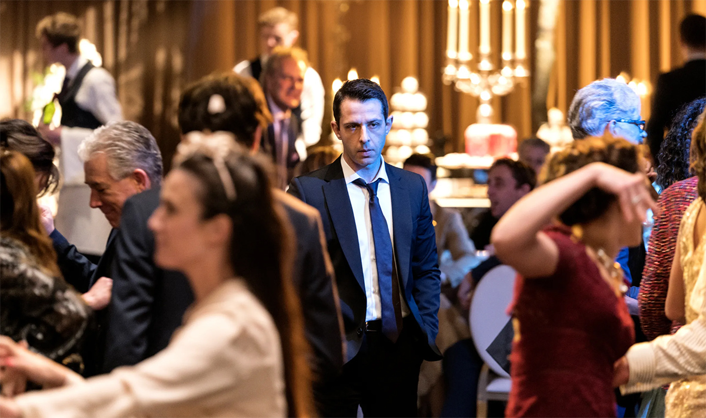

<FigureLabel>The episode of the birthday party is so sad that it makes me hope never to become a billionaire</FigureLabel>

Of course, the reasons why one would develop such a **toxic** personality are complex, multi-varied, and require tons of intros- it's the parents' fault!

Take **Siobhan Roy**. She is self-absorbed, superficial, and manipulative. A textbook c-word. Now, take this incredible scene with her mother.

These are two adults that are taking turns to hurt each other. Amidst all the **vitriol**, they are even making some good points, and they have several opportunities to throw an olive branch and mend their relationship. Instead, they choose to escalate.

Look at Siobhan's face when her mother drops **the bomb**...

<YouTube source={"bp0gvV_8C84?start=61"}/>

How would you react if your **mom** told you that she should not have had kids? 😭 How can you despise Siobhan after this?

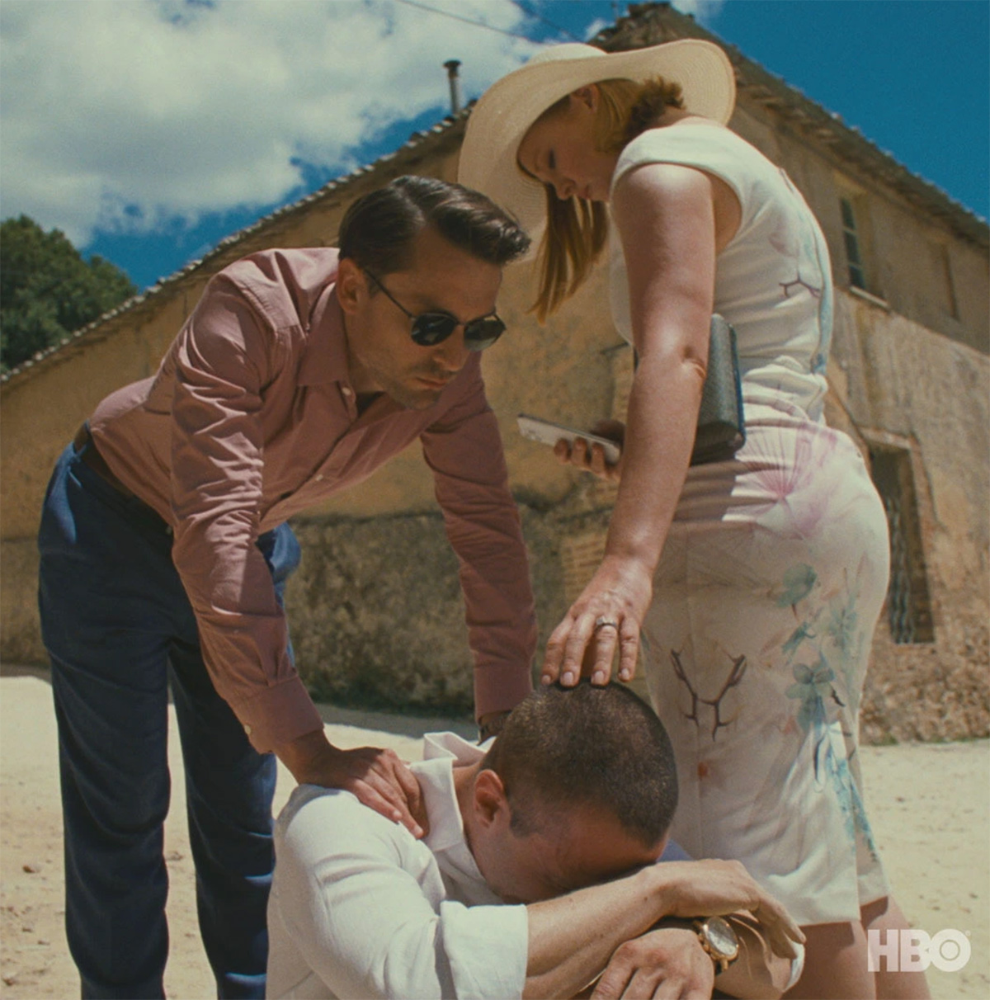

<FigureLabel>Siblings going all Renaissance painting</FigureLabel>

The best written TV show since **The Wire**.

## The Rehearsal

Do you know who **Nathan Fielder** is?

If not, I envy you, because you are now open to the genius that is **Nathan For You**, a show that starts with a simple premise of helping real businesses, and goes into wild places.

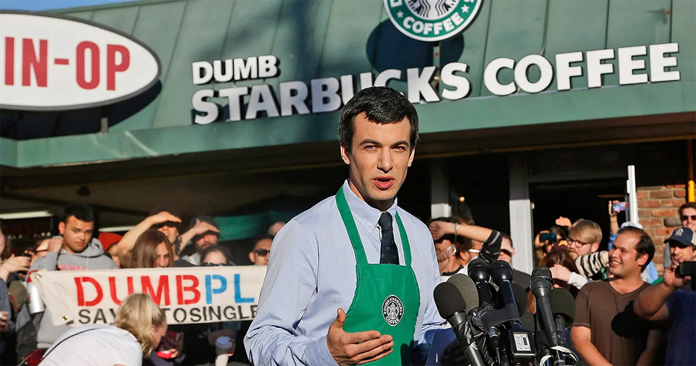

For his next project, Nathan must have thought what if Nathan For You had a **budget**?

The result is **The Rehearsal**...

<YouTube source={"2fjPFt8cpic"}/>
<TvCard seenOn={"HBO Max"} seasons={"1"} ongoing={"yes"} emoji={"🏠📹"}/>

The premise of the show is Nathan meeting people that have a **problem** to solve, and helping them by rehearsing the situation in every tiny detail, which means hiring actors that will follow and study the individual they are impersonating, and even build a complete set of the place where the confrontation will take place.

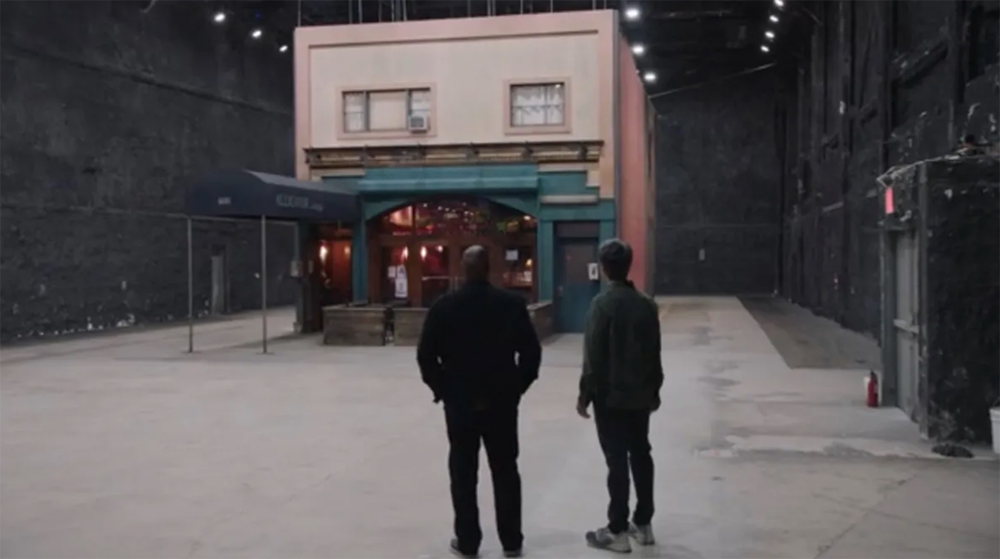

<FigureLabel>Strong <strong>Synecdoche, New York</strong> vibes</FigureLabel>

The **first episode**, involving a man that wants to confess a lie to a friend, establishes the format.

The **second episode** pushes the envelope further, with a woman rehearsing **motherhood** on a multi week endeavor that involves paying child actors of increasing age, so that she can have the full experience.

By the end of the second episode, the format **breaks** already, with Nathan deciding to be more actively involved in the rehearsal by becoming the woman's fake husband.

This spirals in a personal voyage, with Nathan becoming **too involved**, at the point of questioning his tendency of lying to solve problems, his capacity of building healthy relationships, and ultimately his ability of becoming a father.

The process he uses to investigate these feelings involves hiring an actor that plays Nathan, and rehearsing the rehearsal itself in a form of recursive storytelling that screams **Charlie Kaufman** from the rooftops.

Having found myself wondering if I could be a good dad -- or at this point I should rather say "could have been" -- this strikes a chord.

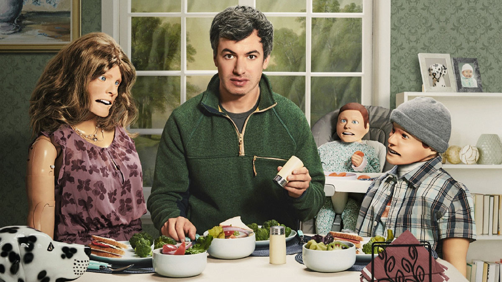

With these kind of shows that involve real people, you never fully know how much of them is **staged**.

Sometimes, events are reassembled to become more meaningful through the magic of **editing**. Some other times, people are just eager to yes-and Nathans's ideas.

But by season end, something happens that is definitely real, as it involves a six-year-old child, which fall precisely into the whole **fatherhood** theme, and that is frankly heartbreaking.

As a result, a show that is so funny in a dry and self-deprecating kind of way, had me in tears by the last episode.

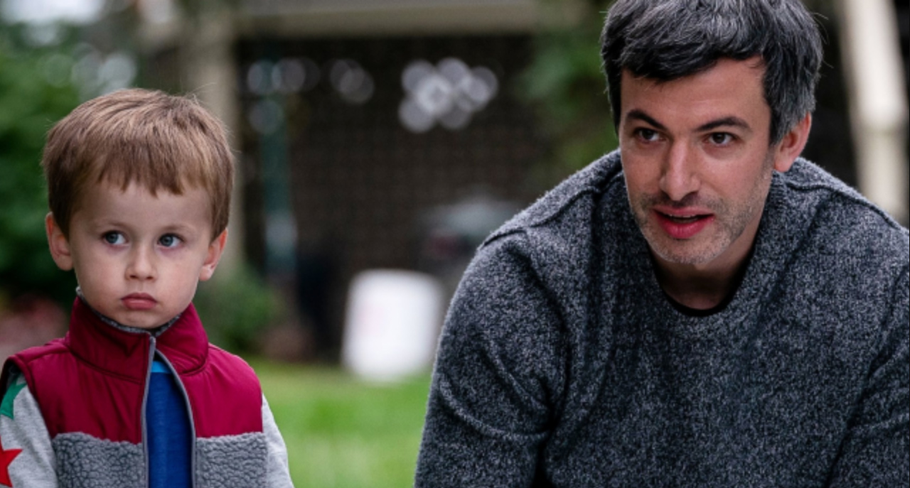

<FigureLabel>When something affects you emotionally this much, it's not much the story that the show is telling, but what you carry with you. So maybe I really hate lawyers?</FigureLabel>

Truly a masterwork of improvisation, careful planning, and unfiltered examination of the self.

It will be studied in schools.

