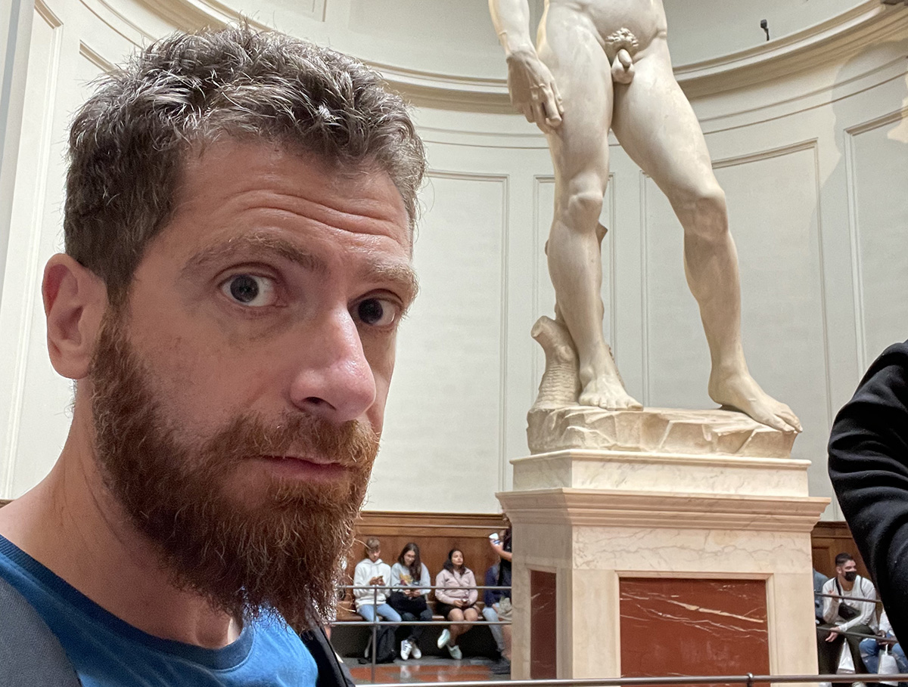
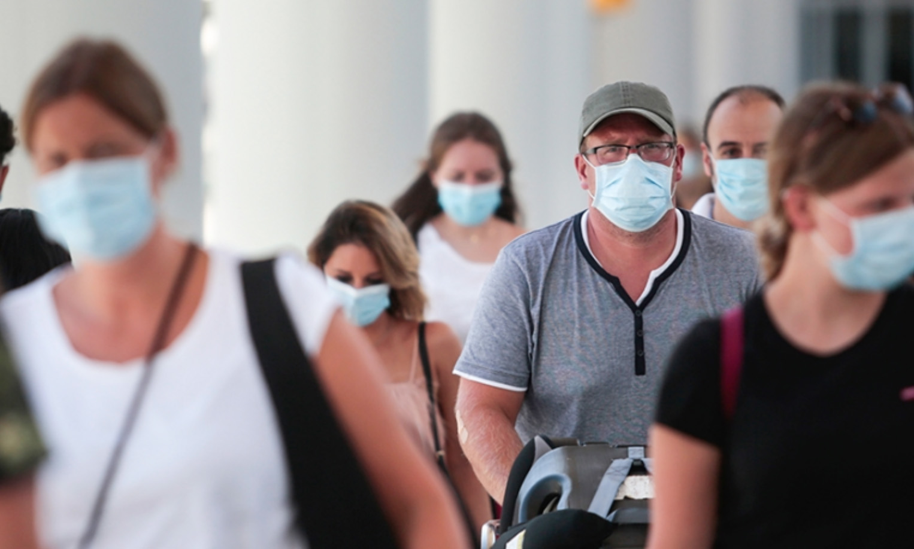
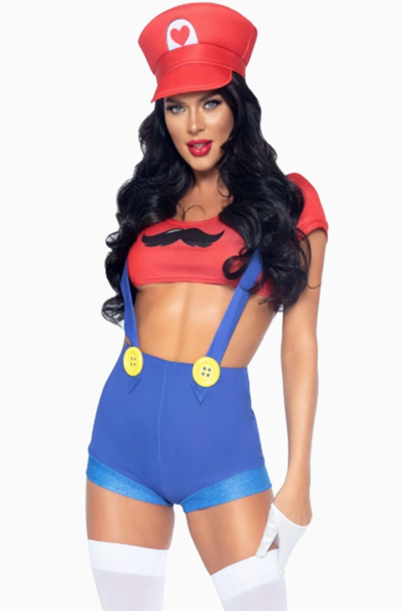
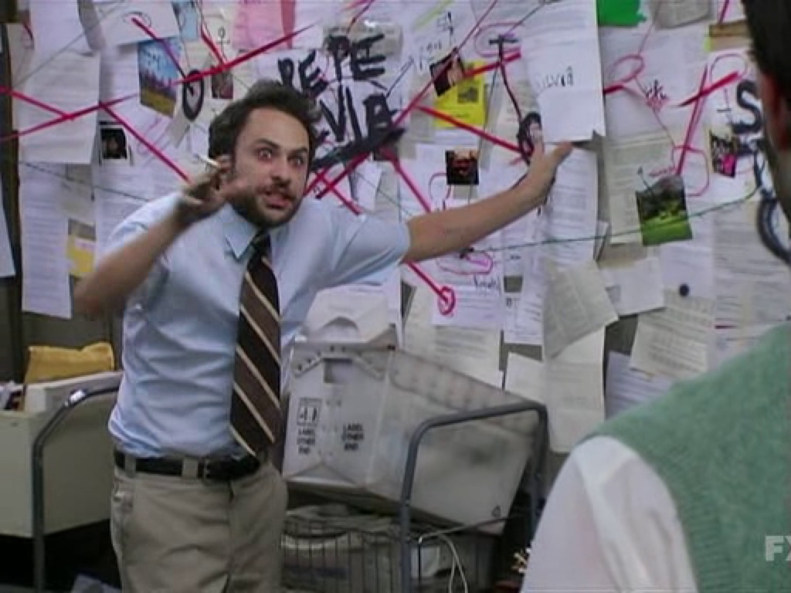

import {Dialogue, FigureLabel} from "../../../components/blog/Text";
import BlogImage from "../../../components/blog/BlogImage";
import Poll from "../../../components/blog/Poll";
import TextBox from "../../../components/blog/Boxes";

<TextBox title="Disclaimer" closeButtonCaption="You are 100% right">
    

        The following is the <strong>real</strong> account of something that has happened to me in the Summer of 2020.
    

    

        As with all <strong>accurate</strong>, verifiable stories, what you are about to read is ballpark 64% true.
    

    

         I'm sorry, but I don't feel that I owe you <strong>radical honesty</strong>. It's not like this is my blog or anything. I will happily deviate from the Truth if it leads to a more compelling story, it helps me make my point, or it creates an opportunity for comedy.
    

    

        And you know what, you do the same.
    

    

        You rewrite your past experiences so that you come across as the hero, the victim, or both. You hold grudges based on biased fictional interpretations. You take me <strong>hostage</strong> with your retelling of past events and then get mad at me when I call your ex to ask for his version of the story.
    

    

        At least I am aware of my lack of honesty.
    

    <BlogImage imageName={"worst-person"}/>
    <FigureLabel>Heartbreaking: the worst person in the world etc. etc.</FigureLabel>
</TextBox>

I was thinking.

It seems like enough water has flowed under the bridge and we are several booster shots past the pandemic, so it's time to finally ask...

<Dialogue>Are we tired of all those jokes about how terrible 2020 was?</Dialogue>

...

Again, this is not rhetorical. I don't do **rhetorical questions** because they are a waste of time. Please answer so we can move on.

<Poll id="wink"
      question="Are we tired of all those jokes about how terrible 2020 was?"
      answers={["Oh my god, yes!", "Nope, keep 'em coming"]}
      labels={["Tired", "Not tired"]}
/>

Exactl-- no, wait, we are?! 😳

Ok, I did not expect that. I thought that 2020 jokes were going to be fine for at least a **decade**!

But no problemo, I’ll **improvise** something. We don't need to talk about no pandemics. Let me think...

So... what’s the deal with the post office, right? They ask you to lick the stamps, and I’m like, really? In all these centuries have we developed no better **technology** than the spit in our tongues? And worst of all, are you asking me to use my saliva in public during a pandem— FUCK!

Fine, let's discuss the **plague** for one last time and use this as a chance to let things go. First of all, I have to confess that 2020 was not the worst year for me. Not by a long shot. That was 2019.

In early 2019, my grandmother died and— you know, it’s ok, she was 94.

<TextBox title={"By the way"}>
    

        Something that I like to do when people tell me that their grandparent died is to provide a shocked and <strong>sorrowful</strong> reaction. This triggers a quintessentially human response. They will minimize the death of their loved one to make me feel better.
    

    

        "Oh, well, she has lived a long life."
    

    

        And I'm counting on this, because I can then reply:
    

    

        "Then I guess <strong>good riddance!</strong> Why did you even tell me? I'm happy the bitch is gone. I hope she died in pain!”
    

    

        Which is very funny to me! But I have to say that, now that I'm <strong>older</strong>, I know that I can't do it anymore. I simply cannot troll my friends when their grandparents die. I have to do it with their parents.
    

    <BlogImage imageName={"worst-person"}/>
</TextBox>

Anyway, in **hindsight**, and considering what was about to unfold, dying at 94 in 2019? Excellent choice, Anna!

Then, a few months after my grandma died, I was assaulted.

Let me picture it for you. It's nighttime, I’m walking home from a party, and I get punched in the head from behind. I don't see who did it, so I'm guessing it's a gang of 16 **sumo wrestlers**. As a result, I lose consciousness and smash my face on the ground, breaking my nose, cutting my face, and probably looking **super clumsy** in the process.

<FigureLabel>Fun fact, this is not my original face. It comes from a donor. Yeah, I know, it's not like you can pick and choose.</FigureLabel>

And the worst part is that this aggression was completely **unprovoked**. Although when it occurred I was listening to the **Joe Rogan** podcast, so I’m not saying that I’m blameless.

What else happened in 2019? Ah yeah, my **laptop** was stolen. It happened at nighttime, after I was punched by strangers from behind and— oh, there’s your motive right there! 🙈

<iframe src='https://gfycat.com/ifr/DazzlingOrdinaryBubblefish' frameborder='0' scrolling='no' width='100%' height='100%' style='position:absolute;top:0;left:0;' allowfullscreen></iframe>

<FigureLabel>A few weeks after the incident, I asked the police if they had made any progress in the <strong>investigation</strong> because I wanted to recreate this scene from my favorite movie. Instead, they were super sweet and told me that they arrested kids responsible for similar acts at night in the nearby city park. And while they couldn't tie my own assault to their doing, I could rest assured that the people responsible were in custody. And I thought: how could they not recreate that scene for me? Pigs.</FigureLabel>

And last not least, in that very same year I broke up with my long time **relationship**. Or rather you could say that she broke up with me if you are a glass half empty kind of person.

So, you can agree that 2019 has been for me a continuous series of **punches**, some of which literal, and by that I don't mean that my ex used to beat me. I'm still talking about the assault.

Still, I’ve tried my best to keep my **chin up**. I recall that, at the end of 2019 on New Year's Eve, I patted myself on the back, saying hang in there, buddy! 2020 is going to be your year!

And don’t get me wrong, it was!

## Grief

One thing that I like to do every time I **break up** with someone is to go through a grief phase.

Since break-ups make me conclude that I’m a worthless piece of **pickled garbage**, I take the chance to behave like one. I think it really helps!

In this phase, I completely isolate from the **outside world**, spending entire stretches of time indoors, always wearing sweatpants, always working from home.

And the rare times I go outside for groceries, since I don’t want people to have their day **ruined** by looking at my face, I cover it with a mask.

So that was 2020 in a nutshell for me, and I have to say I was **relieved** to see that I was not the only one going through such a phase!

## Escape

Then, one day I decided that my apartment got too dirty, and I was ready to **move on** to a new apartment.

To celebrate the epiphany, I was also like what the hell, let’s take some time off, so I went on a vacation to an island to the south of **Sicily**, where my family is from.

That’s where I met her.

Let me picture the scene for you. I’m driving around town on a **Vespa** like a *cliché*, when I notice this woman working at the gas station.

She has brown skin blessed by the sun, with long dark hair and almond brown eyes. She is wearing work overalls like **Super Mario**, but underneath you could notice a thin red swimsuit bra, much unlike Super Mario.

<FigureLabel>Full disclosure, this might not be her. I have already established that parts of this story are less than true.</FigureLabel>

And not only is she hot, but more importantly, given her **profession**, I'm pretty sure that if I play my cards right I could get a 10% discount on the fuel.

So there I am thinking *if only I had an excuse to talk to her!*

Which is when I realize that I’m literally sitting on a **motor vehicle** that drinks more than an Irish.

With that in mind, I drive a circle around town and approach the gas station again. Only, now there are three cars queuing at the pump. And maybe I **overreact** here a tiny bit, but I become convinced that I cannot wait in line, because any of these three assholes — if not all of them! — have the opportunity of scoring a date with her before me.

## The Plan

I need to win her heart with non-conventional **warfare**, and I think I know what needs be done.

The plan? I would jump the queue with my roaring Vespa, drive past the woman, look at her in the eyes, and when she looks back at me, I would wink at her.

...

That’s it. That’s my master plan. Were you waiting for more?

Now, I know what you are thinking, but you need to understand that, in Sicily, winking at women is a perfectly acceptable form of communication. It’s not sexual assault, or at least not yet.

In my mind, after my winking, she would become so infatuated that she would tear down her unitard and jump on my Vespa. I would drive toward the sunset, with her hands holding my body, and her hard nipples pinching my back. Ouch, do you mind?

Now — spoiler! — that’s not how things went, so let’s rewind to me jumping the queue, driving toward her, locking eyes with her, and winking with my left eye — which is important as I can’t really wink with my right eye — you see? It looks like I having a stroke, and this, I’m told, is not sexy.

So, when I winked at her — and I need to remind myself that the past of wink is ‘winked’, and not ‘wank’. I do not masturbate in front of strangers, thank you very much, because they cancel you for that, and it’s also a shitty thing to do.

So when I winked at her, she had exactly no reaction whatsoever. She looks at me driving by, then she returns to filling the fuel tank, and this utterly destroys me.

I would have understood if she had reacted with disgust, because then I’d know it, she’s not into men, what can you do?

But no reaction? That’s the worst reaction! It means that I make zero impact in this world. I am but a worthless piece of shit, a subhuman non-person that’s not supposed to go around winking at strangers. I should be home instead, wearing sweatpants, watching tv shows, crying myself to sleep!

And when I come to this realization, I’m starting to feel relieved. I no longer have to exchange words with strangers in order to procure happiness. I no longer need to feel bad for being alone and dirty. My life is so much simpler now. I’m finally free, and this is worth celebrating by getting fucked up drunk!

So I park my Vespa in front of a bar and go inside. I reach the counter and order every entry in the menu. While I wait, I notice that on the wall behind the counter there’s a huge mirror, which makes the bar look bigger than it really is, and I’m like, great, now I have to see my ugly ass face. But you know what? It’s actually fine, because I don’t give a shit anymore. So I look at the mirror, and that’s when I realize that I’m wearing sunglasses.
