import UpsideDown from "../../../components/blog/UpsideDown";
import {Center, Dialogue, FigureLabel, Indented} from "../../../components/blog/Text";
import Spoiler from "../../../components/blog/Spoiler";
import Poll from "../../../components/blog/Poll";
import {Books2022} from "../../../components/blog/PhotoStack";
import YouTube from "../../../components/blog/YouTube";
import {ResponsiveEmbed} from "../../../components/blog/ResponsiveEmbed";

Due to misinterpreting a passage of the Bible, I ended up reading 52 books in [2020](/books-2020). Then expectations were formed for [2021](/books-2021), and I had to repeat the deed, although with different books.

At that point, I thought I might as well stick with it and read a book per week also in the year **2022** from the birth of **Baby Yoda**.

So let's rejoice and take a few seconds of **mindfulness** to visualize them books, and more importantly, would you look at the freaking awesome **CSS animation** I painstakingly made...

<Books2022 background={"desk4"}/>

Don't you find it **impressive**? The animation, I mean.

And now that the component is written (click [here](https://github.com/gianlucabelvisi/gianlucabelvisi.com/blob/master/src/components/blog/PhotoStack.js) for some code porn), I can reuse it on so many occasions. This blog will turn into **spinning** images so abruptly that you won't even remember that there was a non-spinning dark age.

The nineties are back!

<iframe src="https://giphy.com/embed/fJKG1UTK7k64w" width="100%" height="100%" style="position:absolute" frameBorder="0" class="giphy-embed" allowFullScreen></iframe>

Ok, this is mildly **annoying**. What was I thinking? I have wasted eight hours of coding that I could have used to stare at the ceiling.

Let's go with the analog view...

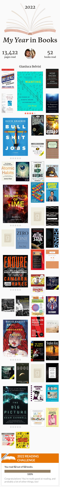

<FigureLabel>Nope, common mistake.</FigureLabel>

You will ask, are we done?

Are there any more books to read, or can we move on to something else like maybe buy a sports car and join those **illegal** street races, but also solve crimes because the car talks?

<small>(Note to self: reserve the rights to <strong>Car Gpt</strong>.)</small>

Well, according to my calculations, if no other books come out in **2023**, we are almost there. Or at least I hope. I don't want to spend another year like this.

## Why, how did it go?

Not very well to be quite honest!

For the whole year, I have constantly been at least **five** books behind schedule. Logging into [Goodreads](https://www.goodreads.com/user/show/12362887-gianluca-belvisi) gave me intense vibes of being **pickled garbage**.

<small>(If you are a regular reader of mine, you might have noticed that I'm trying to make <strong>pickled garbage</strong> happen. I owe it to a dear friend.)</small> 

In early December, I had to **break up** 💔 from a relationship so that I could find the time to read. There were also other problems.

I finally closed the circle on **New Year's Eve**, with the midnight approaching like the guy from **It Follows** and while on the flu, which meant that I had no time to make a bucket list. So that's nice!

<Poll id="books-2022"
      question="How many books did you read in 2022?"
      answers={["Less than 5", "Less than 10", "Less than 30", "Less than 52", "52 or above"]}
      labels={["Cringe", "Not cool", "Based", "Noice", "Liar"]}
/>

Still, to reach the objective, I felt compelled to read:
* 👨🏼‍🎤  Poetry
* 🧑🏽‍🍳  Cooking books
* 👨🏽‍🎨  Art books
* 🦸🏾‍♂️  Comics

Also known as **fake** books.

    <iframe src="https://giphy.com/embed/gtakVlnStZUbe" width="100%" height="100%" style="position:absolute" frameBorder="0" class="giphy-embed" allowFullScreen/>

<FigureLabel>That'll teach them!</FigureLabel>

There are a few reasons for this **lackluster** performance. First, not being in a **pandemic** limits the possibilities to read, which is unfortunate.

Also, work was a thing, I increased my gym time, I tried and failed at meditation because it was the **boringest** thing ever, I once saw a cute dog, and it was generally nice outside. People were naked.

Speaking of, at the beginning of last year I have been involved in some **mad** dating schedule that sucked out all of my free time. Not to brag. While now my dating is way more normalized in its *lack-thereofness*. Again, not to brag. 🥲

Based on the above, it's very easy to blame **myself** for almost messing up my goal, but it's **significantly** easier to blame...

## Elden Ring

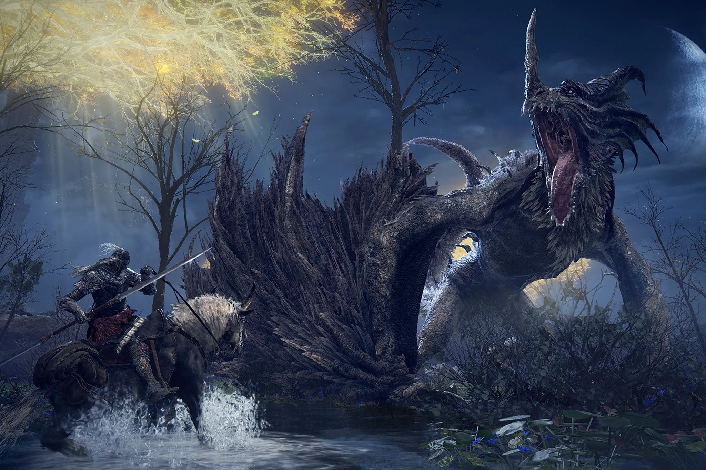

The masterpiece of **From Software**, notorious for making extremely difficult games whose stories require hours of [YouTube videos](https://www.youtube.com/@VaatiVidya) to make sense of them, has been released last March, and is responsible for the loss of at least a percentage point in **GDP**.

Written by George RR Martin, who would rather pen the menu of a family restaurant than finish **The Winds of Winter**, Elden Ring has stolen 130 hours of my life. Or should I say enriched? No, stolen.

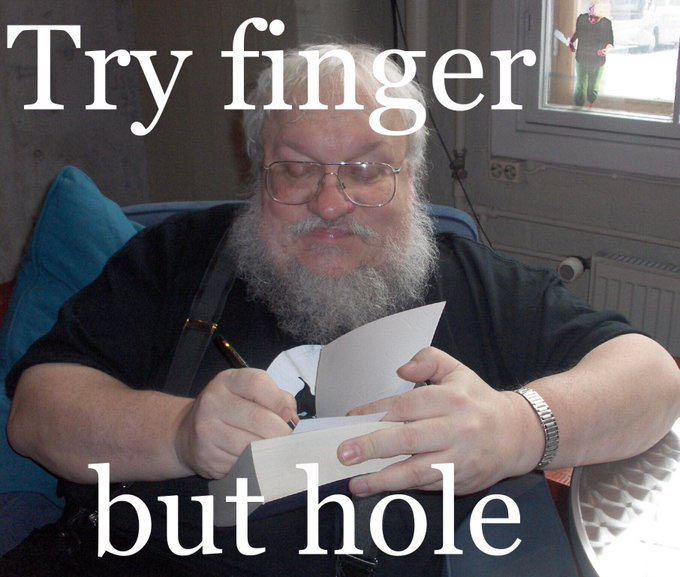

<FigureLabel>If you know the game, this is very funny!</FigureLabel>

This is my character. Her name is Paola. She has a 🐩 resting face, she's strong in **magic**, and can't take yes for an answer.

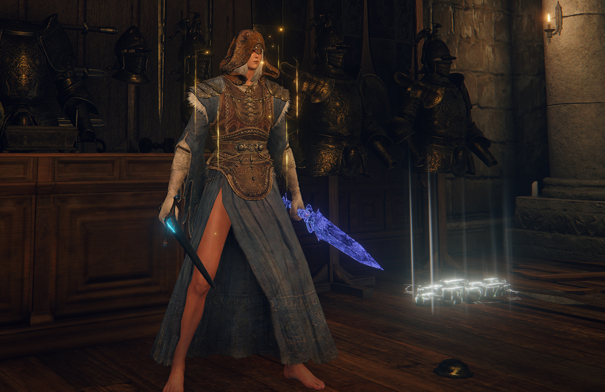

<FigureLabel>Drip check. Paola. Yes, she's not wearing any pants. It does penalize her defense, but I'm a legs enthusiast. 🤷🏽 </FigureLabel>

Halfway through the game, I realized that magic is **op**. *(For the normies, op means over-powered.)* Plus, magic is not cool these days, what with JKR going about posting cringe on the twitter. So she turned into a bloody **c-word** assassin. I mean Paola.

But I digress. Let's go back to books.

## Smaller vs larger

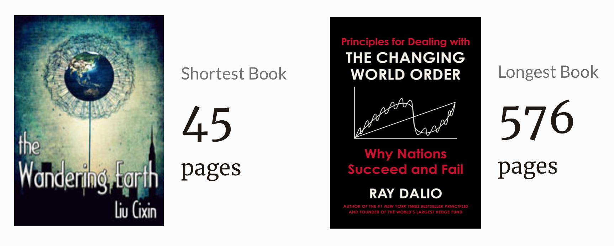

The smaller book I read is a novella about our sun fading out like a cigarette thrown into the toilet. This compels Humanity to build gigantic rockets, attach them to the Earth, and propel the planet toward **Proxima Centauri**.

Basically, they had a **problem**, they solved it, and all it took is 45 pages, which is kinda efficient!

The larger book is about scary intelligent homie **Ray Dalio** reading the tea leaves of History and concluding that Western society is at the end of its cycle, and that we are going to have a **reset**.

Maybe the solution is to build gigantic rockets and attach them to the planet. This will become my answer for **everything**.

## Left hand of darkness

My favorite book of the year and quite possibly *years* is a sci-fi novel by **Ursula K. Le Guin**.

The story takes place on the planet of **Winter**, where the inhabitants are human-like beings known as *Gethenians*, who are unique in that they are ambisexual, meaning they have no fixed gender and are able to change between males and females depending on their sexual and social needs.

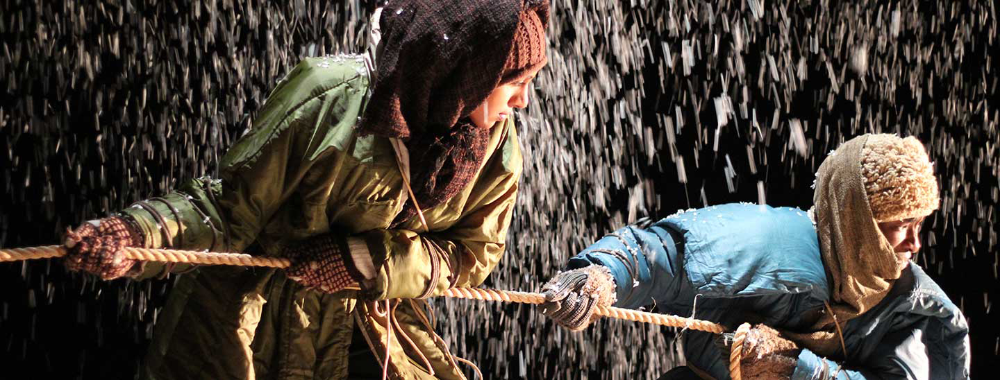

<FigureLabel>A photo of the theater adaptation. Fun fact. I had initially asked Dall-e to paint an illustration of the novel, but it kept drawing severed hands in the snow. With seven fingers. 🤦🏽‍♀️</FigureLabel>

The novel follows the journey of a human envoy, **Genly Ai**, who is sent to Winter to persuade its inhabitants to join a federation of planets. Throughout his journey, Genly struggles to understand and communicate with the Gethenians, and ultimately faces a crisis of identity as he grapples with the nature of humanity. But he also experiences one of the most beautiful **friendships** ever committed to paper.

<small>Before you go all <strong>JKR</strong> on yours truly, the novel was written in 1969 (nice). So, it's not exactly another of those dangers to Society that scare you so much, something, something, woke culture, would someone think of the children.</small> 

What this novel is, is **splendidly written**. You read a sentence, and you are like omg this is wonderful. Let me read it again. Oh, and this other sentence is chef kiss, and this whole page, and this one, too. Am I crying because I will never be this good?! 😭

I wish I had brain damage to read it again with an **oblivious** mind, and maybe I know a way...

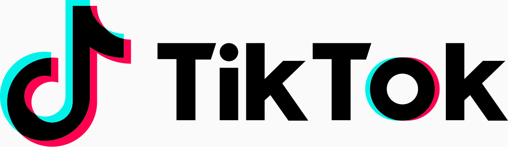

## Rendezvous with Rama

It's going to be **Denis Villeneuve**'s next film -- not sure if in between dunes -- so I was curious to read the original novel from **Arthur C Clarke**, which I enjoyed.

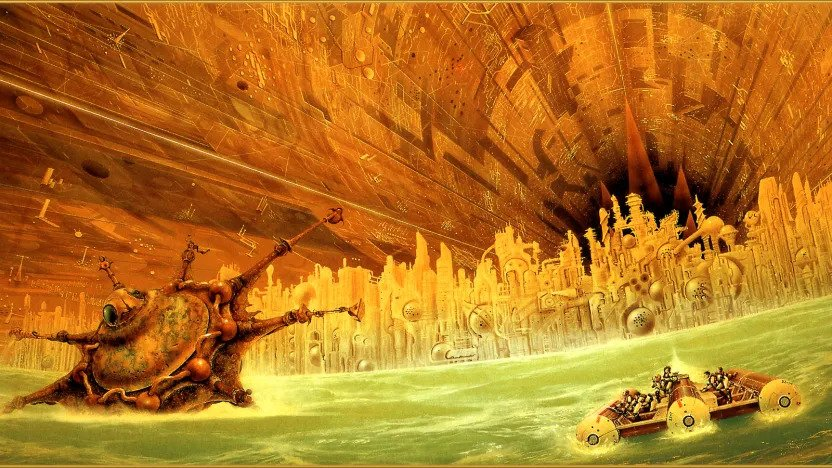

Stories about encounters with aliens are of two kinds.

Either they are **friendly** creatures who want to learn the language, play music, ride with you on a bicycle, or they are **cunty** xenomorphs that want to murder you, eat you, inseminate you. Not necessarily in this order.

**Rendezvous with Rama** reminds us that there is a third, possibly worse, option...

<Spoiler>
    <Dialogue>What if they are indifferent?</Dialogue>
</Spoiler>

## Surely you are joking, Mr Feynman

Not only was **Richard Feynman** one of the greatest minds of the last century, but he had a unique talent for conveying complex ideas to the layperson. His lectures are a treasure of insight, and it's lovely to see how much the audience is captivated.

<YouTube source={"EYPapE-3FRw"}/>

After reading his autobiography **Surely you are joking, Mr Feynman**, I found out that he was also a horny goofball. So there's hope for everyone!

Speaking of.

## Malenia

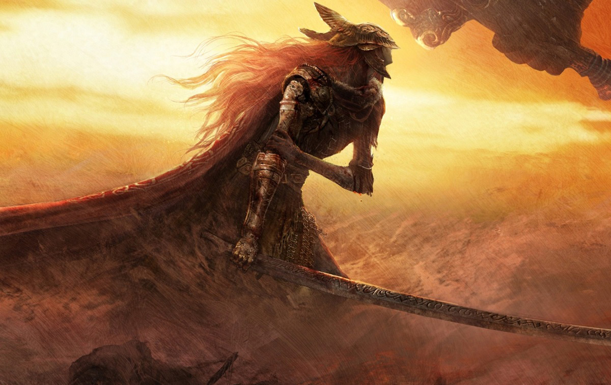

Malenia is the hardest boss in **Elden Ring** and of games in general. She has killed my ass at least sixty times, and considering how little gaming I can do in a week, this meant months' worth of attempts.

Still, death after death, I could appreciate the progression. I started **reading** her moves and countering them. Suddenly, phase one became easy and phase two doable. We weren't really fighting anymore. We were performing for an audience of one.

I had reduced her health to a rounding error, with mine still topped up. And while I was removing my t-shirt to throw it to the crowds, she executed her infamous **waterfowl dance**...

<ResponsiveEmbed ratio={"16:9"} src={"https://gfycat.com/ifr/EachDelayedLamb"}/>

...to which I couldn't help by die.

At that point, I laid the controller on the side, stood up, opened the window and shouted:

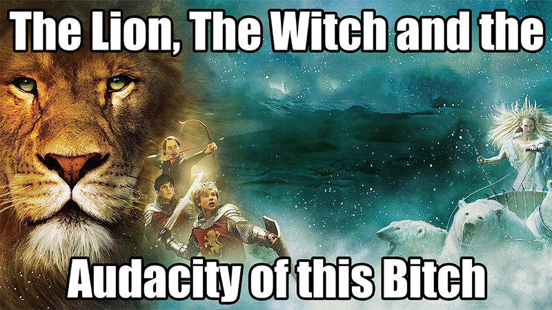

I decided that I was *donezo* with Malenia. I was the moral victor! So, for the follow-up round, I asked for other players' help, because this bitch was gonna go down hard.

Two random players came to my help: **Neytiri** and **Malenia's Ex**, who probably felt he needed closure. This is what happened next.

<YouTube source={"RUwlhu5bcxU"}/>

In phase one, the three of us gang-bang Malenia real good, with Neytiri parrying her attacks (I can't imagine the hours that took to learn that), and her ex being so aggressive that it made me feel uncomfortable.

In phase two, I decide to take a more managerial approach, watching from the sidelines and going all **Ted Lasso** on my team.

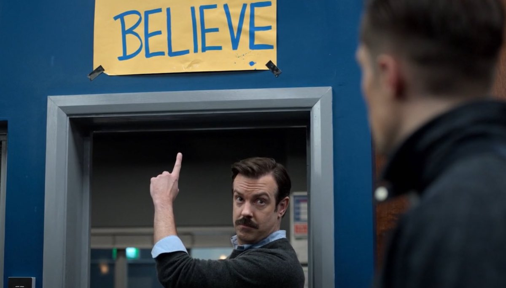

Eventually, Malenia manages to kill her ex, and I mean, I get it. I re-enter the game to save Neytiri, who sorely doesn't need it, and succeed at landing the final blow on the bitch from behind, AS SHE LIKES IT.

But I digress again.

## Philosophy

I'm currently busy writing a post about Philosophy, or rather I should say **rewriting**. This is because I felt that the first draft was lacking insight due to me not knowing a single thing about Philosophy.

Now that I have closed the gap a bit, I can confidently announce that no one should **ever** read about this discipline, because philosophers are quite possibly the worst writers that ever walked the planet. It's like, bro, who **hurt** you? Why are you like this? Are you choosing the worst sentence structures, the longest streams of consciousness without a punctuation break, and the most **obscure** words to bemuse your readers enough that they will acquiesce in laying on the sack with you?

Don't we all.

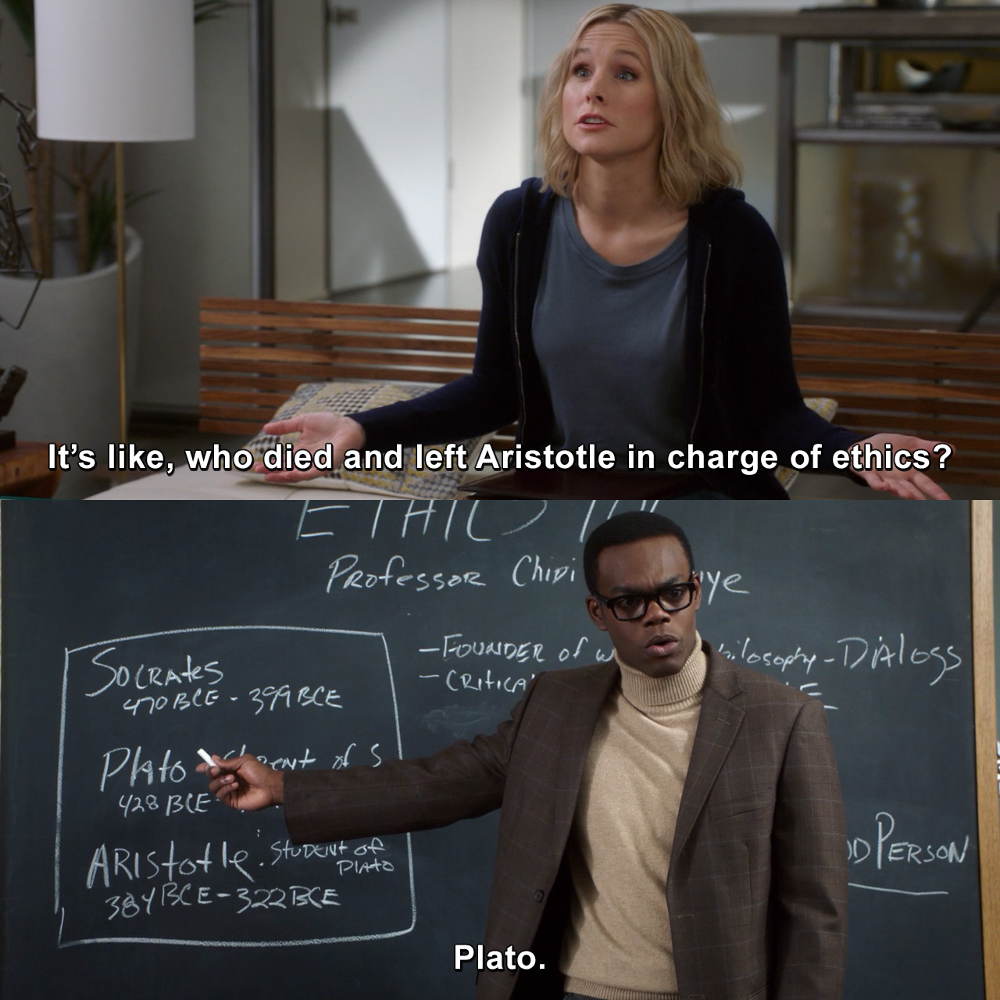

Unsurprisingly, the only exceptions are philosophers that are still alive. This is because they would not tolerate their writing to be ridiculed on the major social networks like **Instagram** and **Tik-Tok**, where Philosophy criticism is rampant.

The following are two examples.

## The big picture

In my objective opinion, **Sean Carroll** is the best Science and Philosophy communicator. He's just a pleasure to listen to. Of course, this is because Richard Feynman has passed away in 1988. So I'm curious about Sean's whereabouts on February 15th of that year.

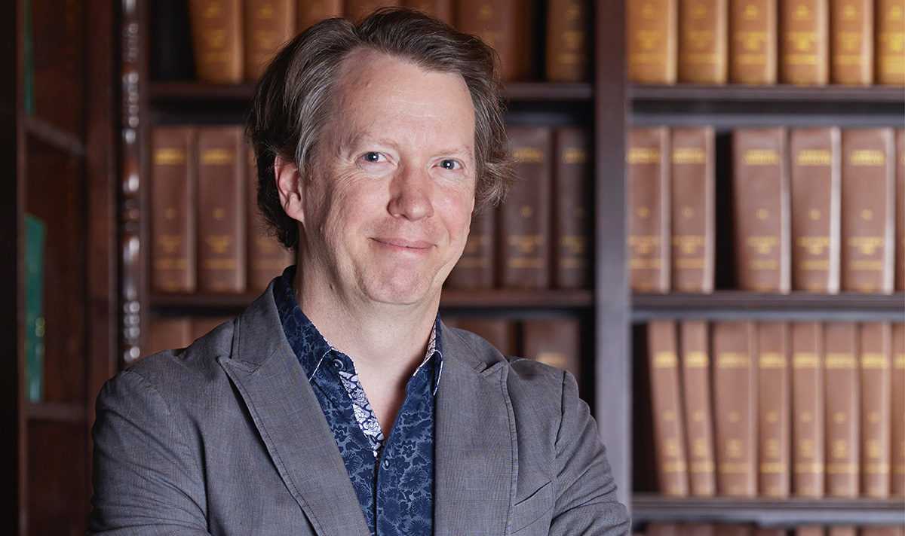

<FigureLabel>I also believe that <strong>Bill Nye</strong> and <strong>Neil Degrasse Tyson</strong> belong to prison.</FigureLabel>

Sean Carroll's **The big picture** is a book about Philosophy, and like all good Philosophy books, it begins from the subatomic, the quantum realm, and it builds its way up, up, and up until he reaches the point of asking what is the answer to life, the universe, and everything.

<small>If you are one of those people that reply 42, I hate you so freaking much.</small>

By the way, Carroll provides the best answer to the (in)famous **trolley problem**. I will not spoil it here because it's going to go in the Philosophy post. Please wait until -- checks notes -- March.

## The fabric of Reality

**David Deutsch** is the smartest person alive, and please don't rebut with the name that is currently forming inside your mind. Just don't. Let's be serious. And I'm saying this with no hate, as a happy and profitable Tesla shareholder.

Two years back, I have tried reading Deutsch's seminal work **The beginning of infinity** and felt that my brain was too tiny for it. So, to properly understand it, I will have to write a series blog of posts about it, and as [Trello](/trello) shows, my backlog is filled. So we are looking at October.

In the meantime, I have read **The Fabric of Reality**, which is far more accessible.

In this book, Deutsch attempts at unifying four theories:
1. Quantum theory
2. The theory of evolution
3. Epistemology (theory of knowledge)
4. Computational theory

In chapter 1, the Author establishes the **Multiverse** as an inevitability, and it's a wild ride up until the end, which I will not spoil, but it's not turtles.

## Comic strips

I think that web comic artists have figured out an excellent business model.

Every week or so, they publish a new strip on their website to keep engagement high. And when they have collected enough material, they release it in a book that is in the price range to be the perfect gift that says "I like you, and I don't want to win you with money."

My favorites are Sarah Andersen's [Sarah's Scribbles](https://sarahcandersen.com/) and [False Knees](https://falseknees.com/432.html) by Joshua Barkman.

**Andersen**'s quirky and self-deprecating humor hits exactly in my soft spot.

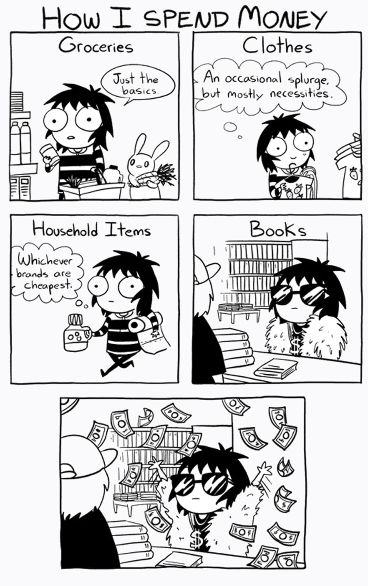

And **Barkman**'s comics feature birds!

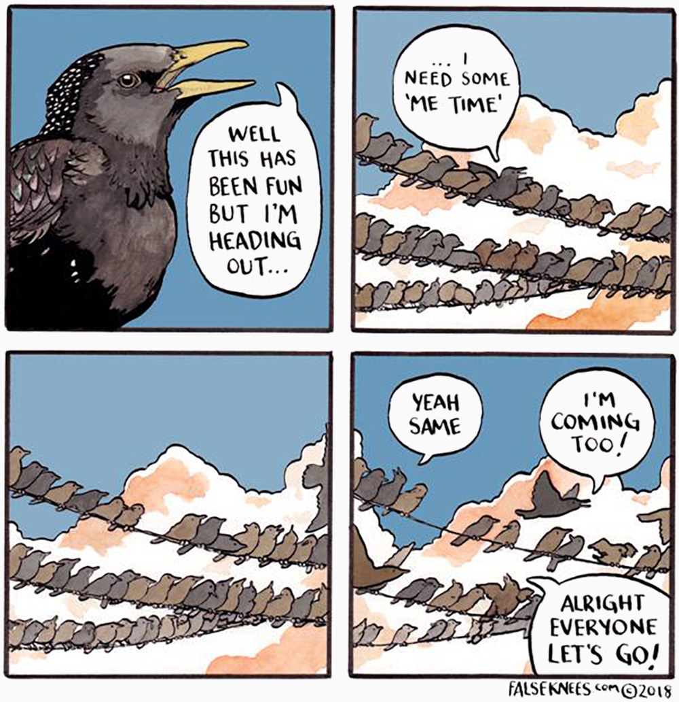

## Big books

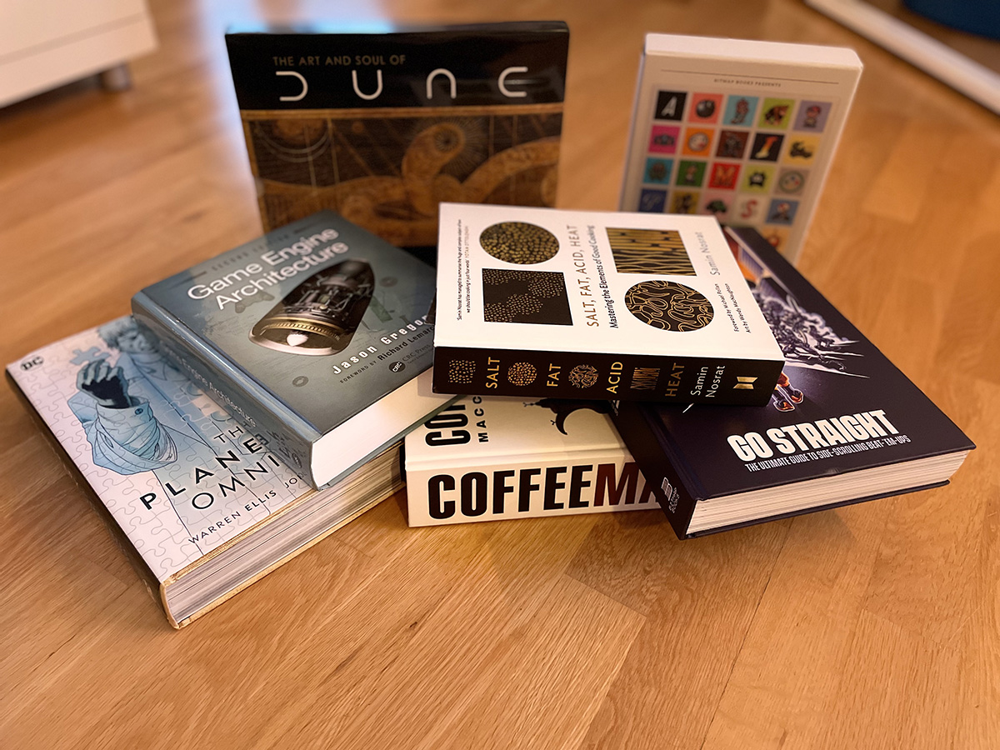

Never been a big books kind of person. More an average book size and cup.

Sorry about the juvenile humor.

last year I had the courage to speak Truth: audio books are books.
Now I am back with another truth bomb. Big books are books. (I was joking before.)

## Why books?

### 1. We kinda suck

asd

### 2. It changes our lives

Reading affects your thinking. Thinking affects your speaking. Speaking affects your actions. Actions affect your habits. Habits are ultimately who you are.

(This is coming from the Talmud. I'm not that deep.)

### 3. It's hard

asd

## Conclusions

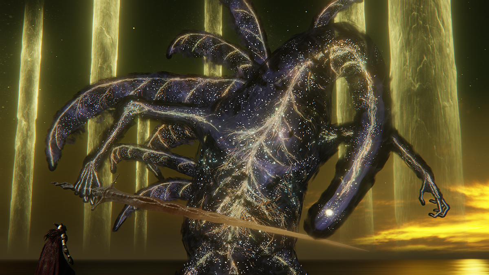

<FigureLabel>We can never be right, we can only prove we're wrong</FigureLabel>

