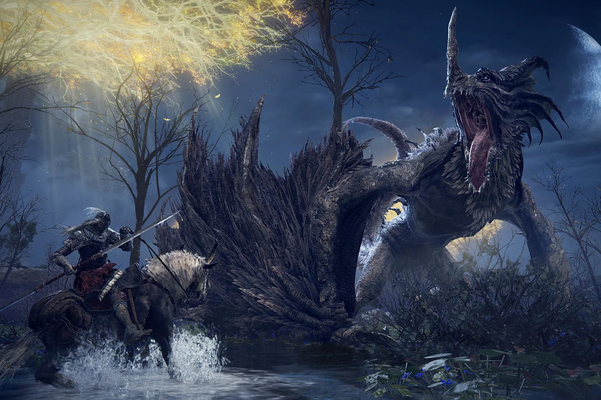

import {Books2022} from "../../../components/blog/PhotoStack";
import YouTube from "../../../components/blog/YouTube";
import {ResponsiveEmbed} from "../../../components/blog/ResponsiveEmbed";

Please, take a few seconds of **mindfulness** and contemplate with me all the books that I have read in 2022. But more importantly, would you take a look at this awesome CSS animation I painstakingly made...

<Books2022 background={"desk3"}/>

Don't you find it impressive? The animation, I mean. We'll talk about the books later.

And now that the [code](https://github.com/gianlucabelvisi/gianlucabelvisi.com/blob/master/src/components/blog/PhotoStack.js) is written, I can use it for so many things. This blog will turn into **spinning** images so abruptly that you won't even remember that there was a non-spinning time. The nineties are back!

<iframe src="https://giphy.com/embed/fJKG1UTK7k64w" width="100%" height="100%" style="position:absolute" frameBorder="0" class="giphy-embed" allowFullScreen></iframe>

Ok, this spinning is mildly annoying. What was I thinking?! I have wasted eight hours of coding that I could have used to stare at the ceiling!

Let's go with the standard static view...

-- Books in image form

## So, how did it go?

Not very well to be quite honest.

For the whole year, I have constantly been at least five books behind schedule. Every time I logged into [Goodreads](https://www.goodreads.com/user/show/12362887-gianluca-belvisi), I felt the warm embrace of anxiety.

In early December, I had to **break up** from a relationship to find the time to meet the goal. There were also other problems.

which finally happened on New Year's Eve close to midnight while on the flu, which meant that I had no time to make a bucket list. Good.

Still, to reach the objective, I felt forced to read:
* Poetry
* Cooking books
* Art books
* Comics

So, not real books.

    <iframe src="https://giphy.com/embed/gtakVlnStZUbe" width="100%" height="100%" style="position:absolute"
            frameBorder="0" class="giphy-embed" allowFullScreen></iframe>

There's a few reasons for this lackluster performance.

First, not being in a pandemic limits significantly the possibility to read. Also, work was a thing. It was generally nice outside and I have travelled a lot.

Additionally, at the beginning of the year I have been involved with some crazy dating schedules (not to brag), while now my dating is way more normalized in its lack-thereofness. Told you: not to brag 🥲

So, on one side it's very easy to blame me for almost messing up my goal, but it's way easier to blame...

## Elden Ring

GRRM would rather write the menu than finish his books.

Drip check.

Elon musk inventory.

## Philosophy

writing a post about philosophy. I should prob read about it. Phi

it's like *bro, who hurt you? Why are you like this?*

There are exceptions, and they are from people that are still alive and hence would not tolerate to be shamed on this blog, so they put an effort.

The following are two examples:

## The big picture

Sean Carroll is probably the best Science and Philosophy communicators, and this is said by one that believe that Bill Nye and Neil Degrasse Tyson belong to prison.

By the way, Carroll provides the best solution to the (in)famous Trolley Problem. I will not spoil it here. Please wait for my post in -- checks notes -- March.

## The fabric of reality

David
* Quantum theory
* The theory of evolution
* Epistemology (theory of knowledge)
* Computational theory

The Author establishes the Multiverse in chapter 1 as an inevitability, then it proceeds to wild ride us

asd

## False knees

## Why books?

asd

## Left hand of darkness

So freaking well written. You read a sentence and you are like omg this sentence is really good. Let's read the next one, oh this is also good, and this, and this.

## Big books

last year I had the courage to speak Truth: audio books are books.
Now I am back with another truth bomb. Big books are books. (I was joking before.)

## Surely you are joking, Mr Feynman

asd

## Rendezvous with Rama

Denis Villeneuve.

Evil or friendly aliens. Third option.

spoiler tag what if they just don't care about us?

## The fire giant

## Malenia

