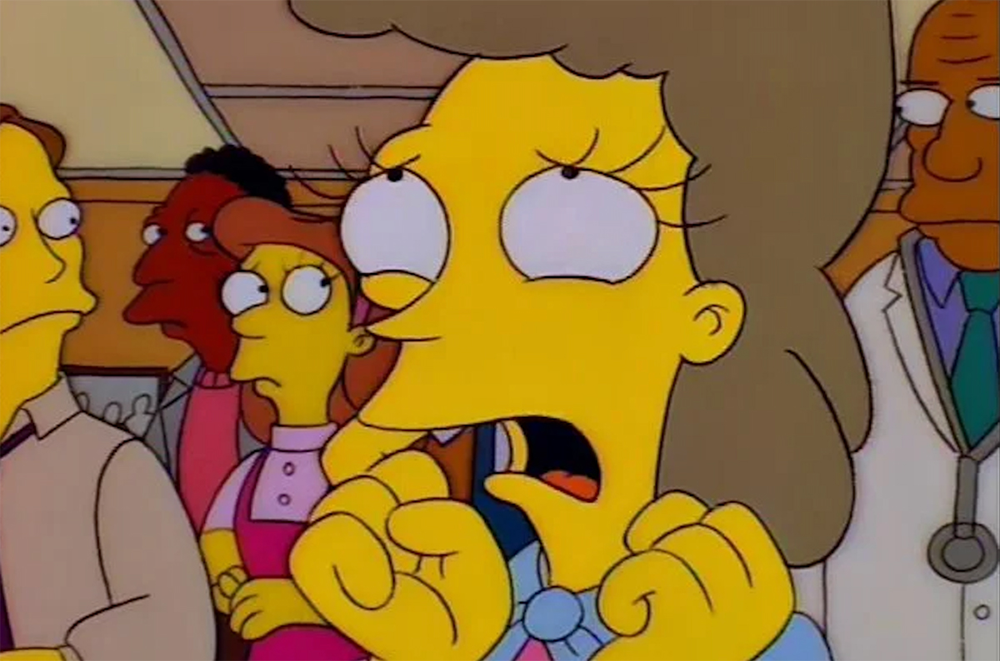
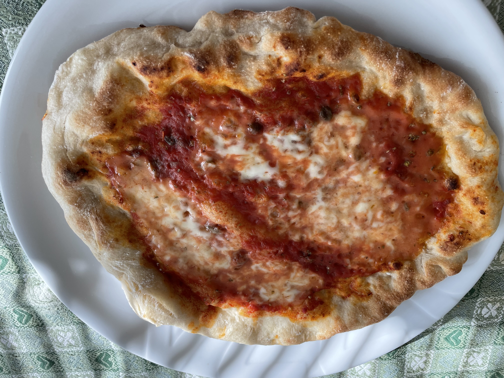
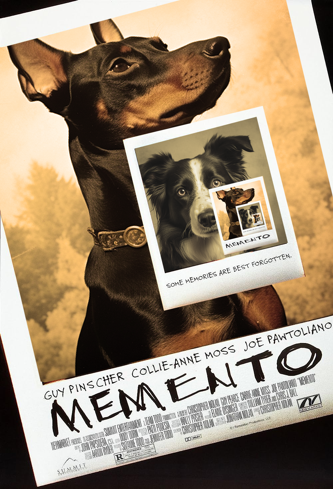
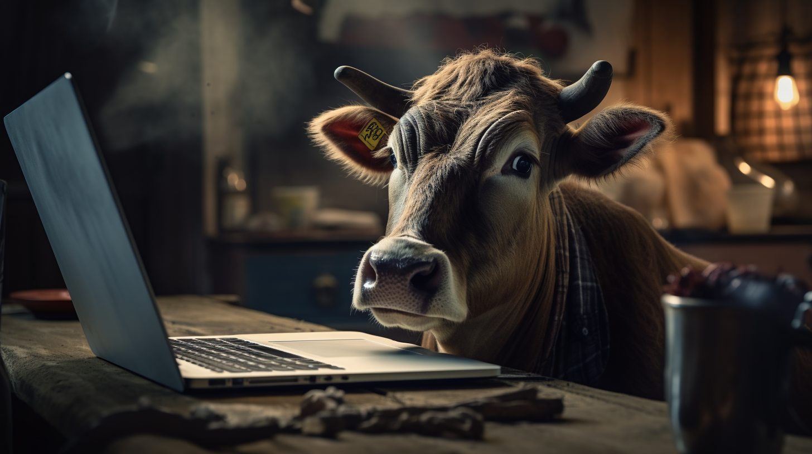

import YouTube from "../../../components/blog/YouTube";
import {Dialogue, FigureLabel, Pony} from "../../../components/blog/Text";
import {ShakyTitle} from "../../../components/blog/Titles";
import UnicornButton from "../../../components/blog/UnicornButton";

<ShakyTitle emoji={"👀"} title={"Content Warning"}/>

Today, we are setting out to achieve the **unprecedented**. We will find the fun in *fundamental animal rights not to be mistreated*. There it is.

This is a **touchy** subject, hence the **royal we**. Creating some distance with the author, whose views I don't necessarily endorse.

In the [Philosophy](/philosophy) writeup, we made an **Anne Frank** joke and nobody seemed to mind because, of course, she was only the **subject** of the joke, and not the target. The target was the inherent contradictions that arise when following moral prescriptions blindly, as you surely understood.

In the same vein, this post is not making light of animals' plights. To discern its true target (spoiler it's people), you will have to reach the **conclusion**, which many of you won't do because, even with these caveats, at the only **hint** of a fictional pet being mistreated, you will literally lose your minds.

<FigureLabel>And the epistemic reason for such a reaction is: 'they look cute'</FigureLabel>

To aid your journey through this post, should you choose to embark it, I have strategically placed a few **piece-of-shit** emojis next to the most contentious jokes.

<UnicornButton page={"doggo"} id={"1"} tooltip={"What a piece of fecal matter!"}/>

☝🏽 <small>Feel free to try</small>

Whenever you dislike a punchline, go ahead and spam-click the button. This will:
1. Offer you a feeling of relief 💆🏼‍♀️
2. Deliver valuable feedback directly to my inbox 🗑
3. Cost me database money, so **please** be mindful 👉🏽👈🏽🥺

Okay? Okay.

## I hope this isn't a mistake

Speaking of, have you ever made a mistake? I can't be the only one. I'm sure you have had your share of **rough edits**.

Here's the thing with mistakes, they are **sticky**. When people look at you, they will inevitably see your biggest blunder:

<Dialogue>Look, there's the guy that <strong>pooped</strong> in your trombone thinking it was a toilet.</Dialogue>

I think we can all agree that mistakes should only hold weight within the **immediate** timeframe of their occurrence.

grafico

Mistakes are **singularities** and need to be treated as such. If one zooms in on a jagged peak, for instance focusing on the mushroom infused party where they took place or even up until the following morning's **jazz audition**, naturally they cast an unfavorable light on you.

Yet, when viewing your life in **landscape mode**, these aberrations should average out.

But this balance is rarely achieved, and so we live in constant dread of stumbling because of one *faux-pas*, like **accidentally** sleeping with your girlfriend's sister. If that were to occur, no matter your defense, be it 'we were drunk', 'she initiated it', 'she looks like you but works out regularly' — none of it would make any difference.

Now, I want to stress that I've never slept with no girlfriend's sister. In fact, I've steered clear of any sisters, nuns included if you can believe it. <small>(More on this in a future post.)</small>

## My mistake

No, the mistake I've made is far worse. I will share it on the promise that it doesn't leave the blog.

<Pony>
    I once watched a YouTube video where a bunch of men risked their life to save a dog that had fallen into the river.
</Pony>

<YouTube source={"smGQUH5ldTA"}/>

As a result, **YouTube** now thinks that I'm into the genre and keeps suggesting videos of animals in peril, meaning that I am no longer being fed with tutorials on how to make 48-hours fermented pizza, which is why I keep delivering these ungrateful turds...

<FigureLabel>Which is the reason I was kicked out of Italy</FigureLabel>

It seems like people can't get enough of this kind of content, and I guess I understand, what with all that is in the news these days, one can use the occasional **uplifting** story.

Incidentally, it's why these videos collect millions of views. On **ad revenue**, you can make north of fifty thousand dollars per upload.

Which makes me wonder. 🤔

<Dialogue>
    What if the people that save the animals are the same people that put them in danger, so that they can then shoot the rescue and cash in? 💰🤑
</Dialogue>

<UnicornButton page={"doggo"} id={"2"} tooltip={"Shut the eff up they would never!"}/>

I want to be clear. I’m **not** saying that this is what happens, I'm only saying that this is what I would do.

And I think I would be good at it. I would do it the **smart way**, not the right way.

## The feels

For instance, picture these videos of dogs greeting their owners returning from the war.

<YouTube source={"d6kjZXwdyJs?start=32"}/>

<FigureLabel>I'm in tears 😭</FigureLabel>

Now, there are **two ways** of producing a video like this.

The first is to get a **puppy**, treat her with love for years, then join the army, be shipped to Afghanistan, kill some nazis, survive, return, and finally shoot the encounter.

This solution gets the job done, but does not optimize for time, it creates a sweeping opportunity cost, and as a side effect you end up **murdering** a bunch of people that probably didn't deserve it.

<Pony>OR!</Pony>

You could simply turn your dog into a **heroin addict** and be sure to always administer the dope while wearing a uniform. Then, you leave her without heroin for a couple of weeks, and finally show up in **camouflage**.

<UnicornButton page={"doggo"} id={"3"} tooltip={"You are literally Saddam Hitler"}/>

## Motivational

Let me give you another example to prove you that I’m not a **one-trick pony**. <small><i>Opens the Notes app and writes down "one-trick pony video idea".</i></small>

Take those videos of morbidly obese dogs and their road to weight loss.

<YouTube source={"qxLHl6upZMk"}/>

To reach this level of fat percentage, they probably come from a **dysfunctional** family, which is a tragedy in and of itself. Cue to sad music. You see them clumsily walk and fall on their bellies, but they do not give up. Cut to them jogging in a shallow pool. The music changes as the **training montage** kicks in. They venture to climb stairs without rolling downhill, and as the crescendo hits you finally see them slim and playful, chasing a ball like a dumb soccer player.

Really inspiring stuff! If the doggo can do it, what’s keeping me on the **sofa**?

Now, can you imagine how difficult these videos are to make? You need to become both a personal trainer and a nutritionist. Or do you? Because you could start with a slim dog, feed him ten thousand calories per day, shoot the whole process up until the dog is a giant ball of fur, then edit the footage in reverse order like in that movie **Memento**.

<UnicornButton page={"doggo"} id={"4"} tooltip={"This is disgusting but what an amazing film"}/>

<FigureLabel>This took me 1 hour to make so please admire it 😭</FigureLabel>

## The plan

With ideas like these, I believe I could create a profitable startup and open offices around the world but mostly in **India**.

I would design a logo that is, like, a paw but, if you look close, you realize that it’s shaped as a heart...

I think I would pay full **healthcare**, pension, and extra vacation days to my employees, because I'm not a monster.

Then, I would spend my days on **Zoom**, walking inside my comically unfurnished loft, wearing airpods, holding a plush ball, and coordinating production:

<Dialogue>
    Guys, we can't throw the <strong>baby elephant</strong> into the sinkhole today because there's been a delay with the catapult. In theory, we could shoot the video with the head of the giraffe stuck inside a <strong>rusty mailbox</strong>, but Gerard has been starving this Greyhound for weeks now and if we don't shoot his rescue soon we might lose the window of opportunity.
</Dialogue>

<UnicornButton page={"doggo"} id={"6"} tooltip={"Would actually watch them videos, but no like, no sir"}/>

After uploading each video, I would add a link in the description to raise money for a non-e0xisting **animal charity**. Then, I would put a heart under every comment that says:

<Pony>
    Fate in humanity: restored! 🫶🏽
</Pony>

Since by reading these lines you gave me consent to access your camera, I can see how **horrified** you are right now. Well, wake the **eff** up! If animals knew how to operate a camera and had semi-professional knowledge of **Final Cut Pro**, they would do the same to us!

<FigureLabel>You can tell that this is AI generated by the number of ports on that laptop</FigureLabel>

Anyway, I have been thinking of getting a dog.

## Getting a dog

I mean a dog for personal use. Not work related. God, no!

<FigureLabel>But dog was looking for a job 😥</FigureLabel>

I think that the pandemic did a number on me.

I like loneliness as a choice. I have so many cool ideas to focus on that I don't need opinionated people around me. But when loneliness is imposed on me, that's uncool.

I’ve been at home sitting on my ass for so long that I’m starting to feel the need of a friend — a bro! — someone that is always by my side and that does everything I tell him do to otherwise no food.

Renato

box

samurai righting wrongs, wronging rights

midjourney disclosure

Now, this might come across as a surprise, but getting a dog is kind of a big decision. Bigger than we'd think. You don’t want to make a mistake in that regard, because mistreating your dog is really frowned upon, and I say rightly so. If you think about it, the one with your dog is going to the most important relationship of your life because the two of you will be together for the rest of the dog’s life. Or yours. Especially if you rank among the unvaccinated.

To bring the point home, you might think that you love your boyfriend or girlfriend, husband or wife, yoga instructor or world of warcraft character, but can you say that you have touched their poop every day while still lukewarm?

Some of you might actually have.

And sure, you can cut fifty percent of the dog's poop if you only feed him every other day, but that’s still a lot of poop if you compare it with the amount of poop I'd like to deal with, which is zero poop.

(I'm not saying do it. I'm saying look into it.)

## Your hypocrisy

Now, if you are horrified by the idea of me starving a dog to decrease the pooping, or turning him into a heroin addict for the purpose of entertainment, tell me, how do you justify the fact that you cut off your dog’s testicles? You bunch of hypocrites!

I’m gonna say it: cutting your dog’s balls is a huge mistake and you should be canceled for it. Personally, I would never do it, unless there is a strong video idea behind.

And I would never do it not only because I think it’s wrong, but also because I’m planning to train my dog, and reward is a key element of training, and every once in a while I’d like to reward my dog with something more than a treat or a toy. I would like to reward him with pussy.

Yes, I would like to occasionally bring my dog to canine escorts. And please appreciate how I used the sophisticated term “canine escorts” even if in this case, semantically, I could have said bitches.

“Hey Rufus, come! Good boy. We are going out! No, no, don’t bring a toy with you. Leave it. Trust me, this time you won’t need it! Oh, but you know what you are gonna need? 600 euros.”

Anyway, congratulations, you have decided to get a dog and now you have an important question in front of you:

## Should I save a dog?

Now, in rhetoric, this is called “begging the question” and is considered a dishonest debate technique, because the way you phrase the question already implies what the correct answer is.

“Should you save a dog?” Well, duh!

“Should you murder your grandma because she’s old and annoying?” Come on, of course I shouldn’t— if you put it that way.

“Honey, will you pick me up at the airport of do you prefer that I take the bus?”

“What? Of course I will quit this open heart surgery and come to the airport! As if taking the bus was really an option for you, bitch!”

A more honest version of ‘should I save a dog?’ is the following:

## Should I get a shit dog?

Because that’s what we are talking about. And this is not a judgement on dogs themselves, but on us. I believe that we as a Society have become too spoiled, what with our smartphones, our streaming services, and the possibility of pulling water to make the poop go away, and as a result we are not equipped with the skills to own a shit dog.

These dogs have experienced more trauma that you could ever handle. They have lived life on the streets. They had to search for leftovers in the trash. They had to do blow jobs to survive.

Luckily, in the country I live in — Sweden — there are no stray dogs, so saving a dog is a decision we don’t have to take, which is great! Now, how did Sweden manage to do it? Trust me, we don’t wanna know!

text box

Ok, fine, here’s my theory. Ikea furniture is not made of compressed sawdust. It’s made of dog. Basically there’s this mold and a guy with a shovel filling it with dogs. Stray dogs. Then the mold closes and there you have your Kallax bookshelf. This is why, when you spill water on Ikea furniture, you smell wet dog.

So, while there are no stray dogs in Sweden, you can still get them from other countries. Most of those dogs these days come from Spain, Greece, or Romania. All great exporters of shit dogs.

## The harsh truth

What happens is that there are organizations that pick up stray dogs from the streets of Bucharest and park them into dirty kennels. Then you connect to a website that doesn’t have the secure connection lock, that uses five different kinds of fonts, and is only compatible with Internet Explorer 4.

So you give you credit card details to what seems to be an absolutely legit enterprise. You choose your dog based on a picture that says this dog will be executed in 5 days if nobody saves him. And when enough orders are filled, all the dogs are crammed into a van and carried for days around Europe to their respective owners.

Now can you imagine how these poor dogs are feeling in this tight and dark space? They left a terrible place, a ghetto. Now they are traveling to an undisclosed location and have no clue on what’s coming next.

“Hey, what do you think is gonna happen to us?”

“Oh, I hope we go to a place with food and balls. I like me some balls!”

Then the dog in the corner that has remained silent for the whole time says:

“Guys, I don’t think you understand the gravity of the situation. You see, before I became a stray dog, I watched a movie with my human. The movie was called Schindler’s List, and let me tell you, I’m seeing parallels!”

And after such a difficult life and an ordeal of a journey, try convincing the dog that everything is going to be alright.

“Hey bro, please stop shaking. You are safe now. No, don’t go back under the bed! You are acting like this is a concentration camp, but I can assure you it’s not! Now, come on, let’s go take a shower!”

So, yeah, consider not saving a dog.

## Breeders

Instead, you need to get a dog from a breeder. Now, getting a dog from a breeder is not easy. It seems like the pandemic did a number on a lot of people, who have been at home sitting on their asses for so long that now they all want a dog. Dickheads.

And apparently breeders cannot increase puppy production by force impregnating their dogs because that’s considered immoral. So you need to figure out a plan to beat the competition.

What you want to do is establish a relationship with all the breeders in the area that have the kind of dog that you want, so that when the time comes you can be selected for of their puppies. To achieve this, you need to go the extra mile. You are gonna need to lie.

In my case, I’ve always wanted a Golden Retriever, because they are funny and playful and they love you unconditionally, which is how I like my love to be. Unconditional.

So what I did is I wrote a letter and sent it to all the breeders that have Golden Retrievers. And this letter was filled with so many lies it was ridiculous!

I told them that I’ve always dreamed to own a Golden Retriever because when I was very little I got lost in a forest and was found by a couple and their Golden Retriever named Kevin!

I told them that I live in a house in the countryside with a large backyard, which I would never do because I’m scared of crickets!

I also told them that my fiancé is a dog trainer, which is ludicrous as I don’t have a fiancé and I would never date a dog trainer because I’m afraid that she would employ the same training techniques with me, and I know they would be effective because I love dog food way too much!

Now when it comes to lying, it’s very important that you never contradict yourself. There are exactly zero mistakes that you can do. You have to go full method and become Daniel Day Fucking Lewis.

For instance, I know every detail of the forest I was “saved” in when I was a kid. So if you write that you fell into a well and were saved by a dog using a rope — kinda like the opposite of those YouTube videos — then when you go visit the breeder you need to let them know that you can’t be in closed spaces because of your claustrophobia.

So, after sending this batch of emails, I just sat waiting for a reply. After a few weeks of no answers, I thought you know what? Border Collies are also nice. They look exactly like Golden Retrievers, but in black and white rather than gold. They are like the previous technology of a Golden Retriever. They are the iPhone 4s of the Golden Retriever.

So I found a bunch of Border Collie breeders and sent them the very same email. And after a few more weeks, I got a response! This breeder couple wrote me that they read my email and were in tears! They told me that while they don’t have any puppies at the moment, I would be the first in line when the time comes.
But they added: we only have one question— why do you want a Border Collie, if when you were a kid you were saved by a Golden Retriever?