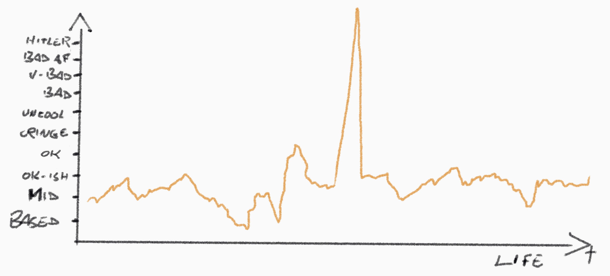
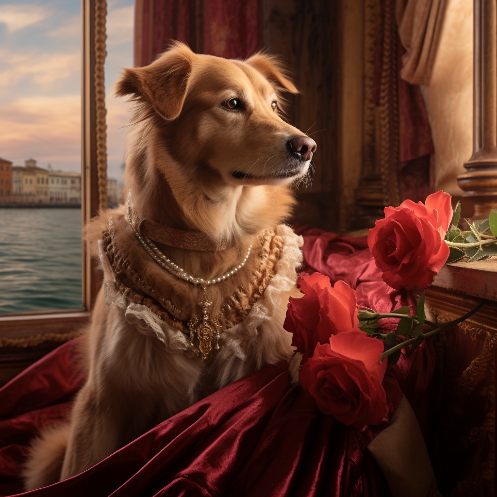
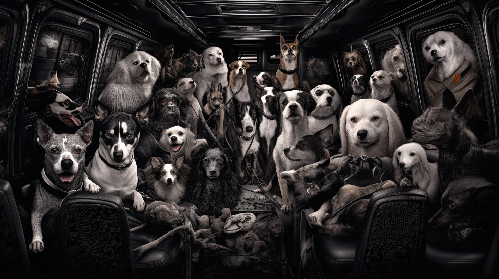
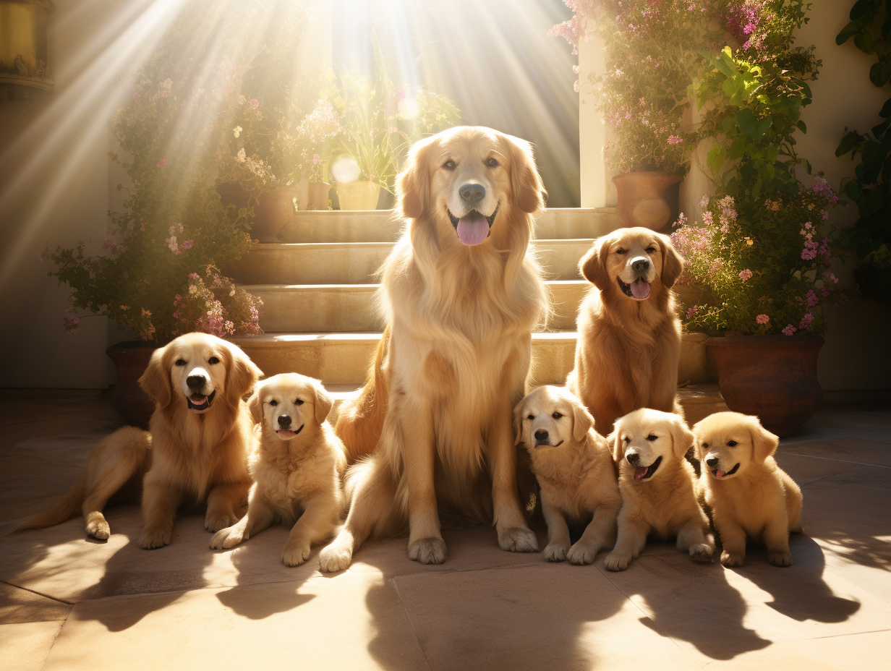

import BlogImage from "../../../components/blog/BlogImage";
import {ResponsiveEmbed} from "../../../components/blog/ResponsiveEmbed";
import YouTube from "../../../components/blog/YouTube";
import {Dialogue, FigureLabel, Indented, Pony} from "../../../components/blog/Text";
import {ShakyTitle} from "../../../components/blog/Titles";
import UnicornButton from "../../../components/blog/UnicornButton";

<ShakyTitle emoji={"👀"} title={"Important clarification"}/>

Today, we are setting out to achieve the **unprecedented**. We will try to find the fun in *fundamental animal rights not to be mistreated*. There it is.

This is a **touchy** subject, hence the **royal we**. Creating some distance with the author, whose views I don't necessarily endorse.

In the [Philosophy](/philosophy) post I made an **Anne Frank** joke and nobody seemed to mind because, of course, she was only the **subject** of the joke, and not the target. The target was the inherent contradictions that arise when following moral prescriptions blindly, as you surely understood.

In the same vein, this article is not making light of animals' plights. To discern its true target (spoiler it's people), you will have to reach the **conclusion**, which many of you won't do because, even with these caveats, at the only **hint** of a fictional pet being mistreated, you will literally lose your minds.

<FigureLabel>And the epistemic reason for such a reaction is: they look cute</FigureLabel>

To aid your journey through the emotional roller coaster that is this post, should you choose to embark it, I have strategically placed a few **piece-of-shit** emojis next to the most contentious jokes.

<UnicornButton page={"doggo"} id={"1"} tooltip={"What a piece of fecal matter!"}/>

☝🏽 <small>Feel free to try</small>

Whenever you dislike a punchline, go ahead and spam-click the button. This will:
1. Offer you a feeling of relief 💆🏼‍♀️
2. Deliver valuable feedback directly to my inbox 🗑
3. Cost me database money, so **please** be mindful 👉🏽👈🏽🥺

Okay? Okay.

## I hope this isn't a mistake

Speaking of, have you ever made a mistake? I can't be the only one. I'm sure you have had your share of **rough edits**.

Here's the thing with mistakes, they are **sticky**. When people look at you, they will inevitably see your biggest blunder:

<Dialogue>Look, there's the guy that <strong>pooped</strong> in your trombone thinking it was a toilet.</Dialogue>

I'm sure we can all agree that mistakes should hold weight within the **immediate** timeframe of their occurrence.

Mistakes are **singularities** and need to be treated as such. If one zooms in on a jagged peak, for instance focusing on the mushroom infused party where they took place or even up until the following morning's **jazz audition**, naturally they cast an unfavorable light on you.

Yet, when viewing your life in **landscape mode**, these aberrations tend to average away.

But this balance is rarely achieved, and so we live in constant dread of stumbling because of one *faux-pas*, like *accidentally* sleeping with your girlfriend's sister. If that were to occur, no matter your defense, be it 'we were drunk', 'she initiated it', 'she looks like you but works out regularly' — none of it would make any difference.

Now, I want to stress that I've never slept with no girlfriend's sister. In fact, I've steered clear of any sisters entirely, nuns included if you can believe it. <small>(More on this in a future post.)</small>

## My mistake

No, the mistake I've made is far worse. I will share it on the promise that it doesn't leave the blog.

<Pony>
    I once watched a YouTube video where a bunch of men risked their life to save a dog that had fallen into the river.
</Pony>

<YouTube source={"smGQUH5ldTA"}/>

Well, now **YouTube** thinks that I'm into the genre and keeps suggesting videos of animals in peril, meaning that I am no longer being fed with tutorials on how to make 48-hours fermented pizza, which is why I keep delivering these ungrateful turds...

<FigureLabel>The ultimate reason I was kicked out of Italy</FigureLabel>

It seems like people can't get enough of this kind of content, and I guess I understand, what with all that is in the news these days, one can use the occasional **uplifting** story.

Incidentally, it's why these videos collect millions of views. On **ad revenue**, you can make north of fifty thousand dollars per upload.

Which makes me wonder. 🤔

<Dialogue>
    What if the people that save the animals are the same people that put them in danger, so that they can then shoot the rescue and cash in? 💰🤑
</Dialogue>

<UnicornButton page={"doggo"} id={"2"} tooltip={"Shut the eff up they would never!"}/>

I want to be clear. I’m **not** saying that this is what happens, I'm only saying that this is what I would do.

And I think I would be good at it. I would do it the **smart way**, not the right way.

## The feels

For instance, picture these videos of dogs greeting their owners returning from the war.

<YouTube source={"d6kjZXwdyJs?start=32"}/>

<FigureLabel>I'm in tears 😭</FigureLabel>

Now, there are **two ways** of producing a video like this.

The first is to get a **puppy**, treat her with love for years, then join the army, be shipped to Afghanistan, kill some nazis, survive, return, and finally shoot the encounter.

This solution gets the job done, but does not optimize for time, creates a sweeping opportunity cost, and as a side-effect you end up **murdering** a bunch of people that probably didn't deserve it.

<Pony>OR!</Pony>

You could turn your dog into a **heroin addict** and be sure to always administer the dope while wearing a uniform. Then you leave her without heroin for a couple of weeks, and finally show up in **camouflage**.

<UnicornButton page={"doggo"} id={"3"} tooltip={"You are literally Saddam Hitler"}/>

## Motivational

Let me give you another example to prove you that I’m not a **one-trick pony**. <small><i>Opens the Notes app and writes down "one-trick pony video idea".</i></small>

Take those videos of morbidly obese dogs and their road to weight loss.

<YouTube source={"qxLHl6upZMk"}/>

To reach this level of BMI, they probably come from a **dysfunctional** family, which is a tragedy in and of itself.

You see them clumsily walk and fall on their bellies. Cue the sad music. However, they do not give up. They rise again. Cut to them jogging in a shallow pool. The music changes pace as the **training montage** kicks in. They venture to climb stairs and manage not to roll downhill. Finally, as the crescendo hits the apogee, you see them slim and playful, chasing a ball like a dumb soccer player.

Really inspiring stuff! If the doggo can do it, what’s keeping me on the **sofa**?

Now, can you imagine how difficult these videos are to make? You need to become both a personal trainer and a nutritionist. Or do you? Because you could start with a slim dog, feed him ten thousand calories per day, shoot the whole process up until the dog looks like a giant hairy testicle, then edit the footage in reverse order like in that movie **Memento**.

<UnicornButton page={"doggo"} id={"4"} tooltip={"This is disgusting but what an amazing film"}/>

<FigureLabel>This took me one hour to make so please do not scroll away so quickly! 😭</FigureLabel>

## The plan

With ideas like these, I believe I could create a profitable startup and open offices around the world but mostly in **India**.

I would design a logo that is shaped like a paw, but if you look close, you realize that it’s a heart.

<FigureLabel>(C) 2023. All rights reserved.</FigureLabel>

I know that I would pay full **healthcare**, pension, and extra vacation days to my employees, because I'm not a monster.

I would spend my days on **Zoom**, walking inside my comically unfurnished loft, wearing airpods, holding a plush ball, and coordinating production:

<Dialogue>
    Guys, we can't throw the <strong>baby elephant</strong> into the sinkhole today because there's been a delay with the catapult. In theory, we could shoot the video with the head of the giraffe stuck inside a <strong>rusty mailbox</strong>, but Deepak has been starving a Greyhound for weeks now and if we don't shoot his rescue soon we might lose the window of opportunity.
</Dialogue>

<UnicornButton page={"doggo"} id={"5"} tooltip={"Would actually watch them videos, but no like, no sir"}/>

After uploading each video, I would add a link in the description to raise money for a non-existing **animal charity**. Then, I would put a heart under every comment that says:

<Pony>
    Fate in humanity: restored! 🫶🏽
</Pony>

Since by reading these lines you gave me consent to access your camera, I can see how **horrified** you are right now. Well, wake the **eff** up! If animals knew how to operate a camera and had semi-professional knowledge of **Final Cut Pro**, they would do the same to us!

<FigureLabel>You can tell that this is AI generated by the number of ports on that laptop</FigureLabel>

Anyway, I have been thinking of getting a dog.

## Wait, what?

I mean a dog for personal use. Not work related. God, no!

<FigureLabel>But dog was looking for a job 😥</FigureLabel>

I guess I'm opening my heart here.

I think that the **pandemic** has done a number on me. I have spent two years in almost complete isolation, sitting on my ass, working from home, staring at the wall, trying to keep my mind busy with mundane activities, and it was awesome!

I had so many cool projects to focus on and nobody around who was super **opinionated** on what to do, like going to the mall to purchase textile materials to cover your body with.

Inebriated by the endless possibilities, I recall thinking:

<Pony>Am I wasting this pandemic by not doing enough?</Pony>

At some point, after a session of several hours online looking for piano lessons, cocktail recipes, podcasts in Spanish, blender courses, Blender courses, old arcades emulation, quantum mechanics, mountaineering documentaries, a year by year chronicle of the Roman Empire, clown porn, value investing, animals in danger, Renaissance history, I realized that I was deep into a toxic spiral of **rumination**, and that all these activities were just a clumsy way of escaping the fundamental issue.

In response to that, I felt the need for a true **friendship**. A bro! Someone that is always by my side, that loves me for who I am and not who they feel I should be. That knows me better than I know myself. That does everything I say otherwise no food.

In short, I felt like what I sorely needed was a Golden Retriever named **Renato**.

## Wait, and I cannot stress this enough, what?

This might come across as oddly specific. Let me break it down for you.

First, I choose my dogs the same way I choose my dates and **Baldur's Gate** companions. I value intelligence and goofiness. Now, if gifs have taught me anything, is that Golden Retrievers are hella goofy.

<ResponsiveEmbed src={"https://giphy.com/embed/xNPB9OnYtIGzK"} ratio={"4:3"}/>

When it comes to wits, here's a list of breeds from smartest to dumbest...

* Border Collie 🧠🏆
* Poodle
* German Shepherd
* Golden Retriever
* Doberman Pinscher
* ...
* Pekingese
* Beagle
* Neapolitans
* Mastiff
* French Bulldog 🧠🥴

Which makes me want to go for a **Golden Retriever** because, while I do want a smart dog, I don't necessarily need one that is smarter than I am. Retaining my alpha-ness is important to me.

And finally, why the name **Renato**? No particular reason except the fact that naming a dog Renato is hilarious to me! By simply thinking about it, I'm giggling like a French Bulldog!

<TextBox title="Let me be clear" closeable={true}>
    
If your name is Renato, please know that I mean no disrespect. In fact, I'm pretty sure that you are a good boy.

</TextBox>

Then, I think I would just walk the earth with my new friend, obviously with **no leash** as the peers we are, despite me being the clear alpha.

We would be hopping from village to village in feudal **Japan** doing sub-quests, bedding ladies, righting wrongs, wronging rights, keeping it fair and balanced.

<FigureLabel>Kids, remember to pay your artists. Unless they ghost you after you have agreed on a 210 euros fee for the project. In which case it's ok to use Midjourney. Remember to pay Midjourney!</FigureLabel>

## Getting a dog

Getting a dog is kind of a **big decision**. You don’t want to make a mistake in that regard because mistreating animals is super frowned upon, and I say rightly so.

If you think about it, the one with your dog is going to the most important relationship you will ever have. The two of you will be together for the rest of the dog’s life. Or yours if you rank among the **unvaccinated**.

To bring the point home, you might think that you love your boyfriend or girlfriend, husband or wife, yoga instructor or World of Warcraft character, but can you say that you have touched their poop every single day while still **lukewarm**?

(I know people that have.)

<ResponsiveEmbed ratio={"16:9"} src={"https://giphy.com/embed/SpPVAQT0mQXzq"}/>

And sure, you can reduce the dog's poop output by a whopping **fifty percent** if you opt to feed him every other day. However, while an improvement, this would still be a far cry from the ideal amount, which is zero poop.

<UnicornButton page={"doggo"} id={"6"} tooltip={"This is making me big mad"}/>

Wow, someone's **big mad** right now. Again, I'm not saying do it. I'm only saying look into it. Now let's talk about your hypocrisy.

## Your hypocrisy

If you are aghast at the thought of me withholding food from a dog to reduce waste, or turning him into a heroin addict for clicks, then tell me: how do you justify **neutering** them?

Let me be clear: removing a dog's testicles is ethically bankrupt, so unlike you I would **never** consider such a procedure, unless there was a strong YouTube video idea behind.

<UnicornButton page={"doggo"} id={"7"} tooltip={"Would totally watch, but no like"}/>

But my stance isn't solely based on a moral prescription. It also aligns with my approach to training. Reward is pivotal in teaching a pet new skills, and sometimes a toy or a treat won't cut it, so I like to go above and beyond my duty and offer the dog experiences that cater to his **natural instincts**.

In short, I intend to reward my friend with the opportunity of interacting with dogs of the female kind. Let's call them **canine companions** so to speak. And please appreciate how I'm refraining from using the zoologically correct terminology.

<Dialogue>Renato, come! Good boy. We are going out. No, leave it! Don’t bring a toy with you. Trust me, this time you won’t need it! 😉</Dialogue>

<FigureLabel>But, my dear, you will need 600 euros plus extras</FigureLabel>

Be it as it may, congratulations! You have made the commendable decision to welcome a **doggo** in your life, and now you're faced with a **reality branching** question...

## Should I rescue a dog?

In Rhetoric, this is known as **begging the question**, a method deemed intellectually dishonest in debate. This is because the framing of the question already presupposes the **correct** answer, thereby influencing the discourse in a biased manner.

<Dialogue>Should you rescue a dog?</Dialogue>

Well, duh! 🥺

<Dialogue>Should you murder your grandma because she’s old and annoying?</Dialogue>

Come on, of course I shouldn't. Not if you put it that way.

<Dialogue>Honey, I know that you are performing <strong>open-heart</strong> surgery today. Would you rather I Uber from the airport?</Dialogue>

Lmao, as if you would ever forgive me! I'll drop this loser dead and come pick you up.

Here is a more honest version of ‘should I rescue a dog?’:

<ShakyTitle emoji={"💩"} title={"Should I get a shit dog?"}/>

<UnicornButton page={"doggo"} id={"7"} tooltip={"I don't like where this is going, but say more"}/>

Because that's what we are talking about. And this isn't a critique of the dogs per se, but rather a reflection on us as a **society**.

I believe that we have become too spoiled, what with our smartphones, our streaming services, and the possibility of pulling water to make the **human waste** go away to a place that remains a mystery to this day.

We are simply not equipped with the skills and temperament to responsibly take care of a **problematic** pet. These dogs have experienced more **trauma** that you could ever fathom. They have navigated the harsh realities of street life, scavenged for food, turned tricks to survive.

Fortunately, in the land of Sweden, of which I am a **genetic** citizen, the issue of stray dogs is non-existent. Rescuing a dog is a decision that I do not have to make, so that's nice!

Now, as for the methods employed to reach **stray-dog zero**... let's just say the details might be a mystery best left unsolved!

<TextBox title={"Ok, fine"}>
    

        Here is my theory on the matter.
    

    

        We have long been told that <strong>Ikea furniture</strong> is crafted from compressed sawdust, rancid eggs, and baby vomit. My hypothesis? The primary ingredient might actually be dogs.
    

    

        Picture this: a conveyor belt injecting the animal into a high precision industrial machine. The press then closes and voila — out comes the Kallax.
    

    <BlogImage imageName={"ikea2"}/>
    

        This explains why, whenever you accidentally spill water on an Ikea bookshelf, the room is filled with the unmistakable aroma of wet dog.
    

    <UnicornButton page={"doggo"} id={"8"} tooltip={"Probably true"}/>
</TextBox>

Now, I know what you are thinking. There might be no strays in Sweden, but you can still adopt from **abroad**.

This is true. Many dogs are imported from countries like Spain, Greece, and Romania. All nations with a high gross domestic production of shit dogs.

## The harsh truth

You don't want to do that.

What happens is that there are organizations that pick up strays from the streets of, let's say, Athens, only to place them in **dirty** kennels. You then find yourself on a dog adoption website that:
* Does not support *https*
* Uses a jarring mix of five different fonts
* Is only compatible with **Internet Explorer 4**.

You proceed to enter your credit card details into what appears to be a completely **above-board** operation. You select your dog based on a distressing photo captioned with a grim countdown:

<Dialogue>If not adopted, this dog will be euthanized in 5 days. Watch our Twitch stream!</Dialogue>

<UnicornButton page={"doggo"} id={"9"} tooltip={"Where?!"}/>

Once enough orders are collected, the dogs are packed into an old **Volkswagen** van and driven across Europe for days.

Can you even begin to imagine the **emotional toll** this takes on the already traumatized dogs? They have just left a terrible place -- a ghetto for all intents and purposes. They are then confined to a dark, cramped space, and transported to an unknown destination with no understanding of what their future holds.

<Dialogue>What do you think is gonna happen to us?</Dialogue>

<Dialogue>I hope we go to a place with balls. I like me some balls!</Dialogue>

Then, the older **Labrador** in the corner that has remained silent for the whole time says:

<Dialogue>Guys, I don’t think you understand the gravity of the situation. You see, before I became a stray, I watched a movie with my human. The movie was called <strong>Schindler’s List</strong>. Now, I can't say I grasped all the details, but let me tell you, I’m seeing parallels, and it ain't good!</Dialogue>

And after such a difficult life and an ordeal of a journey, try convincing your new pet that everything is going to be alright.

<Dialogue>Bro, you can stop shaking. You are safe now. No, please, don't go back under the bed! You are acting like this is a <strong>concentration camp</strong>, but I can assure you it's nothing like that! Now, come, let's go take a shower!</Dialogue>

So, yeah, consider **not** rescuing a dog.

## Breeders

Instead, you want to source your dogs from breeders, who are professional figures in the sector that you can rely upon. Breeders are the **Midjourney** of dogs.

<UnicornButton page={"doggo"} id={"10"} tooltip={"If you are an artist, you might need to hate this"}/>

Which is what I have done back on the cusp of **Covid**. Yes, this is all circling back to me looking indo adopting a dog.

Now, obtaining a dog from a breeder? Not an easy feat back then! The **pandemic** had done a number on a lot of swedes, who had lived in complete isolation, sitting on their asses, working from home, staring at the wall. So they all felt like they needed a dog. Dickheads.

And apparently breeders cannot increase puppy production by **chain-impregnating** their bitches because that would be considered ✌🏼 **unethical** ✌🏼.

<UnicornButton page={"doggo"} id={"11"} tooltip={""}/>

Since I wanted a dog way more desperately than my Viking brothers, this left me with no choice. I had to beat the competition by any means necessary. Being **Italian**, I knew that I had to go the extra mile. I knew that I had to lie.

## Lying

Immanuel Kant was **categorically** against lying, as we saw [last time](philosophy). Plato had a use for the so-called **noble lies**, when they promote some kind of social harmony or benefit. Jesus was like whatever. 🤷🏽

I have already [expressed](wink) what I think about lying and I will not repeat it here, also because I will be repeating it in the next post, which is already written, so it's probably only three months away.

Let's just say that lying is a **craft** that one must perfect before employing it. If you embark on the fictional world of the **untrue**, you must become Robert Freaking De Niro. You have to believe every lie, rehearse any detail and make the story your story. There can be no plot holes, no mistakes, as if your life depended on it. Like that scene in the only masterpiece from **Quentin Tarantino**...

<UnicornButton page={"doggo"} id={"12"} tooltip={"But Pulp Fiction is very good"}/>

<YouTube source={"SP3BNTi35XI"}/>

<FigureLabel>Please appreciate the elegance of quoting <strong>Reservoir Dogs</strong> in a post about dogs.</FigureLabel>

My plan? I established a relationship with all the breeders in the area that deal in Golden Retrievers, so that when the time comes, and a dog *boi* loves a dog *grrl*, and they doggy-style their passion until a puppy is in the oven, I could get a place at the **high table** of potential suitors.

I did this by sending them an email choke full of fabrications:

<Indented>

Dear Breeder,

A lifelong dream of welcoming a puppy into the family has led to this letter.

Nestled in the countryside, our home boasts expansive green fields that any dog would relish as a playground.

Even more ideal, my wife is an award-winning dog trainer. Rest assured, the puppy would be enveloped in love and nurtured with expert training, enabling him to flourish both emotionally and intellectually.

What ignites this passion? A life-changing childhood experience. Lost in a forest at a young age, it was a compassionate couple and their Golden Retriever, Kevin, who found me crying in a ditch. That moment forever sealed the breed in my heart as a symbol of love, comfort, and security.

It would mean the world to us if you would consider our home as a sanctuary for one of your cherished puppies.

Warm regards,

Mark Brown and his beautiful wife Grumilda

</Indented>

There is a lot to unpack:

* I would never live in the countryside because I'm scared of crickets.

* I don't have a wife. I'm not even engaged. I'm not even dating anyone. I'm not even talking to anyone. I'm not even looking at anyone. I'm not even looking at anything. I'm not even looking. I'm not even.

* Even if I were looking (which I'm not), I'd never date a dog trainer because I fear that she would employ the same techniques on me, and I know they would be effective because, as an Italian, I love dog food very much. It reminds me of the northern italian cuisine.

* I have never been lost in a forest. I have never been in a forest. I have essentially never been.

* My name is not Mark Brown. Or maybe it is. Let's create some distance with the author.

So, after spreading these lies, I just sat waiting on my ass for a reply.

After a few weeks of no answers, I felt ready to compromise. I decided that **Border Collies** are also cool, even if I would no longer retain my alpha status.

So I retrieved all the breeders specialized in Border Collie and sent them the very same email.

## The response

A few days later I received a phone call from a number not in my contacts.

I pick up.

<Dialogue>Mr. Brown?</Dialogue>

I'm about to end the call when I remember that **Mr. Brown** is the alias in one of the operations that I'm running. Another elegant Reservoir Dogs reference.

<Dialogue>Yeah, no, mr. Brown is my name. Sure. Hello.</Dialogue>

<Dialogue>Hi. I call from the --redacted-- Kennel. We have just read your email. My wife is here near me in tears. We are happy to tell you that if you are still interested, there is a male puppy of Golden Retriever waiting for you.</Dialogue>

And that's when the record scratches and the world freeze frames.

<Dialogue>Mr. Brown, are you still there?</Dialogue>

And suddenly I know what to say.

<Dialogue></Dialogue>

<Dialogue>I... we understand. Thank you for realizing this <strong>now</strong>.</Dialogue>

And after a few more weeks, I got a response! This breeder couple wrote me that they read my email and were in tears! They told me that while they don’t have any puppies at the moment, I would be the first in line when the time comes.
But they added: we only have one question— why do you want a Border Collie, if when you were a kid you were saved by a Golden Retriever?
