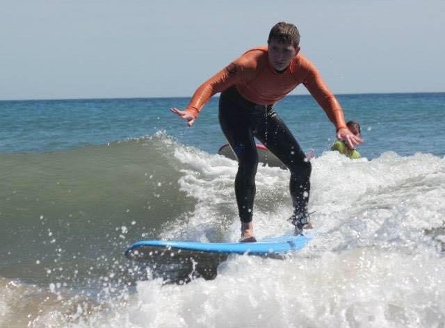

import YouTube from "../../../components/blog/YouTube";
import {Dialogue, FigureLabel, GlyphLeft, GlyphRight, Pony} from "../../../components/blog/Text";
import TextBox from "../../../components/blog/Boxes";
import BlogImage from "../../../components/blog/BlogImage";

At the start of a game, **chess** offers you 20 possible moves-- 16 pawn pushes plus 4 of those pesky knight hops. Which feels manageable.

But by the 4th turn, things escalate so quickly that you now have **85 billion** combinations to choose from. Like in Life.

And exactly as in Life, an overwhelming majority of these options are complete and utter **rubbish**. We are talking growing a mullet levels of rubbish. We are talking drinking milk after 11:00am, wearing Birkenstocks in October, breaking spaghetti in half, enjoying the works of Ryan Reynolds. Just the nadir of horrible decisions in a wasteland of **free will**.

So, as a self-proclaimed **Life Enthusiast** or at the very least Life Customer, a couple of months ago I dove into the world of chess, eager to apply its hard-won lessons to my daily grind, which has occasionally seen its share of H4s.

Well, am I any good? Not at all!

Which is why on November 3rd I travelled to Stockholm and squared against **Gotham Chess** and **Anna Cramling**, i.e. the biggest chess YouTuber and the cutest. I'm still talking about Gotham.

## But why?

This part comes at the end, for effect.

## The hosts

With nearly six million subscribers obtained in under five years, **Gotham Chess** has become one of the most recognizable figures in the chess community. Deservedly so. He is of course a talented player, but his success relies primarily on his ability to be both informative and entertaining. Gotham has an **improv-like** gift for delivering unedited, 30-minute streams of consciousness packed with insightful game analysis and witty humor, which is a breath of fresh air in a market of heavily edited content.

The daughter of two chess grandmasters, **Anna Cramling** started playing chess when she was three. Her success as a content creator stems largely from her genuine enthusiasm for the game and her approachable, lighthearted style.

Anna talks with her hands as if she was Italian, and at the same time employs this typically Swedish matter-of-fact way of saying things, like:

<Dialogue>Now, this is a really bad move.</Dialogue>

That one can't help but find endearing.

## The show

Held at a venue by the King's Garden in central Stockholm, the event kicked off with a lively **Guess the Elo** segment, where the two hosts reviewed games submitted by the audience.

I was relieved my contribution didn't make the cut, as it was a **blunder fest** that left me with three queens on the board, while still relying on the enemy king seppuku-ing himself.

The evening continued with a Q&A session, blending heartwarming moments with some **drama** commentary. It seems like no human endeavor is complete without a slice of conflict.

As the first part of the event wrapped up, the hosts reflected on how remarkable it was to see such a **turnaround**. Not long ago, they noted, it would have been unthinkable to pack a full theater for a chess event-- i.e. a game that is admittedly as thrilling as watching a soccer match, a formula 1 race, or grass growing.

So, for the turns having tabled this much and chess now enjoying widespread interest, we must be thankful to the **pandemic**.

*(Fine, the hosts didn't say this. I threw it in to spice things up and keep you engaged.)*

<FigureLabel>Here I am playing on a giant chessboard and not, as it might first seem, shrinking down to Sardinian proportions to play on a standard-sized one</FigureLabel>

## The game

During the second part of the event, I, along with 59 other VIP ticket holders, challenged our hosts in a game of **simul-chess**.

For the **n00bs**, this is a format where a single player (or in this case, two) hops from table to table, playing White on all of them and making a move on each one while holding all **60 games** partially played in their mind.

Gotham and Anna gladly took on the task. However, to keep things moving at a reasonable pace, Anna’s parents —- GM Pia Cramling and GM Juan Manuel Bellón López -- stepped in to help.

So you must understand that I had **no chance**.

<FigureLabel>As his name length's suggests, Juan is originally from Spain</FigureLabel>

A game of Chess is divided into **three phases**: the opening, the middlegame, and the endgame.

In the **opening**, you develop your pieces so they can work together while protecting your king, ideally by castling. This is not the time for improvisation; you want to stand on the shoulders of giants and follow well-studied opening strategies instead of, say, growing a mullet.

If you survive the list of well-known traps that can end you in just a few moves, congratulations — you made it to the **middlegame**! Here, you start crafting attack plans while sabotaging your opponent’s. Pieces will be traded, blundered, heroically sacrificed, or stolen by cats.

When enough pieces have been cleared and no checkmate is in sight, you have reached the **endgame**. By now, the queen is probably gone, the king is strutting around being all misogynistic, and pawns are playing the game of thrones.

Let's see how it went for me...

## 1. Opening

Openings are so important that I spent the entire train ride to the capital deciding which one to use. In the end, I went for the **King's Indian Defense** because it's the only opening I know.

So, while my respectful opponents move their pieces in a **seemingly** random fashion, I develop my pieces based on theories I’ve absorbed from countless books. Fine, Instagram Reels.

However, I can't help but **blunder** my knight to Gotham, because I'm the kind of person that, on their first day in prison, likes to be punched in the face by a random inmate to establish dominance, or lack thereof.

Be it as it may, we end our opening in the following configuration...

Not too shabby, innit? The mayor is protected and I have plenty of **ideas** going forw-- just kidding, I'm in danger!

After the game, I fed the opening moves into Stockfish — the most powerful chess engine on the planet — and it laughed at me. I didn’t even know it could do that!

Turns out that White had an **overwhelming** range of choice ahead, whereas Black basically brexited...

I'm King Harren the Black, barricading inside the impregnable castle that carries my name and feeling all **hygge** and shizz, while from the sky I'm about to be barbeque'd by **Aegon Targaryen** The Conqueror. First of his name. King of the Andals, the Rhoynar, and the First Men. Lord of the Seven Kingdoms and Protector of the Realm.

*(It bothers me that I didn't need to look it up.)*

<FigureLabel>I took this selfie right after he got my knight. Stockholm Syndrome</FigureLabel>

## 2. Middlegame

That said, I didn't travel first class and spent the night at a five stars hotel for **nothing**. I am determined to lose slowly and painfully, dragging my own **carcass** with as much dignity as I can muster.

I pay attention to every move and go **surgical**, ensuring protection of my pieces and preventing White's rude attempts at forking attacks. In the entirety of the mid-game, I believe I have made one single mistake, which I commented to my opponent with a loud:

<Dialogue>BRO!</Dialogue>

You will ask, was it to Gotham? I wish! But it was to Pia. 🙈

<Dialogue>You are not giving up,<GlyphRight/> Gotham tells me a few moves later. <GlyphLeft/>Good!</Dialogue>

I want to reply with an <GlyphLeft/>I can to this all day!<GlyphRight/> but have a train to catch, so I could not, in fact, have done this all day.

At some point Pia even whispers <GlyphLeft/>Fy fan<GlyphRight/> which is Swedish for <GlyphLeft/>I'm really enjoying this game!<GlyphRight/>

In all this, my Apple Watch keeps asking me:

<Dialogue>Hey, are we ok?</Dialogue>

Apparently, my **heart** is pumping as if I was running from the police...

Which is what happens when you push yourself out of your **comfort zone** and do something so inadequately outrageous.

Or maybe this is simply due to Anna asking me if I am **Finnish**.

Speaking of, she declares <GlyphLeft/>Let's spice things up<GlyphRight/> and triggers a flurry of trades that catapults us into the endgame.

## 3. Endgame

This is the **sorry ass** state of the board...

Can you see how my King is all but **surrounded** while their King completely lacks any form of surrounding?

**Stockfish** says that this is Mate in 4 for White. Also, I need to pee real bad and have an imminent train to catch. I'm about to figuratively throw the towel when it appears to me. The move I have been waiting for. A final (fine, first) attack to go out in style and bring the house down with me!

Can you see it?

Exactly. Queen D1 **check**!

With the pawn sniping G2, this leaves the King only one square to escape to. **Stockfish** is now fifty-fifty on us. Hypocrite. It loved White five minutes ago!

My strategy is crystal clear. This is what I’ve strived for all my years of playing chess (fine, weeks). I become **unstuck** in time. Nothing is of substance anymore. The train. The Pee. My entire life flashes in front of my eyes and I can't help but notice a mullet from ages 14 to 16.

After their King moves, I go Queen F1, then Queen G2 **check mate**!!!

However, I do not have two **consecutive** moves, do I? I didn't consider this.

Anna hops in, and after placing the King out of check, says:

<Dialogue>I think you have one move left.</Dialogue>

Classic Anna!

Can you guess White's next move?

It is of course Queen F3, which removes my mating aspirations and enables a descent south that will inevitably win the game.

I pick up my King, bring him to the backyard and shoot him in the face with a shotgun, as was customary back then.

<TextBox title={"Little known fact"}>
    

        According to legend, King <strong>Adolf Frederick</strong> of Sweden died in 1770 after eating a big meal featuring 14 semlor among other dishes.
    

    <BlogImage imageName={"semla"}></BlogImage>
    

        Given my recent <a href={"/diabetes"}>diagnosis</a>, this is exactly how I want to go.
    

</TextBox>

With the King laying on the porch, there is only time to say thank you, shake hands, take a blurry selfie...

...then I'm off. I played against two YouTubers and two Grand Masters and survived until move 32. What a day.

## Ok, but why?

I belong to the silent majority of people who don't have a **thing**.

Do you know what I mean by that? Anna and Gotham's thing is chess, obviously. Picasso's thing was painting and prostitutes. Sardinians' thing is being Sardinians.

<FigureLabel>You're goddamn right</FigureLabel>

If you are a **surfer**, then surfing has to be your thing. You can't half-ass surfing. It's your identity. That's why we say that you *are* a surfer, and not that you surf on weekends. You are probably thinking about waves right now. You say **dude** a lot and surround yourself with other like-minded surfers because, frankly, everyone else finds you unbearable.

Having a thing matters because the act of doing it feels **meaningful**. It’s not something you have to force. It’s effortless because it defines you.

For me, work occupies 80% of my waking hours and a few of the sleeping ones (I have the git history to prove it). I love it and it is in many ways a thing. But I also hold the remaining 20% of life’s real estate in high regard. And that’s why **striving** to have a thing there feels so important.

## My thing

I have of course tried surfing after watching **Point Break**. I caught a few waves, nearly smashed my teeth, got a carpenter suntan, and said dude more times than I care to admit.

But I realized that it was not my thing when my surf-sensei told me:

<Dialogue>You see, Gianluca. A wave breaking is so powerful that the water <strong>molecules</strong> smash and split and...</Dialogue>

<Dialogue>Wait, wait, wait. Are you saying that each wave could potentially trigger an uncontrolled chain <strong>atomic</strong> reaction?</Dialogue>

<Dialogue>Uh... yeah, dude!</Dialogue>

Which is why I quit surfing. Too dangerous.

<FigureLabel>I put everyone at risk</FigureLabel>

For a while, I thought **writing** was my thing. But here’s the thing (sorry): I’ve been working on a post about the **meaning of life** since last February. In my head, it’s all there: groundbreaking revelations, perfectly timed jokes, pacing that feels like clockwork, callbacks that tie it all together. That was the easy part.

But actually sitting down to type it out? Shuffling commas, removing repetitions, making it sound like music? That’s horrible! It’s so hard that I rather go and re-watch **In Bruges** instead.

So, yeah, I'm **thingless**. But how does one even get a thing?

## Mimetic desire

French philosopher **René Girard** would argue that you don't have to do anything. We have no idea of what we want. Our desires are mere imitations of the desires of others. We are sponges at best.

For instance, I didn't just randomly decide to surf, did I? I watched a movie and concluded that **robbing banks** was too much hassle.

In the same vein, it's why I'm currently planning a trip to Belgium. Belgium!

Do you think that Pia and Juan told her 3 years old daughter:

<Dialogue>Anna, no. You can't be a doctor. Du måste spela chess!</Dialogue>

<FigureLabel>I could be treating hemorrhoids right now.</FigureLabel>

Of course not. Anna absorbed it all. The dinner table debates about openings, the late-night game analyses. She didn’t need to be told; she just **soaked** it in.

That’s why the sons and daughters of actors tend to be actors (plus, they’re **hot**). That’s why the sons and daughters of Sardinians tend to be Sardinians.

And it’s not only family influence; not anymore. Social media is a giant mimetic desire machine. We get a constant feed of strangers baking sourdough, running marathons, or speaking High Valyrian, and suddenly think <GlyphLeft/>I should be doing that too!<GlyphRight/>

And therein lies a problem.

## The pitfalls of mimetic desire

While **scrolling**, you stumble upon an incredible guitar solo…

<YouTube source={"M4lsB-B1O7U"} />

There you go. Now all you want is to learn how to play guitar. Damn you, **Girard**!

So you go to the music shop and spend money on guitars, tuners, amplifiers, sound suppressants. Then you book classes and make space in your calendar and life. However, more often that not, **nothing** will come of it. The mimetic desire you expressed is wrong. You told yourself that you want to learn playing guitar, but what you really meant is:

<Pony>I want to have learned playing guitar.</Pony>

You are picturing yourself on the beach at night by the campfire, pulling out a six strings, riffing *Wish you were here*, and **melting hearts**. What you are not factoring in is the grind to get there, the hours of repetitive scales, the blisters on your fingertips, and the soul-crushing realization that your first chord sounds like a **horny manatee**.

<small>
(Apparently, horny manatee violates Midjourney's terms of service.)
</small>

I have learned this the hard way, which is why I do not fall into these traps anymore. A few months back I deleted a piano from the shopping cart because, I concluded, I'm not willing to alter my schedule to fit in an hour a day to practice.

<FigureLabel>Plus, the logistics of bringing a long-tail piano to the beach at night are just a nightmare.</FigureLabel>

## What I do instead

fake till you make it is a toxic trait. I want to absorb passion.

I'm gonna leech the shit out your enthusiasm and make it my own

## Did it work?

asd