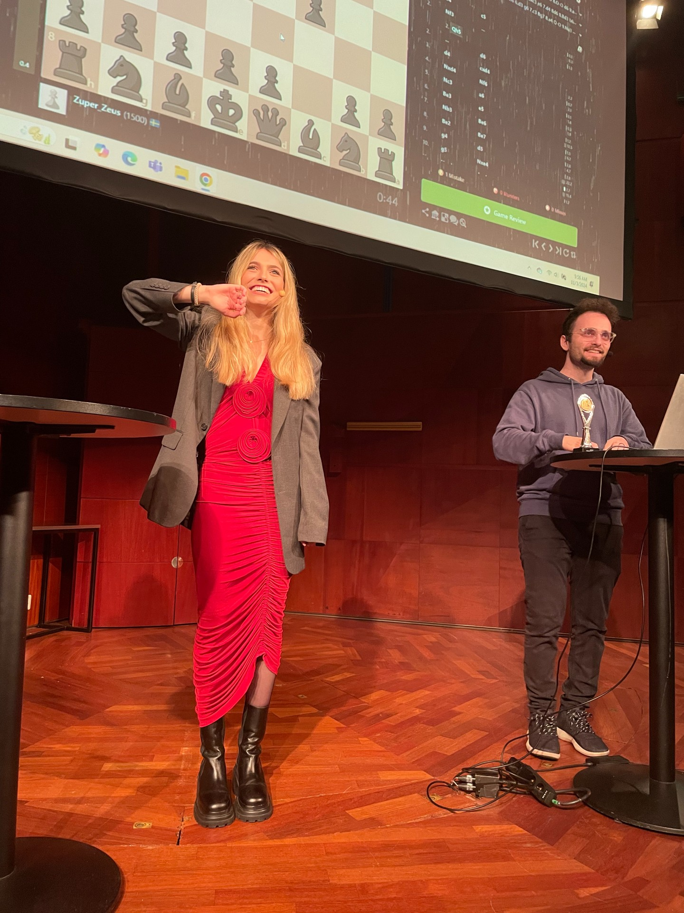

import {Dialogue, FigureLabel} from "../../../components/blog/Text";

At the start of a game, **chess** offers you 20 possible moves: 16 pawn pushes and 4 of those pesky knight hops. Which feels manageable.

But by the 4th turn, things escalate so quickly that you now have **85 billion** combinations to choose from. Like in Life.

And exactly as in Life, an overwhelming majority of these options are complete and utter **rubbish**. We are talking growing a mullet levels of rubbish. We are talking drinking milk after 11:00am, wearing Birkenstocks in October, breaking spaghetti in half, enjoying the works of Ryan Reynolds. Just the nadir of horrible decisions in a wasteland of **free will**.

So, as a self-proclaimed **Life Enthusiast** or at the very least Life Customer, a couple of months ago I dove into the world of chess, eager to apply its hard-won lessons to my daily grind, which has occasionally seen its share of H4s.

Well, am I any good? Not at all!

Which is why on November 3rd I travelled to Stockholm and squared against **Gotham Chess** and **Anna Cramling**, i.e. the biggest chess YouTuber and the cutest. I'm still talking about Gotham.

## But why?

This part comes at the end, for effect.

## The hosts

With nearly six million subscribers amassed in under five years, **Gotham Chess** has become one of the most recognizable figures in the chess community. Deservedly so. He is of course a talented player, but his success relies primarily on his ability to be both informative and entertaining. Gotham has an **improv-like** gift for delivering unedited, 30-minute streams of consciousness packed with insightful game analysis and witty humor, which is a breath of fresh air in a market of heavily edited content.

The daughter of two chess grandmasters, **Anna Cramling** started playing chess at just three years old. Her success as a content creator stems largely from her genuine enthusiasm for the game and her approachable, lighthearted style.

Anna talks with her hands as if she was Italian, and at the same time employs this typically Swedish matter-of-fact way of saying things, like:

<Dialogue>Now, this is a really bad move.</Dialogue>

...that one can't help but find endearing.

## The show

Held at a venue by the King's Garden in central Stockholm, the event kicked off with a lively **Guess the Elo segment**, where two hosts reviewed games submitted by the audience.

I was relieved my contribution didn't make the cut, as it was a **blunder** fest that left me with three queens on the board, while still relying on the enemy king seppuku-ing himself.

The evening continued with a Q&A session, blending heartwarming moments with some **drama** commentary. It seems that no human endeavor is complete without a slice of conflict. Really makes you think.

As the first part of the event wrapped up, the hosts reflected on how remarkable it was to see such a **turnaround**. Not long ago, they noted, it would have been unthinkable to pack a full theater for a chess event-- i.e. a game that is admittedly as thrilling as watching a soccer match, a formula 1 race, or grass growing.

So, for the turns having tabled and chess now enjoying widespread interest, we must be thankful to the **pandemic**.

*(To be fair, the hosts didn't say this. I threw it in to spice things up and keep you engaged.)*

<FigureLabel>Here I am playing on a giant chessboard and not, as it might first seem, shrinking down to Sardinian proportions to play on a standard-sized one.</FigureLabel>

## The game

During the second part of the event, I, along with 59 other VIP ticket holders, got the chance to challenge our hosts in a game of **simul-chess**.

For the **n00bs**, this is a format where a single player (or in this case, two) hops from table to table, playing White on all of them and making a move on each one while holding all **60 games** partially played in their mind.

Gotham and Anna gladly took on the task. However, to keep things moving at a reasonable pace, Anna’s parents —- GM Pia Cramling and GM Juan Manuel Bellón López -- stepped in to help.

So you must understand that I had **no chance**.

<FigureLabel>As his name length's suggests, Juan is originally from Spain.</FigureLabel>

A game of Chess is divided into **three phases**: the opening, the middlegame, and the endgame.

In the **opening**, you develop your pieces so they can work together while protecting your king -- ideally by castling. This is not the time for improvisation; you want to stand on the shoulders of giants and follow well-studied opening strategies instead of, say, growing a mullet.

If you survive the list of well-known traps that can end the game in just a few moves, congratulations — you’ve made it to the **middlegame**! Here, you’ll start crafting attack plans while sabotaging your opponent’s. Pieces will be traded, blundered, or heroically sacrificed.

When enough pieces have been cleared and no checkmate is in sight, you’ve reached the **endgame**. By now, the queen is probably gone, the king is strutting around being all misogynistic, and pawns are playing the game of thrones.

Let's see how it went for me...

## 1. Opening

Openings are so important that I spent the entire train ride to the capital deciding which one to use. In the end, I went for the **King's Indian Defense** because it's the only opening I know.

So, while my respectful opponents move their pieces in a **seemingly** random fashion, I develop my pieces according to the theory's that I have learned in so many books (or rather reels).

However, I can't help but **blunder** my knight to Gotham, because I'm the kind of person that, on their first day in prison, likes to be punched in the face by a random inmate to establish dominance, or lack thereof.

Be it as it may, we end up our opening in the following configuration...

Not too shabby, innit? The mayor is protected and I have plenty of ideas going forw-- just kidding! After the game, I fed the opening moves into **Stockfish**, and the machine laughed at me. I didn't know it could do that.

Turns out that White had an **overwhelming** range of possibilities, whereas Black basically brexited...

I'm King Harren the Black, barricading inside the impregnable castle that carries my name and feeling all **hygge**, while from the sky I'm about to be barbeque'd by **Aegon Targaryen** The Conqueror; first of his name. King of the Andals, the Rhoynar, and the First Men. Lord of the Seven Kingdoms and Protector of the Realm.

*(It bothers me that I didn't need to look it up.)*

<FigureLabel>I took this selfie right after he got my knight. Stockholm Syndrome.</FigureLabel>

## 2. Mid game

In all this, my Apple Watch kept notifying me with a:

<Dialogue>Hey, are we ok?</Dialogue>

Apparently, my heart was behaving as if I was running for my life, while being completely still. This is what happens when you force yourself out of your comfort zone and do something so inadequately outrageous.

Or maybe this was only due to Anna asking me if I was Finnish.

asd

## End game

asd

<Dialogue>I think you have one move left.</Dialogue>

## Ok, but why?

asd

## Having a thing

asd

## Did it work?

asd