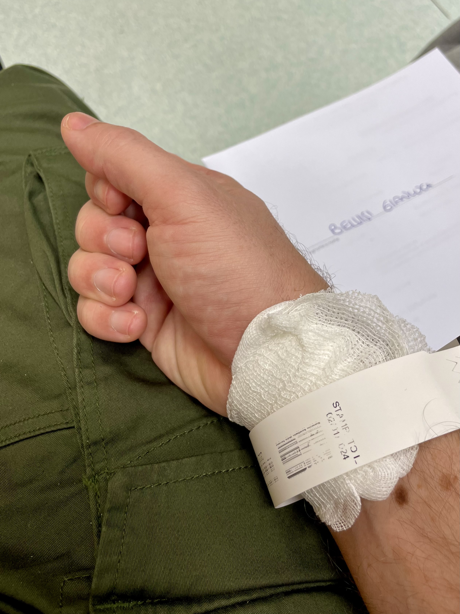

import Poll from "../../../components/blog/Poll";
import TextBox from "../../../components/blog/Boxes";
import {Dialogue, FigureLabel} from "../../../components/blog/Text";

Meet Semola.

My sister found Semola in a parking lot when he was but a tiny ball of fur, possibly abandoned by his mother because he was **ginger**.

<TextBox title={"By the way"}>
    Remember kids that February is <b>ginger awareness month</b>. Please be kind to gingers and donate <a href={"https://paypal.me/gianlucabelvisi"}>here</a>.
</TextBox>

Semola refuses to **purr**, finds that tuna upsets his stomach, and delights in catching sparrows, which he then presents to my sister as tokens of affection, misinterpreting her cries of **horror** as expressions of approval.

Lastly, but not leastly, this cat will play a pivotal role in my **diagnosis**. How, you might wonder? All shall be revealed in due course. Meaning now.

Let's turn back the clock to **January 2nd, 2024**. I am in Italy, visiting family and friends for the holidays and wrapping up the final days working remotely from my parents' place. My flight back to Sweden is set for the 4th.

It's important to know that Semola has a particular fondness for **lounging** on my lap while I work. It's not just any lap he chooses. Mine is apparently a prime spot, a sweet piece of real estate, the ultimate chilling location, and this sentiment is echoed by **countless** others who have been blessed with such an exclusive treatment.

<Poll
    id={"lap_sitting"}
    question={"How did you like sitting on my lap?"}
    answers={["It was a once in a lifetime experience!", "It was kinda mid", "I haven't sat on your lap yet"]}
    labels={["Loved it!", "Mid", "DM me"]}
/>

In the midst of an afternoon coding session, I realize that I have to **pee**. A natural consequence of our Italian lunches where sipping wine is part of the lore and **totally** not an addiction.

But how could I possibly disturb Semola when he was so **contentedly** settled? I mean, just look at him.

Yes, I could pee in an **empty water bottle**, but my company is not a 1 trillion dollar e-commerce organization, or at least not yet, so the next best option is to use my catholic upbringing and **endure** it, exactly like Jesus our Lord on the cross.

Later in the evening, I'm done with work and have an appointment with a friend for **fika** (of the Swedish kind). Also, I have to pee real bad, so I gently move Semola like your typical Indiana Jones...

...and sprint to the bathroom to relieve myself.

Now, that was a long pee, and since I like to comment out loud on events that skew 5 sigmas beyond the mean, I tell my mother:

<Dialogue>Now, that was a long pee.</Dialogue>

My mother takes in the bit of unrequested information, spends a few seconds pondering, then replies:

<Dialogue>You have diabetes.</Dialogue>

<FigureLabel>It's either that or Lupus.</FigureLabel>

She then insists that I check my glucose level with the measurement device we have at home, being my mother a fresh type 2 and my sister a type 1 since age 3. And knowing it'll be easier to give in the request than debating the reasons for my Oppenheimer-level long urine, I prickle my finger (ouch!) like in a satanic ritual and measure my bloody blood sugar.

The result is 22 mmol/L. To put it in context, the normal range is around 3-4 mmol/L and, beyond 28, organs severely deteriorate until you are mostly kinda dead.

While trying to process the enormity of the information, I remember that I'm supposed to meet a friend, so I text her:

<Dialogue>Hey, so, I have to cancel our (swedish) fika because I have diabetes.</Dialogue>

Which, looking for silver linings, is a great excuse for anything.

<Dialogue>Listen, I can't come to your wedding because I have diabetes. Also, I don't wanna be invested in this union because I don't think it will last, and the reason I'm saying this is that I have eyes. But mostly diabetes.</Dialogue>

I go to the ER. The triage nurse acknowledges that this not normal, but at the same time she has a queue of 50 people that exploded their fingers with fireworks on New Year's Eve, so she's like:

<Dialogue>Look, let's measure it again. If it's below 22, you go home and come back tomorrow.</Dialogue>

It's 25.

<Dialogue>You stay.</Dialogue>

## The Italian hospital

At the hospital, I have an amazing experience, all the personnel is at their kindest. I am given insulin, glucose measurement tech, and all sorts of advices. The only exception is a nurse that asks me how come I am at the hospital despite having no symptoms. I tell her about the cat, the pee, the mother, and she replies:

<Dialogue>What was your mother even thinking? You should not have tested yourself if you don't have symptoms.</Dialogue>

I reply one-upping the obvious joke:

<Dialogue>Yeah, this bitch, am I right?</Dialogue>

But then she repeats the same remarks two more times, so I no longer think it was in jest. 😭

But again, everything else is perfect and administered with kindness and professionalism. Which gets me thinking...

<Dialogue>Hey soo, this all looks great but also expensive. Could it be a problem that I am a tourist here and that I have not, like, paid taxes in Italy for the past 10 years? Plus, I got a speeding ticket in Florence back in 2013 that at this point I just refuse to pay.</Dialogue>

The doctor types in her computer for some time, then says:

<Dialogue>It seems like Italy still loves you, signor Belvisi.</Dialogue>

Well, of course. Italy has sat on my lap. Sat on my lap real good.

## Interlude: Diabetes

## The Swedish hospital

asd

## Coping

asd

