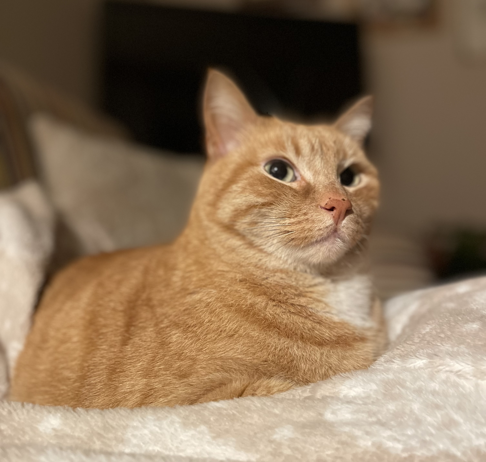
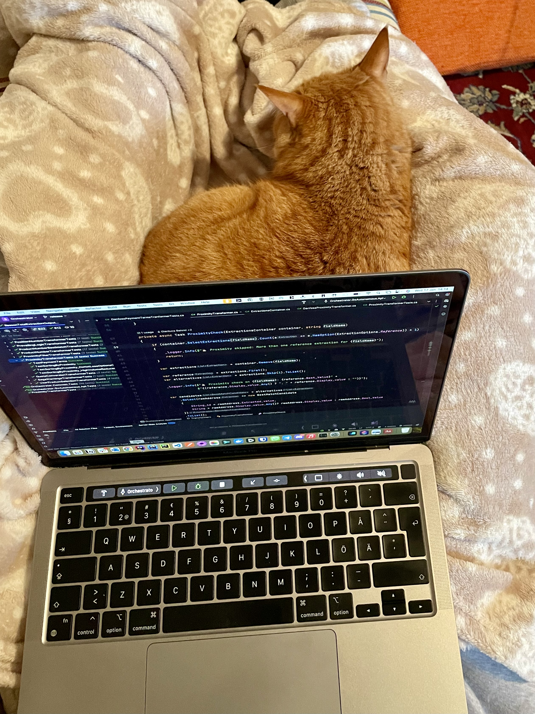
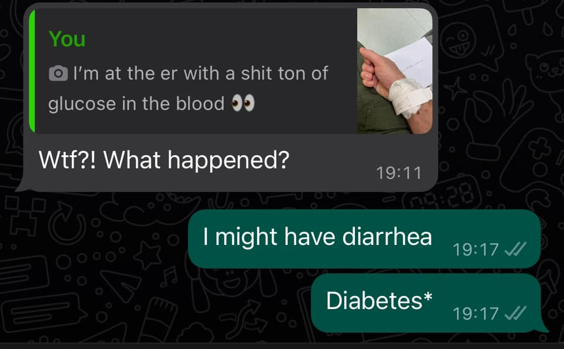
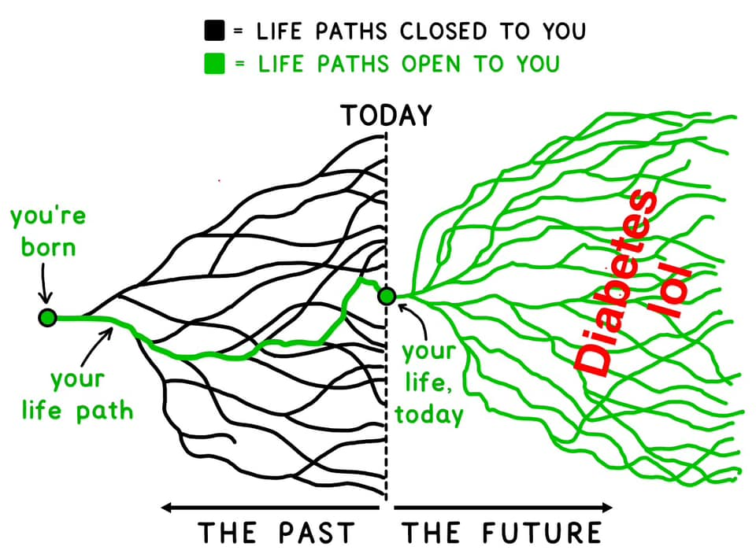

import Poll from "../../../components/blog/Poll";
import TextBox from "../../../components/blog/Boxes";
import {Dialogue, FigureLabel} from "../../../components/blog/Text";
import BlogImage from "../../../components/blog/BlogImage";
import {ResponsiveEmbed} from "../../../components/blog/ResponsiveEmbed";

Meet Semola.

My sister found him in a parking lot when he was but a tiny **furball**, possibly abandoned by his mother because he was **ginger**.

<TextBox title={"By the way"}>
    
Remember kids that February is <strong>ginger awareness month</strong>.

    <BlogImage imageName={"ginger"} alt={"Ginger awareness month"} />
    
Be kind to the fellow <strong>soulless</strong> and donate <a href={"https://paypal.me/gianlucabelvisi"}>here</a>.

</TextBox>

Semola refuses to **purr**, finds that tuna upsets his stomach, and has a thing for catching sparrows, which he then presents to my sister as tokens of affection, misinterpreting her cries of **horror** as manifestations of delight.

Lastly but not leastly, this cat will play a pivotal role in my **diagnosis**. How, you might inquire? Well, stop inquiring and continue reading. I mean, what is wrong with you?

## Part 1: The diagnosis

Let's turn the clock back to **January 2nd, 2024**. I'm in Italy visiting family and friends for the holidays and wrapping up the final days working remotely from my parents' place. My flight back to Sweden is set for the 4th.

Semola has a particular **fondness** for sitting on my lap while I work. It's not just any lap he chooses. Mine is apparently a prime spot. A sweet piece of real estate. The ultimate chilling location, which does not come as a surprise to me, as this sentiment is echoed by **countless** others who have been blessed with such an exclusive treatment.

<Poll
    id={"lap_sitting"}
    question={"How did you like sitting on my lap?"}
    answers={["It was a once in a lifetime experience!", "It was kinda mid", "I haven't sat on your lap yet"]}
    labels={["Loved it!", "Mid", "DM me"]}
/>

I'm the midst of an afternoon coding session -- or **pure bliss** as I like to call it -- with cat in tow, when I realize that I have to **pee**. A natural consequence of our Italian lunches, where sipping wine is part of the lore and **totally** not an addiction shut up.

But how could I possibly disturb Semola when he is so **contentedly** settled? I mean look at him...

And bear in mind that I don't have the option of peeing in an **empty water bottle**, because my company is not a trillion dollar e-commerce corporation, or at least not yet, so the next best option is to use my catholic upbringing and **endure** it, exactly like Jesus our Lord and Savior did when a donkey sat on his lap (Matthew 23:12).

Later in the evening, I'm done with work and have an appointment with a friend for **fika** (of the Swedish kind). To the surprise of no one, I have to pee real bad. I gently move Semola so as not to disturb him...

<ResponsiveEmbed ratio={"16:9"} src={"https://gifer.com/embed/3P6t"}/>

...and sprint to the bathroom to relieve myself.

Now, that was a long pee, and since I like to comment out loud on events that skew **5 sigmas** outside the mean, I tell my mother:

<Dialogue>Now, that was a long pee.</Dialogue>

She takes in the bit of **unsolicited** information, spends a few seconds pondering, then concludes:

<Dialogue>You have diabetes.</Dialogue>

<FigureLabel>It's either that or Lupus.</FigureLabel>

You need to understand that mom is **absolutely** not a doctor. However, she might be a witch.

She insists that I check my **glucose** level with the measurement device we have at home, being her a fresh type 2 and my sister a type 1 since age 3. And understanding that it's simpler to comply with the request rather than discuss the reasons behind my Oppenheimer-level long urine, I prickle my finger (ouch!) like in a **satanic** ritual and measure my bloody blood sugar.

The result is **22 mmol/L**. To put it in context, the normal range is around 3-4 mmol/L and, beyond 28 mmol/L, organs severely **deteriorate**, until you are mostly kinda dead.

<FigureLabel>This is the first iteration on the cover image. It has a ginger cat in it, which I didn't ask for but I absolutely loved. When I directly told <strong>Midjourney</strong> to add a cat on my lap, it couldn't figure out the logistics. This is why we still need human artists. Just kidding, no cat is fine!</FigureLabel>

While processing the enormity of the information, I remember that I'm supposed to meet a friend, so I text her:

<Dialogue>Hey so I have to cancel our (swedish) fika because I have diabetes lol</Dialogue>

Which, grasping at silver linings, is an **amazing** excuse that I can use for anything, replacing my previous, weaker, "I have a sore face".

<Dialogue>Listen, I can't come to your <strong>wedding</strong> because I have diabetes. Also, I don't wanna be invested in this union because I don't think it will last, and the reason I'm saying this is that I have eyes. But mostly diabetes.</Dialogue>

I go to the ER. The triage nurse acknowledges that this not normal, but at the same time she has a queue of 50 people that exploded their fingers with fireworks on New Year's Eve, so she's like:

<Dialogue>Look, let's measure it again. If it's below 22, you go home and come back tomorrow.</Dialogue>

It's 25.

<Dialogue>You stay.</Dialogue>

## The Italian hospital

At the hospital, I have an **amazing** experience. The personnel is at their most professional despite 50 **lunatics** running around the facility with missing fingers and a blood trail.

The only **exception** is a nurse that asks me how come I measured my glucose despite having no symptoms. I tell her about the cat, the pee, the witch mother, and she comments:

<Dialogue>What was your mon even thinking? You should <strong>not</strong> have tested if you didn't have symptoms.</Dialogue>

I **yes-and** on the obvious joke because, no matter how **dire** things are, I will **never** let a joke un-yes-anded:

<Dialogue>Yeah, this bitch, am I right?</Dialogue>

But then, during my stay, she **repeats** the same remarks two more times, so I am now inclined to say she was serious. 😭

Be it as it may, I'm told that this is most definitely diabetes with a high probability toward **type 1** because "look at you". So I got this thing going now!

<FigureLabel>Original image: <a href={"https://waitbutwhy.com/"}>Wait but why</a></FigureLabel>

I'm told that more analysis will be needed. I am given insulin, glucose measurement tech, and all sorts of advice, like not eating (swedish) fika that much. Everything is administered with kindness and precision. Which gets me thinking...

<Dialogue>Hey soo, this all looks great but also expensive. Could it be a problem that I am de facto a tourist here and that I have not, like, paid taxes in Italy for the past 10 years? Plus, I got a speeding ticket in <strong>Florence</strong> back in 2013 that at this point I just refuse to pay also due to Niccolò Machiavelli's treatment of Caterina Sforza, but I digress.</Dialogue>

The doctor types on her computer for a few beats, then says:

<Dialogue>It seems like Italy still loves you, signor Belvisi.</Dialogue>

Well, of course. Italy has sat on my lap. Sat on my lap **real** good.

## Interlude: Diabetes

What is it?

Type 1

Type 2

## The Swedish hospital

finland, sweden, sardinia

But i digress.

Blood measurement device.

Insulin patch.

Research.

## Status update

Memes.

Leyla's text.

<TextBox title="Malding" closeable={true}>
    
<i>From mald +‎ -ing, itself a blend of mad +‎ bald.</i>

    

    “Malding” is a slang word used to describe an angry person.
    A combo of the words “mad” and “balding,” “malding” refers to a person (often a gamer) who gets extremely heated and irritated about something (to the point where they could metaphorically lose their hair/pull out their hair/go bald). Often, the thing they’re angry about isn’t a very big deal.
    

</TextBox>

Which brings us to part 2.

## Part 2: The coping

asd

