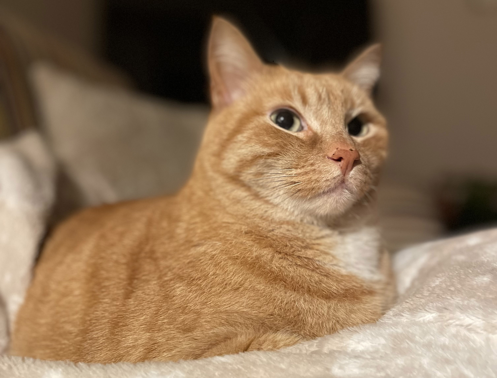
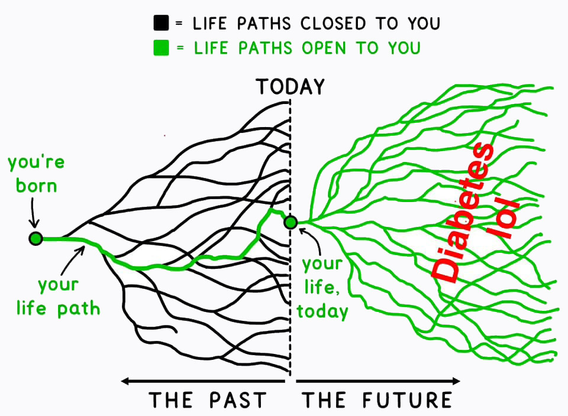
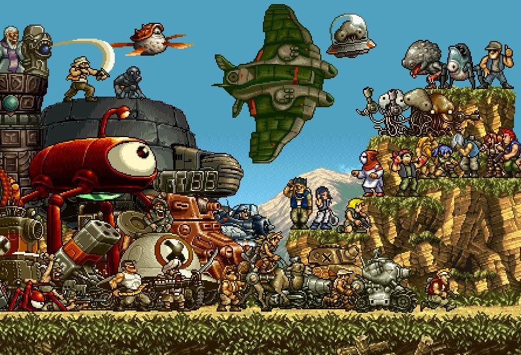
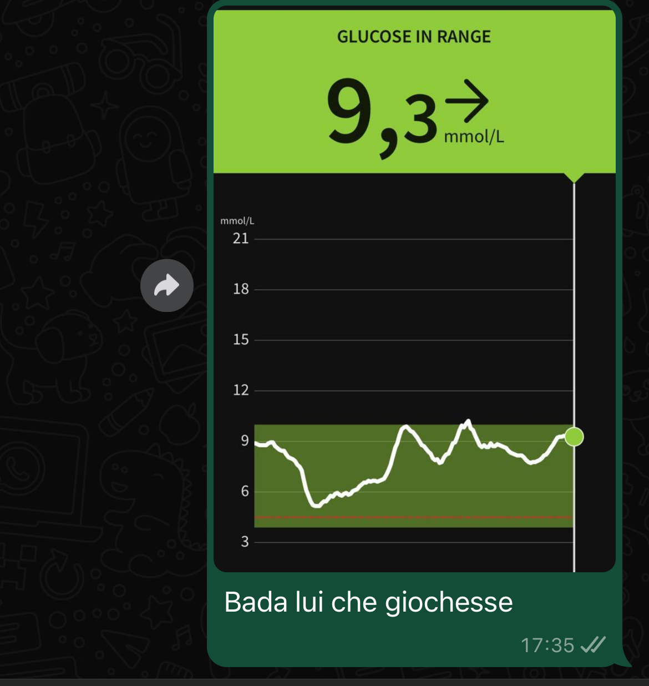
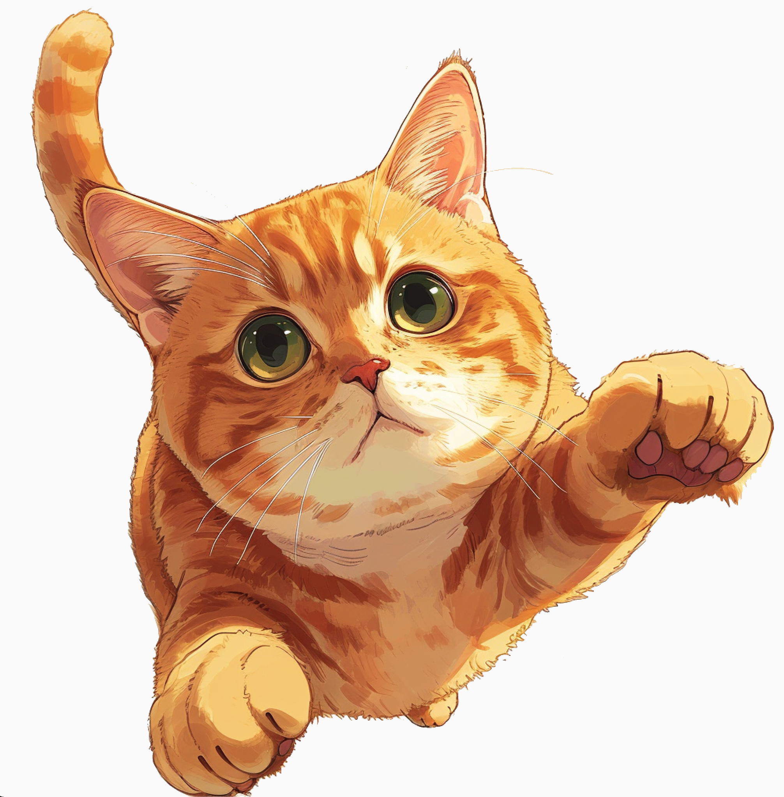

import Poll from "../../../components/blog/Poll";
import YouTube from "../../../components/blog/YouTube";
import TextBox from "../../../components/blog/Boxes";
import {Dialogue, FigureLabel, GlyphRight, GlyphLeft, Pony} from "../../../components/blog/Text";
import BlogImage from "../../../components/blog/BlogImage";
import {ResponsiveEmbed} from "../../../components/blog/ResponsiveEmbed";

Meet Semola.

My sister found him in a parking lot when he was a tiny **furball**, possibly abandoned by his mother because he was **ginger**.

<TextBox title={"By the way"}>
    
Remember kids that February is <strong>ginger awareness month</strong>.

    <BlogImage imageName={"ginger"} alt={"Ginger awareness month"} />
    
Be kind to the fellow <strong>soulless</strong> and donate <a href={"https://paypal.me/gianlucabelvisi"}>here</a>.

</TextBox>

Semola refuses to **purr**, finds that tuna upsets his stomach, and has a thing for catching sparrows, which he then presents to my sister as tokens of affection, misinterpreting her cries of **horror** as manifestations of delight.

Lastly but not leastly, this cat will play a pivotal role in my **diagnosis**.

# Part 1: Diagnosis

Let's turn the clock back to **January 2nd, 2024**.

I'm in **Italy** visiting family and friends for the holidays and wrapping up the final days working remotely from my parents' place. My flight back to Sweden is set for the 4th.

Semola has a particular **fondness** for sitting on my lap while I work. It's not just any lap he chooses. Mine is apparently a prime spot. A sweet piece of real estate. The ultimate chilling location. This is not at all surprising, as the sentiment is echoed by **countless** others who have been blessed with such an exclusive treatment.

<Poll
    id={"lap_sitting"}
    question={"How did you like sitting on my lap?"}
    answers={["It was a once in a lifetime experience!", "It was kinda mid", "I haven't sat on your lap yet"]}
    labels={["Loved it!", "Mid", "DM me"]}
/>

I'm the midst of an afternoon coding session — or **pure bliss** as I like to call it — with cat in tow, when I realize that I have to **pee**. A natural consequence of our Italian lunches, where sipping wine is part of the lore and **totally** not an addiction shut up.

But how could I possibly disturb Semola when he is so **contentedly** settled? I mean look at him...

And bear in mind that I don't have the possibility of peeing in an **empty water bottle** because my company is not a trillion-dollar corporation, or at least not yet, so the next best option is to recall my catholic upbringing and **endure** it, exactly like Jesus our Lord and Savior did when a donkey sat on his lap (Matthew 23:12).

Later in the evening, I'm done with work and have an appointment with a friend for **fika** (of the Swedish kind). To the surprise of no one, I have to pee real bad. I gently move Semola so as not to disturb him...

<ResponsiveEmbed ratio={"16:9"} src={"https://gifer.com/embed/3P6t"}/>

...and sprint to the bathroom to relieve myself.

Now, that was a long pee, and since I like to comment out loud on events that skew **5 sigmas** outside the mean, I tell my mother:

<Dialogue>Now, that was a long pee.</Dialogue>

She welcomes the bit of **unsolicited** information, spends a few seconds pondering, then concludes:

<Dialogue>You have diabetes.</Dialogue>

<FigureLabel>It's either that or Lupus.</FigureLabel>

You need to understand that my mom is **absolutely** not a doctor. However, she might be a witch.

Since number one-ing for too long can be a sign of **high glucose** in the blood, she insists that I check my level with the measurement device we have at home, being her a fresh type 2 and my sister a type 1 since age 3. And understanding that it's simpler to comply than to discuss the reasons behind my Oppenheimer-level long urine, I prickle my finger like in a **satanic** ritual and measure my bloody blood sugar.

The result is **22 mmol/L**.

To put it in context, the normal range is around 3-4 mmol/L and, beyond 28 mmol/L, organs severely **deteriorate**, until you are mostly kinda dead.

<FigureLabel>This is the first iteration on the cover image. It has a ginger cat in it, which I didn't ask for but I absolutely loved. When I directly told <strong>Midjourney</strong> to add a cat on my lap, it couldn't figure out the logistics. This is why we still need human artists. Just kidding, no cat is fine!</FigureLabel>

While processing the enormity of the information, I remember that I'm supposed to meet a friend, so I text her:

<Dialogue>Hey so I have to cancel our (swedish) fika because I have diabetes lol.</Dialogue>

Which, grasping at silver linings, is an **amazing** excuse that I can use to pull myself out of anything, replacing my previous and admittedly weaker: _I have a sore face_.

<Dialogue>I'm sorry, I can't come to your <strong>wedding</strong> because I have diabetes. Also, I don't want to be invested in a union I know it will not last, and the reason I'm saying this is that I have eyes. But mostly diabetes.</Dialogue>

My father drives me to the ER. The triage nurse acknowledges that this is not normal, but at the same time she has a queue of 50 people that **exploded** their fingers with fireworks on New Year's Eve, so she's like:

<Dialogue>Let's measure it again. If it's below 22, you go home and come back tomorrow.</Dialogue>

It's 25.

<Dialogue>You stay.</Dialogue>

## The Italian hospital

At the hospital, I have an **amazing** experience. The personnel is at their most professional despite 50 **lunatics** running and screaming around the facility, with missing fingers and a blood trail.

The only **exception** is a nurse that asks me how come I measured my glucose despite having no symptoms. I tell her about the cat, the pee, the witch, and she comments:

<Dialogue>What was your mon even thinking? You should <strong>not</strong> have tested if you didn't have any symptoms.</Dialogue>

I **yes-and** on the obvious joke because, no matter how **dire** things are, I will **never** let a joke un-yes-anded:

<Dialogue>Yeah, this bitch, am I right?</Dialogue>

But then, during my stay, she **repeats** the same remarks two more times, so I am now inclined to think she was serious. 😭

Be it as it may, the conclusion is that this is most certainly diabetes, with a high probability toward **type 1** because _look at you_. So I have this thing going now!

<FigureLabel>Original image: <a href={"https://waitbutwhy.com/"}>Wait but why</a></FigureLabel>

The doctor tells me that more analysis is needed. I'm given an insulin stash, glucose measurement tech, and all sorts of **advice** like not eating fika that much. Swedish.

Everything is administered with **kindness** and precision. Which gets me thinking...

<Dialogue>Hey soo, this all looks great but also expensive. Could it be a problem that I am <i>de facto</i> a tourist and that I have not, like, paid taxes in <strong>Italy</strong> for the past 10 years? Plus, I got a speeding ticket in <strong>Florence</strong> back in 2013 that at this point I just refuse to pay also due to Niccolò Machiavelli's egregious treatment of <a href={"https://gianlucabelvisi.com/caterina-sforza-1"}>Caterina Sforza</a>, but I digress.</Dialogue>

The doctor types on her computer for a few beats, then says:

<Dialogue>It <strong>seems</strong> like Italy still loves you, signor Belvisi.</Dialogue>

Well, of course. Italy has sat on my lap. Sat on my lap **real** good.

## Interlude: Diabetes

But what is diabetes, anyway?

In **type 1** diabetes, imagine your pancreas as a Facebook friend that has been sharing conspiracy theories for a tad too long. Suddenly, you realize that his posts (insulin) are no longer showing up on your feed (bloodstream). This is because your immune system (Facebook) has decided to **shadow-ban** his ass, and now you have to go on his profile and manually like all the posts about the moon landing being faked by **Stanley Kubrick** so that he could get from NASA those juicy Zeiss f/0.7 lenses he used to shoot indoor candlelight scenes in **Barry Lyndon** (insulin injections).

<FigureLabel>Totally freaking <strong>worth it</strong></FigureLabel>

In **type 2** diabetes, imagine your pancreas as this lazy as fuck security guard...

<YouTube source={"ZN5xiCEsV5o?si=pj4XqdW-m0iF5C6d"} />

There is no certainty on why type 1 diabetes manifests. In part, it is **genetically** determined, but the trigger is unknown. It could be a virus, stress, fatigue, or using a microwave oven to warm up your panties.

There is indeed certainty on type 2. Your fondness for food, divided by your love for exercise, approaches **infinity**.

## The Swedish hospital

At the hospital, I have an **amazing** experience. The personnel is at their most professional, despite a **lunatic** running around the facility having not yet figured out after 10 years that, in Sweden, the first floor is the ground floor. I'm talking about someone that is not me.

The only **exception** is a nurse who insists that we communicate in Swedish.

<Dialogue>You need to learn, so that you can <strong>become</strong> Swedish.</Dialogue>

<Dialogue>Well, I'm already <strong>Swedish</strong>, so what you just said was really dumb.</Dialogue>

I reply with my Swedish level of a **second-grader** with a learning disability, which adds to the irony, I think.

Then, I get to meet the doctor who turns out to be **amazing**. She asks me what happened, I tell her about Semola, and upon request I show her a reel I made of him.

<FigureLabel>If you are a boomer you can click <a target={"_blank"} href={"https://www.instagram.com/p/CnCe-NpIr5k/"}>here</a></FigureLabel>

She concludes that this is most certainly diabetes, with a high probability toward **type 1** because I am very fit. I thank her despite not feeling in the mood for lap sitting. She adds:

<Dialogue>Know that you are in good hands here. Sweden is very advanced in the treatment of diabetes. In fact, the regions with the <strong>highest</strong> number of cases _per capita_ are Finland, Sweden, and Sardinia.</Dialogue>

Which raises an eyebrow.

<Dialogue>Oh, really? Wait... Sardinia?!</Dialogue>

<Dialogue>There we suspect the so called <strong>small island</strong> effect</Dialogue>

<Dialogue>Is it a polite way of saying <strong>inbreeding</strong>?</Dialogue>

<Dialogue>...</Dialogue>

<Dialogue>Well, don't get me started with <strong>Sardinians</strong>. Not only do they leave their region in search of opportunities in <strong>Italy</strong>, but they are so obnoxious in telling us how this is all temporary, that nothing compares to Sardinia, be it climate, food, people, and I'm like why don't you and your defective genes <strong>eff off</strong> back to your island and, like, swim in your transparent waters, enjoy your high longevity life, grow your organic food, cook your juicy piglets, and make love to your beautiful goats. But I digress.</Dialogue>

<FigureLabel>Sardinians</FigureLabel>

The doctor adds that genetics account for around 20% of diagnoses for type 1 diabetes, so the rest has to be **environmental**. There is something in Finland and Sweden that gets more people sick. So let's update the tally of shit hands I was dealt with by this country:

1. I was [assaulted](/wink)
2. My boots were stolen at the gym (no blog post yet)
3. I got [diabetes](/diabetes)

I'm told that more analysis is needed. I'm given an insulin stash and glucose measurement tech that I **attach** directly to my skin and sends glucose data to then phone. Then, through the phone, it forwards it to the hospital, so that they can track in real time if I'm alive.

<FigureLabel>Pardon the thirst trap</FigureLabel>

As is the case for Italy, this is all **free** because in Europe we recognize that the individual is not an island, but the integral part of a community. The higher taxation level ensures the help of those in need.

Then again, I'm not really paying taxes in Sweden, am I? I'm paying them in **Denmark**. Let's keep this between us.

<YouTube source={"OtIZL1U49G8"}/>

<FigureLabel>Sound on</FigureLabel>

Finally, the doctor tells me that there is an ongoing study at the **Lund University Hospital** looking into halting the deterioration of the pancreas in newly diagnosed type 1s. Would I be interested in participating? Heck yeah!, I say.

A few minutes later, I start thinking about the students in Lund I have hung out with. Their **drinking habits**. Their allergy for challenging tasks. So here I am hoping that I'll end up in the control group!

## Conclusions

As you can imagine, this is a whole thing!

But-- is **traumatic** a part of that whole? Should you feel bad for me? Should I? Absolutely not! It's not what happens to you but how you-- wait, let's hear it from Gandalf...

<YouTube source={"2jC-rRPKZ3U?si=PL0L0hvZjbRw0hkt&amp;start=9"}/>

<FigureLabel>Ignore the part when they talk about jewelry. The metaphor detaches there.</FigureLabel>

And for what it's worth, know that I'm keeping my chin up, spirits high, and I'm not letting this get to me.

This is where I should end the post, but I can't, because I've been lying to you. You see, while externally I'm vibing and meme-ing, internally I'm **malding**.

# Part 2: Malding

<TextBox title="" closeable={true}>
    
<i>From mald +‎ -ing, itself a blend of mad +‎ bald.</i>

    

        Malding is a slang word used to describe an angry person. A combo of the words <strong>mad</strong> and <strong>balding</strong>, malding refers to a person (often a gamer) who gets extremely heated and irritated about something (to the point where they could metaphorically pull out their hair.
    

</TextBox>

In the days following the diagnosis, I am as angry as I've never been before. I need to take breaks to ✌🏼calm the eff down✌🏼, hating every injection as if I was in **death row**, and waking up during the night with acid refluxes.

Not only am I angry, but I know that I'm the worst kind of angry, as there is nothing I could point the anger at. Not the government, not the diet, not the lack of exercise or a decadent lifestyle, and as much as I would like to blame **Jesus**, let's face it, I know the guy (or gal) is innocent.

## Help is on the way

But, since day one of my diagnosis, I am helped by one of my best friends. Someone that I know since we were single digits years sold. Someone I blacked out with and had to recollect the trail of parties from the photos like in that film. Someone I have been trapped with in a stream while snowboarding off-piste. Someone with whom half of our conversations are obscure references to our favorite movie.

Finally, someone who has since recently been injecting insulin, but for a very different reason.

## His diagnosis

Let's turn the clock back to **August 2023**.

My friend is at the hospital. The doctors are not loving the scan of his pancreas, but they do not fail to mention that this one of the variants with symptoms early on. So the outlook is positive.

The primary surgeon in the hospital in Pisa is world class. The surgery is done via robots and minimal invasive techniques.

Then, as it happens for 25% of the patients, the pancreas fights back on the stitches. The prospective two weeks in the hospital become six. Two more surgery are needed and in the end the decision is to remove the pancrease entirely.

Hence the need to insulin.

In September, I fly back to Italy to visit him, but he's not out of the woods yet. I finally see him for Christmas, and he looks great. The 20 kilograms he lost, he regained, and he is back to doing sport, albeit in a mild way.

As every year, I'm invited at his place, and a role that I have is be Santa Claus for his children of four and two.

This is a role that I absolutely love because:

1. It brings me back to the acting days
2. I enjoy lying to kids a bit too much maybe

As for any year, I like to go full Method on this role, but this year I want to go the extra mile. I want a Santa that caters to the new Generation Alpha. I want a woke Santa. I want to be the first Santa in the world that, instead of HO HO HO, says **poggers**.

<FigureLabel>Poggers</FigureLabel>

At the same time, I know that any creative process is a collaborative one, so I'm open of integrating my interpretation of what is Santa in 2023 with my friend's notes:

<Dialogue>Listen, don't take this the wrong way, but the less you talk, the better.</Dialogue>

## My diagnosis

Which brings us to January 2nd, 2024. The cat, the pee, "you have diabetes", the hospital.

The following day, my friend invites for lunch and cheers me up:

<Dialogue>It might seem overwhelming,<GlyphRight/> he says. <GlyphLeft/>But trust me, it's not. It's just a chore that you do without even thinking. And this is coming from someone who hates needles.</Dialogue>

<Dialogue>Oh yeah, no big deal.<GlyphRight/> I reply while secretly malding.<GlyphLeft/>And maybe I even get to be prescribed with Metforming, which seems to have longevity benefits.</Dialogue>

We continue talking about our project to make version 3.0 of his commercial website, which I have been developing thanks to the skills accrued with this wonderful blog.

Then, he tells me that he's opening a Showroom area at his office, with vintage vibes that include a pinball machine and an arcade coin operated box where you can run all games released before 2000 in emulation.

Which is:

1. Freaking awesome
2. Kinda illegal

Now, we are not lawyers, but we believe that point 1 cancels out point 2, so it's all good.

<Dialogue>Including Metal Slug?</Dialogue>

<Dialogue>Including Metal Slug.</Dialogue>

## Back to Sweden

On the following day I travel back to Sweden and start talking with doctors and nurses while malding.

Every day, my friends text me and ask for updates. He wants to see my glucose sensor as it's version 3, which doesn't seem to have reached Italy yet.

He wants to see my glucose levels and mocks me because they look like the **stock market**. He asks how much slow absorption insulin I'm taking during the night. I reply. Those are rookie numbers, he says. You gotta pump those numbers up.

<ResponsiveEmbed ratio={"16:9"} src={"https://giphy.com/embed/hs8SqOYWARxO8"} />

<Dialogue>YO, I NEED SOME FUCKING VALIDATION RIGHT NOW! 🙈</Dialogue>

Little did I know that, in that very moment, my friend was at the hospital kissing his children goodnight for the last time.

# Appendix

