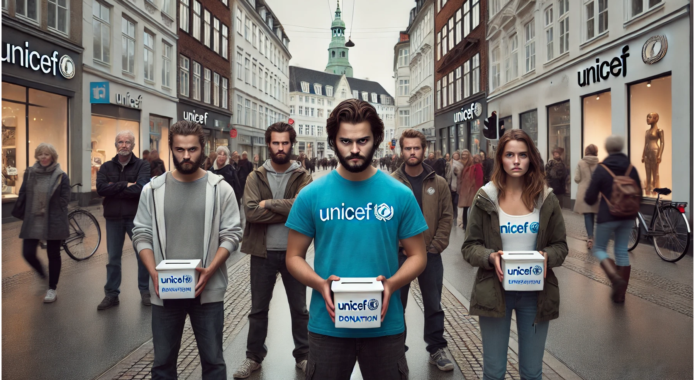
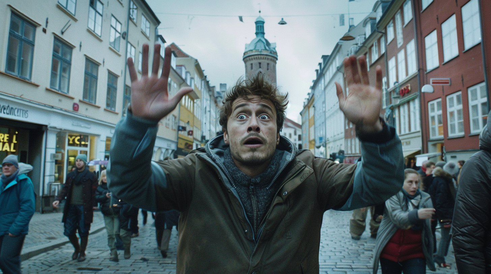

import Poll from "../../../components/blog/Poll";
import {Dialogue, GlyphLeft, GlyphRight, Pony} from "../../../components/blog/Text";
import TextBox from "../../../components/blog/Boxes";

## Exterior/day

I'm strolling around beautiful Copenhagen when I suddenly lock eyes with a friend I have not seen in three years.

Both of us express an **appropriate** level of excitement at seeing each other. We are about 70 meters apart on a crowded shopping street. Overcast October day. Hints of cinnamon in the air.

As I walk toward him, I ask myself what I'm supposed to do.

Do I keep my gaze on him to **continuously** acknowledge his presence? Must I momentarily forget about my friend and then act surprised again when our **bounding boxes** collide? Or should I just check my phone like I do to avoid those pesky [UNICEF](https://www.unicef.org/) minions?

Whatever you might suggest, I choose to ignore it because I’m not a **time traveler**. After a few seconds of unbearable awkwardness, we reach **covid** distance and indulge in a manly bear hug that lasts about three Mississippis too long. Then, he pats me on the back and asks:

<Dialogue>How are you doing?</Dialogue>

Which pisses me off.

<Dialogue>How am I doing? I’m dying,<GlyphRight/> I retort. <GlyphLeft/>Within the intricate confines of my body, cells are undergoing a process of renewal and <strong>decay</strong>. The DNA works overtime to replicate itself, but the wear and tear make the process less efficient. Imperfections <strong>creep in</strong>. Like ripples expanding across a pond, these tiny changes will eventually propagate throughout the entire system. As the balance starts faltering, my body will eventually succumb to the arrow of time. People call it <strong>living</strong>, but it’s actually quite the opposite. It’s happening to all of us, including you,<GlyphRight/> I pause for a second. <GlyphLeft/>Judging by those Gucci bags under your eyes, especially you.</Dialogue>

As I watch my friend back away, with defensive hands and an expression of anguish, I start to realize that I might not be very good at **small talk**.

## My problem with small talk

I think this all boils down to the fact that I'm **busy**.

I have a lot on my [plate](/habits) all the time, and even when I don't, I'd rather use the free computation to ponder about the meaning of **Life**, evaluate chess openings, and mine bitcoins.

So, excuse me, but:

* Chitchatting about the weather is not a priority I hold, also because it's one of the few features that **Siri** can handle. That and timers.

* I don't want you to **inquire** about me to know be better because I know myself already, and avoiding that is exactly why I started this blog.

* I'm not interested on a summary of the latest episode of your favorite **true-crime** podcast because I'm not a white woman. Yes, I'm still mad about that time in Florence.

* And please, never tell me about a dream you had last night. I truly do not want to hear about your overnight chemical imbalances, you freaking perv.

<TextBox title={"Speaking of dreams"}>
    

        A friend of mine who happens to be a popular Italian comedian once heard about my less than enthusiastic interest in people's dreams and, as a result, every once in a while she sends me a voice message where she goes through the excruciating details of a dream she's had.
    

    

        Now, this is endearing, and I feel privileged in receiving a funny and exclusive monologue by a talented artist.
    

    

        At the same time, I can't help but hate her.
    

</TextBox>

box

Whenever someone tries to pull a small talk with me, I try to remain cordial and reply with a british demeanor: "Pardon me, how can I get a refund for the 15 seconds of my life you just tore apart?"

With the more insistent ones, who ask me stuff like what are my plans for the weekend, I just cut to the chase and say: “Listen, do you need money? Is this what it’s all about? Because I will pay you to never talk to me again.” And I can tell you that my girlfriend did not like this answer.

## My blunders

And that is not to say that I’m perfect, because I’m not. Sometimes, I do a smalltalk myself. Like, last week I was in an elevator. The door is closing and a friend of mine catches it in time even if I pressed the close button the moment I saw him entering the building. And since we are together in this enclosed space, I end up telling him, air quotes, how are you doing?

Yeah, big mistake on my side, although to be fair, it’s my polite way of saying you look like shit, are you sure you should be near people indoors? Anyway, he doesn’t catch the hidden message, and replies with: “How are you doing?”

And I am like, what did just happen? Not only are you ignoring my legitimate inquiry, which means that you are not recognizing my right to exist, but you are asking me the same question expecting a different outcome? What am I supposed to do? I don’t want to give up in this penis measuring contest but, as an Italian, I will never use fewer words when more are available; so I’ll have you know that I’m not very good. In fact, my current condition can be summarized in three main points.

First, I’m exhausted because last night I dreamed that I was working, and I believe there should be a law that says that if you dream about working, then you don’t have to work the next day.

I mean, come on, you got days off when your child died!

Second, I got a tattoo recently, and I was a piece of shit to the tattoo artist for the whole time because I didn’t know that getting a tattoo was so painful. Well, now I’m suspecting that all the bones of the skeleton I asked him to draw, to a closer inspection, are actually dildos.

And third, before entering the elevator I farted, and by the feels of it, I’m not sure it was 100% fart, so I hope we get to the floor soon.

(I think there’s no worse feeling in the world than pooping your pants. I mean, if it’s diarrhea. If it’s solid it’s fine, it’s just anal sex in reverse. Or so they say.)

Here I am, small talking again.

## The origins

Man, smalltalk is weird. How have we, as a species, come up with it? I mean, I get the importance of talking. Can you imagine how was it in ancient times before we invented communication?

“Hey, I think that the leader of our tribe just died, stomped by a dinosaur or something more historically consistent.”

“Oh, shit… we are gonna have to invent fire again.”

Isaac Newton said that if he managed to see further than most with his discoveries, it’s only because he was standing on the shoulders of giants. Meaning that he benefited from all the mistakes and knowledge gathered by great minds before him. So, communication is really when things started to click for us. In fact, we took a lap on the other species. We humiliated those suckers! We ate them for dinner! Quite literally in many cases.

So, communication is cool, but what about smalltalk? What do we need it for? Well, think about our ancestors that just learned how to talk…

“Hey, Michael? I just saw a lion by the river, so maybe don’t go there to masturbate?”

“Oh, thanks Dimitri, matter of fact, I was about to go to the river to rub one off. I guess I’ll do it here instead. I owe you one!”

And next day, the skilled hunter Michael, will share an antelope with weaker Dimitri, and Dimitri will survive and have a chance at reproduction, adding his talk genes to the pool.

But, as Micheal has to come up with game meat on a regular basis, otherwise he dies, Dimitri has to figure out how to stay relevant in the information sharing game, and not always there are lions to save people from. So that’s when, I believe, smalltalk and its sibling gossip come into play.

“Hey, Michael! Do you kn— can you please stop masturbating for a second? It’s really distracting. I was saying, do you know who had sex with Vanessa by the orchard last night?”

“No, Dimitri, I don’t know who fucked my wife?!”

“Er, that was Stuart. He lives in the blue tent by the well. Second floor?”

Now, can you imagine what went through Dimitri’s mind at that point?

“Oh shit, shit, shit, shit. I just said that Stuart fucked Vanessa, but in reality I fucked Vanessa. I accused Stuart because I thought I was gonna die, but now something worse will happen, I suspect. Reality is going to collapse because I violated the natural order of the universe. A black hole will form and suck in the whole of Neanderthal valley!”

But then nothing happens. Jealous Michael kills Stuart and peace is restored in the tribe. Dimitri invented lying!

## Lying

But he did much more than that, because lies come in different flavors depending on the awareness of both the transmitter and the receiver.

There are lies we tell, knowing that they are lies, to people that don't know that they are lies, and those are plain, textbook definition lies. They are generally frowned upon, but, oh, so useful!

Then there are lies we tell, knowing that they are lies, to people that also know that they are lies, and those are stories. They can be really inspiring, like that tiny all powerful being called baby Yoda.

And there are lies we tell, not knowing that they are lies, to people that also don't know that they are lies, and that's religion. Also a powerful source of inspiration, like that tiny all powerful being called baby Jesus.

Finally, there are lies we tell, not knowing that they are lies, to people that actually do know that they are lies, and those are Facebook status updates. Like, seriously Amanda, another drunken picture at a party? You might be able to fool yourself, but we all see the cry for help.

Now, maybe you’ve already noticed, but I have been told several times by everyone I know that my conversations can turn real heavy real soon. It’s actually a real problem for me that I’m not sure how to address.

For instance, recently I was sexy talking with my girlfriend. Preparing ourselves for the intercourse. But then things quickly escalated and we ended up discussing about the meaning of life. I mean, who does that? It’s just ridiculous, also because there isn’t an answer to the meaning of life. There’s three. And I will share them with you.

## The meaning of life

First answer: there is no meaning. We are just a bunch of loosely assembled atoms living in an indifferent universe. Nothing matters, you don’t matter, nobody gives a shit.

Judging by your empty gaze, I understand that this can be a bleak view to subscribe to, which brings us to the second answer. Because, you see, in all the indifference, meaning can still be found, for instance in the incredible coincidences that we can observe. Take the universe. You have it? The universe is 13.8 billion years old. 13.8 billion years! And that’s last time I checked, so it’s probably 14 by now.

And of all of the possible years in the past or the future, we happen to be existing roughly in the same period that David Bowie was alive, or even Freddie Mercury for some of us. And not only we exist at the same time, but we are also sharing the same location in the universe with point at the person from before this fucking guy!

And if you think about it, we’ve only missed Jesus by a tiny bit.
mime driving
“Wait, I think you should have taken that exit.”
point to the back
“Really? Oh shit… we are gonna miss Jesus.

So, yes, these coincidences can be a valid argument for God. I don’t have a strong opinion on this, I just think that either God doesn’t exist, or he does exists, and he's a moron.

Now, I have started formulating my somewhat controversial theory for a moronic god by observing reality with a critical eye. I have started asking questions. And that’s not the banal question:  “How can God exist when bad things happen to good people?”

No, this is solved already. If you really must know, bad things happen to good people because you are a piece of shit, Amanda, and— oh, cry me a river! Go get drunk at another party, nobody likes you!

No, the real question is how can God exist when the universe is filled with so many dumb things? Like, this one time that I had to use an Android phone and I was like what going on, who made this?!

And I can imagine the gods from other universes visiting our own, having a look around, puzzled, then saying:

## The many Jesuses interpretation

“Hey, God? Hum, why did you allow bathroom sinks in England to have two faucets, one for the hot water and one for the cold one? I mean, people can’t mix the water. It doesn’t make any sense! And more importantly, God, why did you send only one Jesus? What about all of the other planets? They have exactly zero Jesuses! How can they be saved?

“Well, there are no Jesuses telling me this is wrong, so I guess I’ll just continue fucking this chicken. I mean, what else can I do?”

And even for earth, why only one Jesus? What about the Aztecs, the Mayans, the Hobbits?

Why didn’t you send thousands of Jesuses like we did, one for each 50 km radius, to equally spread the Word around and maximize user engagement.

That’s cool also because then you get to crucify all of them them at the same time and that shit was crazy. Entire forests gone to build the crosses. People couldn’t stop talking about it. Jesus fucking christ. You kidding? It was a whole thing.

“Honeftly? I fhought fhat one fesus was enough.”

And of course I’m using Christianity as the default religion. Do I like Christianity? Not really, but let’s be honest, all the other religions are just ridiculous. Yes, even THAT one! I don’t care, kill me, I don’t give a shit.

(If you see a red dot appear on my forehead, could you let me know? Because it would mean that I’ve become a Hindu, which would make me a hypocrite.)

So, that’s the second answer to the meaning of life.

For the third answer, I want you to think: what are we all doing all the time.

Anybody?

Correct, we exist to resist entropy.

Entropy is a measurement for the chaos in the universe. The universe is constantly moving from a state of less chaos to more chaos. When you put milk in the coffee, you see the two liquids merge together and form a new substance whose scientific name is Latte Macchiato. That’s entropy at work.

Now, us living beings, as long as we stay alive, are resisting entropy, which is why when you get back from work, tired, and you chill in front of the TV, you usually don’t melt with the sofa.

So, for how long has this non melting thing been going on? Since the beginning, when life originated in the ocean. You see, in order for life to begin, you need to have something that separates the inside from the outside, and this thing is the lipid: the molecule of fat. Yes, Life originated thanks to fat, you body shaming assholes!

The lipid is a peculiar molecule because, you see, one side of it really likes water, while the other side is like nope, I’m not sold on this whole water bullshit.

Now, because of this love/hate relationship with water, lipids in the sea were incentivized to join with each other until they formed a sphere, with the water phobic part on the inside and the water horny part on the outside. That’s how cells are formed. And just like that, you now have a container, something that it is capable of resisting entropy for the necessary time for RNA to form. And all that happens downhill? That’s life, motherfucker.

So, it seems to me that the whole meaning of life is that gotta be ambivalent about water, which is what I was originally trying to convey to my girlfriend at the beginning of this discussion, when she told me that, if I really wanted her to blow me, I was gonna need to take a shower.