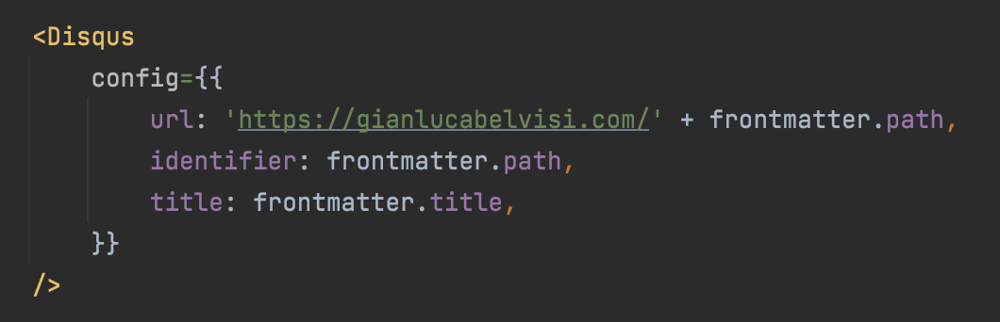

This website has release notes. It's a thing I do.

## How to read a version

A version comprises three numbers: major.minor.patch

* *Major*: used for big updates. Not necessarily breaking changes, but something that you should notice. A redesign. A new section maybe.
* *Minor*: some tinier details that you shouldn't probably mind too much
* *Patch*: bug fixes or minor visual improvements

## Version 1.1.0 - bunch of stuff!
* The navbar now hides when you scroll down for more than 100 pixels. It shows up again when you scroll up
* The 404 page is now working, albeit minimalistic AF
* Added link to more posts at the end of each post
* **Fixed** the Giovannozzi bug in the social container when displayed on a shitty phone

## Version 1.0.0 - le comments!

I'd say we reached the first milestone thanks to Disqus comments being integrated in the blog posts!

And all it took was basically adding this piece of code.

I'm not crazy about the emoji reactions: too big, too dumb. So I'm thinking about reimplementing them on my own.